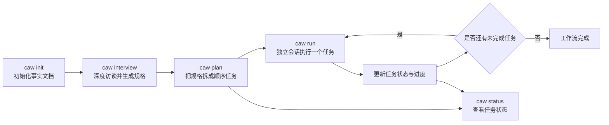
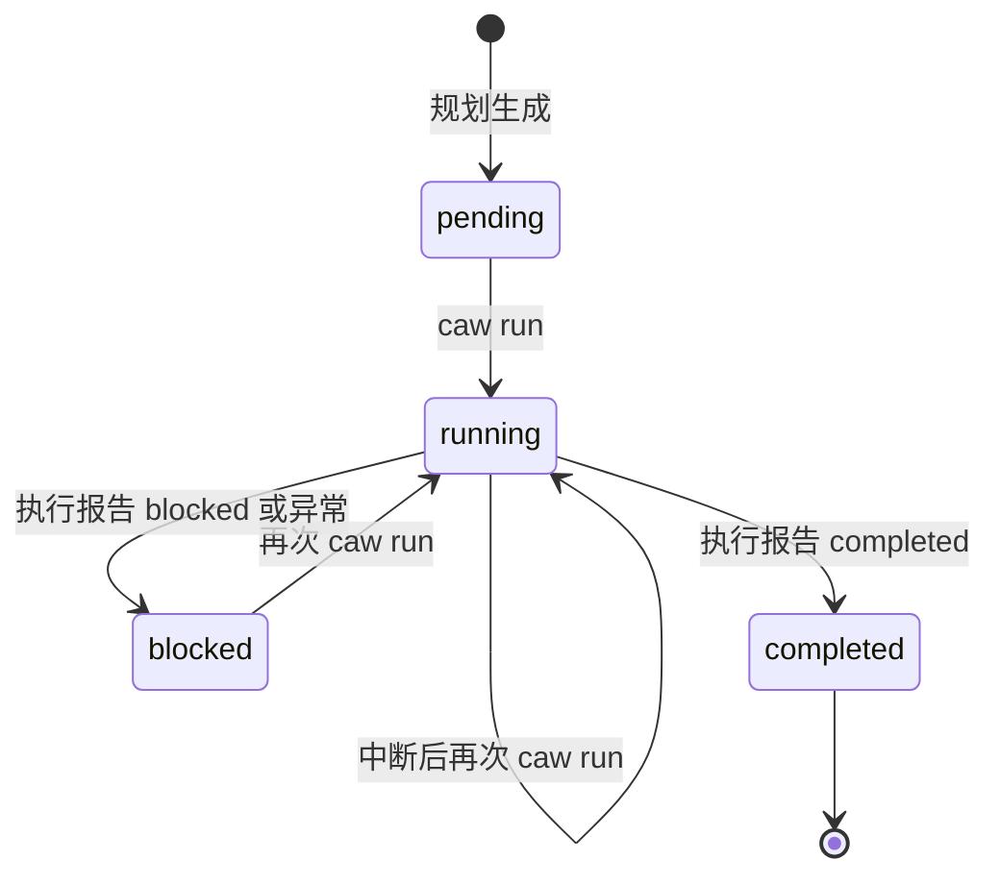
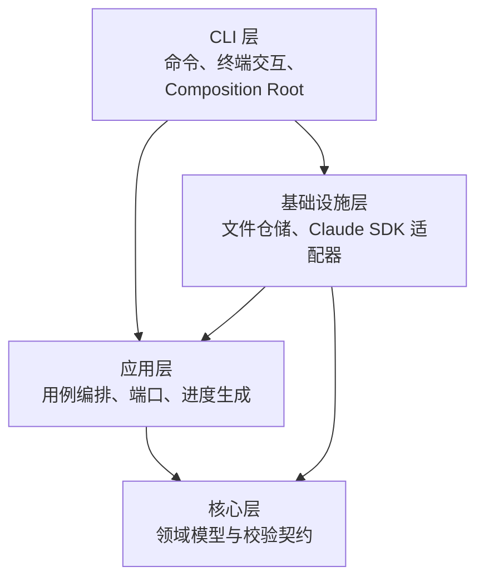

# 项目源码功能与架构说明

## 1. 分析依据

本文档只依据当前代码、测试、构建配置、依赖清单和 CI 配置整理，没有读取项目中原有的任何 Markdown 文档。

本次实际检查的范围包括：

- `src` 下 19 个 TypeScript 源文件；
- `test` 下 3 个测试文件，共 7 个测试用例；
- `package.json`、依赖锁、TypeScript、ESLint、Vitest、Git Ignore 和 CI 配置；
- `dist` 下 19 个 JavaScript 构建文件及其 Source Map 来源；
- CLI 的实际帮助输出。

`dist` 中的 19 个 JavaScript 文件已经与当前 TypeScript 源码的临时编译结果逐字节比较，二者一致。因此，下文以 TypeScript 源码为主要解释对象，同时也能代表当前本地构建产物的实际行为。

## 2. 项目定位

这是一个名为 `coding-agent-workflow`、命令名为 `caw` 的本地命令行工具。它把一个模糊的软件需求转换为可以由 Claude Code 逐项实现的工作流。

完整主流程是：

它的核心设计不是维持一个长期 AI 会话，而是把规格、任务和进度写入项目文件。每次执行任务时都启动一个新的 Claude Code 查询，并显式注入当前任务所需的全部上下文。

## 3. 用户可用功能

### 3.1 `caw init [targetDir]`

作用：在目标项目中初始化最小工作流结构。

实际行为：

- 目标目录默认为当前工作目录，也可以显式传入；
- 如果目标路径已经存在但不是目录，命令报错；
- 自动创建任务目录；
- 创建项目执行约束、规格占位文档和进度占位文档；
- 已存在的核心文件不会被覆盖，只统计为“跳过”；
- 不创建数据库、Git 配置、架构文档、决策记录或其他旁路状态。

该命令可以在不存在的目标目录上执行，递归创建目录；也可以在已有项目根目录中执行。

### 3.2 `caw interview <requirement...>`

作用：通过交互式深度访谈，把初始自然语言需求整理为完整产品规格。

实际流程：

1. 把命令行中的多个需求参数拼接成初始需求；
2. 调用 Claude 判断信息是否足够；
3. 信息不足时，Claude 每轮返回一个问题；
4. CLI 逐行读取用户回答，保留普通换行和空白行，直到用户单独输入 `/done`；
5. 将问题和回答显式加入访谈记录；
6. 下一轮再次发送初始需求和完整访谈记录；
7. Claude 返回完成状态后，校验并写入最终规格。

关键规则：

- 初始需求去除空白后不能为空；
- 最多允许 30 轮访谈；
- 用户提交空答案时，系统会写入一条明确的“暂无更多信息，请基于已有内容继续判断”语义，而不是保留隐式空状态；
- 终端多行输入由独立 Readline 适配器聚合，输入流结束时会提交已有内容，没有任何内容时则明确报错；
- Claude 返回“继续提问”时，问题不能为空；
- Claude 返回“完成”时，规格不能为空；
- 访谈不复用 SDK 隐藏 Session，完整上下文由应用层维护；
- 最终规格会覆盖写入，代码中没有旧版本兼容或合并逻辑。

访谈使用产品分析师系统提示词，要求覆盖目标用户、核心流程、范围、非目标、业务规则、数据、状态、异常、边界和验收标准，并禁止在该阶段设计技术架构。

### 3.3 `caw plan`

作用：读取最终规格，生成可以顺序执行的最小需求任务集合。

实际流程：

1. 从当前项目读取规格；
2. 如果规格文件不存在、仍是初始化占位内容，则报错；
3. Claude 生成至少一个任务草稿；
4. 每个草稿必须包含标题、需求正文和至少一条验收标准；
5. 仓储按顺序分配 `TASK-001`、`TASK-002` 等编号；
6. 每个任务初始状态为 `pending`；
7. 删除原有符合 `TASK-数字.md` 命名规则的任务文件，再写入新任务；
8. 重置进度，避免新计划继续引用旧计划的执行事实。

任务规划提示词明确要求：任务只描述用户可观察的需求和验收标准，不指定目录、文件、框架、类、函数或具体实现方案。后续任务可以假设前序任务已经完成。

重新规划属于破坏式整体替换，不保留旧任务兼容关系。任务目录内不符合任务命名规则的其他文件不会被删除。

### 3.4 `caw run`

作用：执行任务列表中第一个未完成任务。一次命令只处理一个任务。

选择规则：

- 按任务编号的数字部分升序读取任务；
- 选择第一个状态不等于 `completed` 的任务；
- `pending`、`running`、`blocked` 都会被视为可再次执行的未完成任务；
- 所有任务都完成时，直接提示完成，不启动 Claude Code；
- 没有任何任务时，要求先执行规划。

执行流程：

1. 把选中任务状态更新为 `running`；
2. 从文件重新读取该任务，确认持久化后的运行状态；
3. 读取完整规格；
4. 读取历史进度；
5. 将“完整规格、历史进度、当前任务文档”共同构造成执行 Prompt；
6. 启动一个新的 Claude Code SDK 查询；
7. Claude Code 检查和修改目标项目代码，并执行非浏览器验证；
8. Claude 返回结构化执行报告；
9. 把任务状态更新为 `completed` 或 `blocked`；
10. 重建当前任务状态视图，并把本次结果追加到执行历史。

CLI 在长任务中只显示 Claude Code 正在使用的工具名称，不回显模型的结构化 JSON，也不显示部分消息。

结构化执行报告包含：

- 最终状态：只能是 `completed` 或 `blocked`；
- 结果摘要；
- 对后续独立任务有用的进展和架构事实；
- 变更文件列表；
- 验证记录；
- 阻塞原因。

如果 SDK 调用、结果解析或用例执行发生异常，应用会先生成一个本地 `blocked` 报告，记录异常原因并更新任务和进度，然后重新抛出异常，使 CLI 以非零状态退出。Claude 正常返回 `blocked` 报告时则属于一次正常完成的命令调用。

### 3.5 `caw status`

作用：读取当前任务文件并输出状态列表。

实际行为：

- 没有任务时输出“尚未生成任务”；
- 有任务时按编号排序，逐行显示任务 ID、状态和标题；
- 状态直接来自任务文档，不依赖缓存或派生索引；
- 该命令不调用 Claude。

## 4. 领域模型与状态模型

### 4.1 任务状态

系统只有四种任务状态：

| 状态 | 含义 | 是否会被下一次 `run` 选中 |
| --- | --- | --- |
| `pending` | 已规划，尚未执行 | 是 |
| `running` | 已开始执行，尚未形成最终报告 | 是 |
| `completed` | 已满足当前任务并完成 | 否 |
| `blocked` | 当前执行无法可靠完成 | 是 |

正常用例形成的状态流如下：

仓储的底层 `updateTaskStatus` 方法本身不校验状态迁移合法性，但当前应用用例只按上图操作。`completed` 是调度意义上的终态，不会被 `run` 自动重开。

### 4.2 核心数据契约

| 模型 | 字段 | 约束与用途 |
| --- | --- | --- |
| `TaskMetadata` | `id`、`title`、`status` | ID 必须符合 `TASK-数字`；标题非空；状态为四态之一 |
| `TaskRecord` | `metadata`、`document` | 任务的机器元数据和完整文档内容 |
| `InterviewReply` | `status`、`question`、`specification` | 每轮要么提问，要么返回最终规格 |
| `TaskDraft` | `title`、`requirement`、`acceptanceCriteria` | 规划阶段的任务草稿，至少一条验收标准 |
| `TaskPlan` | `tasks` | 至少包含一个任务草稿 |
| `TaskExecutionReport` | 状态、摘要、进展、文件、验证、阻塞原因 | 执行结果及供后续任务恢复上下文的事实 |
| `ProgressEntry` | 任务信息、执行报告、记录时间 | 应用层生成的稳定进度历史条目 |

模型的运行时校验使用 Zod。交给 Claude Agent SDK 的输出格式另有 JSON Schema，禁止额外字段并约束必填字段；SDK 输出返回后仍会再次经过 Zod 校验。

## 5. 数据持久化与事实来源

系统没有数据库、缓存、任务索引或隐藏状态机。文件仓储集中维护三类工作流事实：

- 产品规格；
- 顺序任务集合；
- 当前进度与执行历史。

任务文档采用 YAML Frontmatter 加 Markdown 正文：

- Frontmatter 保存 `id`、`title`、`status`，属于机器状态；
- 正文只保存任务需求与验收标准，属于人和 AI 可读的任务语义；
- 更新状态时会解析并重新序列化 Frontmatter，同时保留正文；
- YAML 解析和序列化逻辑集中在单独模块中。

进度文档由应用层统一渲染，包括：

- 已完成数量；
- 所有任务的当前状态；
- 最近一次执行结果；
- 逆时间顺序积累的执行历史。

每次重新规划都会整体替换任务集合并重置进度。代码没有迁移、版本兼容、旧状态恢复或回退分支。

## 6. AI 会话设计

### 6.1 统一端口

应用层通过 `CodingAgentPort` 只认识三个产品动作：

- 访谈需求；
- 创建任务计划；
- 执行当前任务。

它不认识 Claude SDK 的消息类型、权限模式或会话实现，因此可以使用 Fake Agent 做独立测试，也可以在不修改用例的前提下替换 AI 适配器。

### 6.2 访谈与规划会话

访谈和规划都使用 `dontAsk` 权限模式与结构化输出，但拥有不同的显式工具边界：

- 访谈通过 `tools` 只暴露 `Read`、`Grep`、`Glob`，并通过 `allowedTools` 自动批准这三种只读工具；
- 访谈遇到初始需求明确提供的本地文件或目录时，会优先自行核对内容，不要求用户重复粘贴；
- 规划通过 `tools: []` 关闭全部内置工具，只消费最终规格；
- 两类会话都不额外设置 SDK Turn 上限，结构化输出校验与有限重试由 SDK 负责；
- 两类会话都不指定固定模型，鉴权和模型选择由 SDK/运行环境提供。

### 6.3 任务执行会话

执行使用 Claude Code 预设系统提示词，并追加本项目的工作流约束。它与访谈、规划最大的区别是允许真正检查、修改和验证项目。

当前执行权限配置为：

- 工作目录固定为目标项目根目录；
- 加载用户、项目、本地三类 Claude 设置来源；
- 使用 `bypassPermissions`；
- 显式允许跳过权限检查；
- 未限制最大 Turn 或工具清单；
- 收到 `SIGINT` 时通过 `AbortController` 中止 SDK 查询；
- 会话结束后移除进程信号监听器，避免监听器泄漏。

因此，`caw run` 对目标项目拥有很强的自动执行能力。安全边界主要依赖执行 Prompt、目标项目自身约束和操作者选择的工作目录，而不是工具级沙箱。

### 6.4 显式上下文恢复

每个任务执行会话只依赖三段明确输入：

1. 总目标与完整规格；
2. 以前完成了什么，即进度文档；
3. 现在要做什么，即当前任务完整文档。

这种设计消除了对前一个模型会话隐藏记忆的依赖。后续任务能否正确继续，取决于规格、任务拆分质量，以及前序执行报告中 `progress` 字段记录的事实质量。

## 7. 分层架构与模块边界

依赖方向如下：

### 7.1 核心层

`src/core/workflow.ts`：

- 定义任务状态、任务元数据、访谈回复、任务草稿、计划和执行报告；
- 提供 Zod 运行时 Schema；
- 提供 Claude 结构化输出所需的 JSON Schema；
- 不依赖 CLI、文件系统或 Claude SDK。

### 7.2 应用层

`src/application/ports.ts`：

- 定义 AI、工作流仓储和访谈输入输出三个端口；
- 用产品动作隔离底层实现。

`src/application/generate-specification.ts`：

- 编排最多 30 轮显式访谈；
- 负责输入和 AI 回复的业务校验；
- 只在形成最终规格后持久化。

`src/application/generate-tasks.ts`：

- 读取规格；
- 请求 AI 生成任务草稿；
- 委托仓储整体替换任务。

`src/application/execute-next-task.ts`：

- 选择第一个未完成任务；
- 管理运行、完成、阻塞状态；
- 组装执行上下文；
- 把异常转换为可持久化的阻塞事实；
- 统一更新进度。

`src/application/progress.ts`：

- 将结构化执行结果转换为进度条目；
- 从旧进度中提取历史；
- 重建当前视图并追加历史；
- 通过注入时间保证测试可重复。

`src/application/index.ts`：

- 作为应用层公共出口，统一导出端口和用例。

### 7.3 基础设施层

`src/infrastructure/file-workflow-repository.ts`：

- 实现全部文件系统持久化；
- 管理初始化模板、规格读写、任务替换和状态更新、进度读写；
- 负责任务编号、任务正文模板和任务文件排序。

`src/infrastructure/markdown-document.ts`：

- 解析和序列化最小 YAML Frontmatter 协议；
- 保证任务创建和状态更新共享同一格式实现。

`src/infrastructure/claude-code-agent.ts`：

- 实现 `CodingAgentPort`；
- 集中维护三类系统提示词；
- 构建 SDK Options；
- 执行结构化查询并做 Zod 校验；
- 管理中断和工具活动反馈。

`src/infrastructure/claude-code-session-policy.ts`：

- 用 `interview`、`planning`、`execution` 三种显式会话类型替代布尔权限分支；
- 集中定义每类会话可见工具、自动批准工具和权限模式；
- 保证访谈只能读取资料、规划不能访问项目、执行维持完整开发能力。

`src/infrastructure/index.ts`：

- 只公开文件仓储和 Claude Code 适配器。

### 7.4 CLI 层

`src/cli/index.ts`：

- Node 可执行入口；
- 转交命令行参数并设置进程退出码。

`src/cli/framework.ts`：

- 注册五个命令；
- 统一处理 Commander 和业务异常；
- 空参数时显示帮助并成功退出。

`src/cli/composition.ts`：

- 唯一主要 Composition Root；
- 创建真实文件仓储和 Claude Code Agent。

`src/cli/readline-interview-io.ts`：

- 把 Readline 行流聚合成保留换行的完整访谈回答；
- 使用显式 `/done` 命令划定回答边界，不把代码中的空白行误判为提交；
- 隔离终端提示符、输入结束和多轮迭代器状态。

`src/cli/commands/*.ts`：

- 每个文件只负责一个命令；
- 命令层处理终端输入输出，并调用对应应用用例或只读仓储能力。

## 8. 错误处理与退出语义

CLI 对错误进行集中收口：

- Commander 的帮助和版本退出码为 0，不作为业务错误打印；
- 参数错误保留 Commander 的非零退出码并输出消息；
- 普通异常统一输出 `error: 错误内容`，退出码为 1；
- `interview` 无论成功失败都会关闭 Readline；
- `run` 的 SDK 异常会在退出前尽量持久化 `blocked` 状态和进度；
- Claude 正常报告业务阻塞时，命令本身仍可成功退出。

## 9. 技术栈、构建与发布形态

### 9.1 运行时与语言

- Node.js 20 或更高版本；
- TypeScript；
- ESM 模块；
- 编译目标 ES2022；
- `NodeNext` 模块和解析策略；
- 严格类型检查，并启用未检查索引访问、隐式 override 和 switch fallthrough 等额外约束。

### 9.2 主要生产依赖

| 依赖 | 用途 | 当前安装版本 |
| --- | --- | --- |
| `@anthropic-ai/claude-agent-sdk` | Claude Code 查询和结构化会话 | `0.3.206` |
| `commander` | CLI 命令、参数和帮助 | `12.1.0` |
| `yaml` | YAML Frontmatter 解析与序列化 | `2.9.0` |
| `zod` | 领域模型和 SDK 输出运行时校验 | `4.4.3` |
| `@anthropic-ai/sdk` | 在清单中声明，但当前源码没有直接导入 | `0.110.0` |

依赖锁格式版本为 3，共记录 313 个 Package 条目。当前锁定的 TypeScript 实际安装版本为 `5.9.3`，高于清单中的最低兼容范围。

### 9.3 构建和质量命令

- `npm run typecheck`：检查 `src` 和 `test`，不生成文件；
- `npm run lint`：检查 `src` 和 `test` 的 TypeScript；
- `npm test`：以 Vitest 单次运行模式执行测试；
- `npm run build`：只编译 `src` 到 `dist`，不发布测试代码；
- 构建同时生成 Source Map；
- NPM 包只声明包含 `dist`，可执行命令指向 `dist/cli/index.js`；
- 包当前标记为 `private`，用于避免意外发布。

### 9.4 CI

GitHub Actions 在以下时机执行：

- 推送到 `main`；
- 任意 Pull Request。

CI 使用 Ubuntu 和 Node 20，顺序执行：

1. `npm ci`；
2. 类型检查；
3. Lint；
4. 测试；
5. 构建。

CI 不调用真实 Claude 模型。

## 10. 测试现状

当前共有 5 个测试文件、14 个测试用例。

已覆盖：

- 访谈逐轮累积显式上下文，并只在完成时写规格；
- 从规格生成顺序编号任务；
- 只执行第一个未完成任务；
- 执行会话收到规格、进度和当前任务三段上下文；
- 成功执行后更新任务状态和进度；
- SDK 异常后任务被标记为 `blocked` 并记录错误；
- 初始化只创建三个核心文档；
- 任务只含最小元数据、需求和验收标准；
- 更新状态不会丢失任务正文。
- 访谈、规划、执行三类会话拥有独立且可验证的工具权限策略，并且不会被单轮上限截断结构化输出流程。
- 终端多行回答保留换行、缩进和空白行，多轮回答不会串流，输入结束行为明确。

这里的“14 个测试用例”中部分用例同时验证多个行为，所以上述覆盖点多于 14 项。

当前未由自动测试直接覆盖：

- CLI 参数、帮助、退出码和终端问答的完整集成行为；
- 真实 Claude Agent SDK 调用、鉴权、模型输出和工具执行；
- 访谈 30 轮上限及各种空字段校验；
- 重新规划删除旧任务和重置进度的全部边界；
- 进度历史多次追加及 Markdown 内容冲突；
- 任务排序、异常 Frontmatter、文件损坏等错误路径；
- 并发运行两个 `caw run` 的行为；
- 进程强制终止后的恢复；
- 文件写入中断或磁盘错误下的一致性。

本次代码分析期间实际执行结果：

- 类型检查通过；
- ESLint 通过，无警告输出；
- 5 个测试文件全部通过；
- 14 个测试用例全部通过；
- CLI 帮助入口成功运行；
- 当前 `dist` 与源码编译结果一致。

## 11. 架构评价

### 11.1 已形成的良好边界

- 领域模型不依赖文件系统、CLI 或 SDK；
- 应用用例依赖端口，不依赖具体基础设施；
- AI 能力按产品动作建模，没有把 SDK Session 细节泄漏给应用层；
- 文件持久化集中在一个适配器中，没有散落读写；
- YAML 文档协议集中实现，任务创建和状态修改不复制解析逻辑；
- CLI 命令职责较小，业务编排主要位于用例；
- AI 会话上下文显式、可追踪、可测试，符合 AI-Friendly Architecture；
- 时间可注入、Agent 可替换、仓储通过临时目录测试，测试边界清楚；
- 重新规划采用整体替换，不保留旧协议或旧状态兼容分支。

### 11.2 当前真实限制与风险

以下内容是从现有实现推导出的限制，不代表已经发生故障。

#### 高影响

1. **执行权限边界较宽**

   `caw run` 使用绕过权限确认的 Claude Code 模式，并加载用户、项目和本地设置。代码没有额外沙箱、允许路径或工具白名单。运行目录选择错误或项目约束不足时，影响范围可能大于单个任务。

2. **没有并发锁和任务租约**

   两个 `caw run` 同时启动时，都可能读到同一个未完成任务并重复执行。`running` 状态不是互斥锁，因为调度器会再次选择 `running` 任务。

3. **文件更新不是事务性的**

   任务状态和进度分别写入；重新规划也先逐个删除旧任务，再逐个写新任务。进程或磁盘在中途失败时，可能留下状态与进度不一致或任务集合不完整的情况。

#### 中等影响

4. **执行成功主要依赖模型自报和结构校验**

   程序校验报告结构，但不会独立核对 `changedFiles`、验证命令结果或验收标准是否真正满足。真实性主要依赖 Claude Code 会话行为和 Prompt 约束。

5. **进度文档使用标题文本切分历史**

   历史提取通过查找固定标题完成。如果模型生成的摘要或进展中包含同名标题，可能干扰历史切分；模型文本中的 Markdown 也没有转义。

6. **领域 Schema 与 SDK JSON Schema 需要手工同步**

   同一个输出契约同时存在 Zod 和手写 JSON Schema 两份定义。运行时双重校验能发现错误，但字段演进时仍存在维护漂移成本。

7. **真实 SDK 边界没有自动化集成测试**

   当前测试使用 Fake Agent，能很好地验证用例，但无法发现 SDK 版本、权限选项、结构化输出或消息格式变化造成的问题。

#### 较低影响或当前规模可接受

8. **文件仓储承担了多项职责**

   同一个类同时负责初始化模板、目录管理、规格、任务、状态、进度和任务正文渲染。当前规模仍可理解；若未来增加版本、原子写入或其他存储后端，建议拆分文档编解码、模板和文件事务职责。

9. **CLI 装配入口不完全统一**

   访谈、规划、执行通过 `createRuntime` 装配；初始化和状态命令直接实例化文件仓储。功能上没有问题，但扩展多仓储实现时需要同步调整多个命令。

10. **直接声明了未直接使用的 Anthropic SDK**

    `@anthropic-ai/sdk` 在生产依赖中声明，但当前源码只直接使用 Claude Agent SDK。需要结合上游 SDK 的依赖要求确认它是否必须由根项目显式固定。

## 12. 明确未实现的能力

根据当前代码，系统没有实现以下能力：

- 自动循环执行全部任务；
- 并行任务执行；
- 任务依赖图或复杂调度；
- Reviewer、二次评审或多 Agent 共识；
- Git 分支、提交、回滚或 Pull Request 管理；
- SQLite、远程数据库、缓存或队列；
- Web UI、桌面 UI 或浏览器自动化；
- 多模型 Provider 切换；
- 模型、预算、超时和重试策略配置；
- 规格、任务、进度的版本迁移；
- Legacy 数据兼容、灰度、Fallback 或 Deprecated 流程；
- 文件级执行白名单或沙箱；
- 对 Claude 报告内容的独立验收执行器。

这些能力既没有业务实现，也没有隐藏在当前构建产物中。

## 13. 总结

当前项目已经实现了一个边界清楚的最小闭环：用产品访谈形成规格，用无实现约束的规划生成顺序任务，再让相互隔离的 Claude Code 会话逐项实施，并通过显式文件状态把上下文传递给下一次执行。

架构的主要优点是分层明确、应用层可测试、AI 上下文显式、没有旧系统兼容负担。当前最值得优先关注的长期问题不是继续增加命令，而是执行安全边界、并发互斥、文件原子性，以及对模型自报结果的独立验证。解决这些问题时应继续保持现有端口和用例边界，避免把锁、事务或 SDK 细节渗透到领域与应用编排中。
