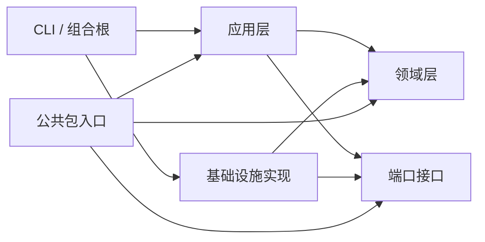
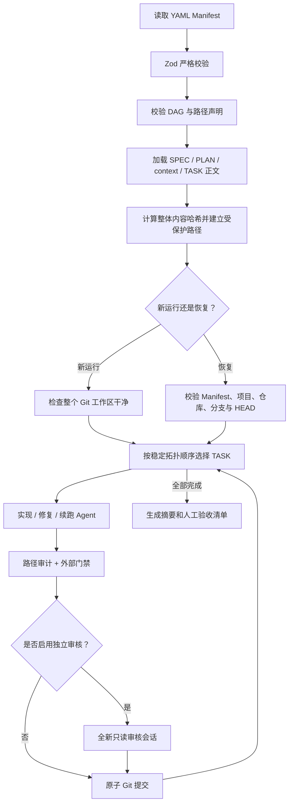
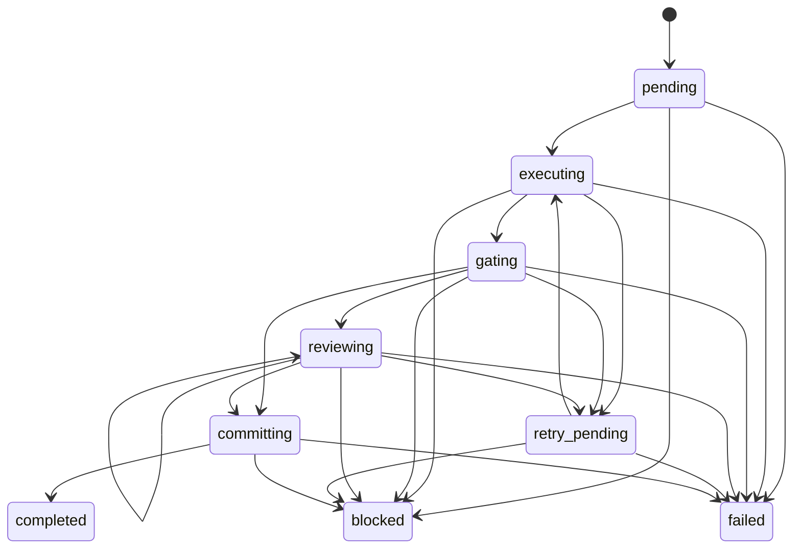

# Claude Task Orchestrator 功能文档（源码基线）

> 生成日期：2026-07-14  
> 对应包版本：`0.1.0`  
> 事实来源：当前仓库的生产源码、测试源码与构建配置  
> 明确未读取：`README.md` 及任何现有项目说明文档  
> 明确不作为独立源码重复分析：`dist/`、`node_modules/`、`coverage/` 和依赖锁文件

## 1. 文档范围与验证结论

本文档描述当前代码实际实现的功能，而不是已有文档中的设计意图。分析范围包括：

- `src/` 下 30 个 TypeScript 生产源码文件；
- `test/` 下 9 个测试与测试支撑文件；
- `package.json`、TypeScript、ESLint、workspace 和忽略规则等构建配置；
- 领域模型、应用状态机、Claude Agent SDK 适配、Git 边界、持久化、CLI 和测试夹具。

生成本文档前完成了以下可执行验证：

| 检查 | 结果 |
| --- | --- |
| `pnpm typecheck` | 通过 |
| `pnpm test` | 8 个测试文件、33 个测试全部通过 |
| `pnpm lint` | 通过 |

## 2. 系统定位

该项目是一个基于 Claude Agent SDK 的命令行任务编排器。它读取一份 YAML Manifest 和 Manifest 引用的任务上下文，将任务按 DAG 依赖顺序逐个交给 Claude，实现后执行外部门禁、可选独立审核，并为每个完成的任务创建一个独立 Git 提交。

系统的核心特征是：

- 单并发：一个项目同一时间只允许一个编排器实例，单次运行内也只推进一个 TASK 的一个阶段；
- 显式依赖：任务依赖通过 DAG 声明，并以稳定拓扑顺序执行；
- 受限 Agent：实现 Agent 只能使用文件读取和写入工具，审核 Agent 只能使用文件读取工具；
- 确定性验收：Claude 的完成声明不能替代 Manifest 中声明的外部门禁命令；
- 候选不可变：门禁、审核和提交通过同一个内容指纹绑定；
- 可恢复：状态在关键 checkpoint 原子落盘，可恢复 Agent 会话、门禁、审核和提交阶段；
- 每任务提交：每个 TASK 通过后生成一个带精确恢复 trailer 的 Git 提交；
- 人工 UI 验收：系统不会启动浏览器或 UI 自动化，完成后只生成手工验收清单。

当前系统不提供：

- 多任务并行执行；
- Web UI 或服务端 API；
- 自动部署、push、merge 或创建 PR；
- 自动浏览器测试；
- blocked/failed 任务的原地人工解锁命令；
- 历史状态迁移或旧版 Manifest 兼容层。

## 3. 总体架构

### 3.1 分层结构

| 层 | 主要目录 | 职责 |
| --- | --- | --- |
| 领域层 | `src/domain` | Manifest 契约、Agent 结构化结果、DAG、运行状态机、稳定错误类型 |
| 端口层 | `src/ports` | Agent、Git 工作区、状态存储、锁、门禁、日志、时钟和 Manifest 仓储接口 |
| 应用层 | `src/application` | 队列调度、单任务阶段推进、会话 checkpoint、提示词构建 |
| 基础设施层 | `src/infrastructure` | Claude SDK、Git、文件状态库、文件锁、子进程门禁、日志和 YAML 仓储实现 |
| CLI 层 | `src/cli` | 参数解析、依赖装配、信号处理、退出码和初始化模板 |
| 公共入口 | `src/index.ts` | 导出稳定领域契约、应用服务和端口，不导出 CLI 副作用与默认基础设施实现 |

依赖方向如下：



### 3.2 生产运行时装配

`createOrchestratorRuntime()` 是默认实现的唯一组合根，装配关系为：

- Manifest：`YamlManifestRepository`；
- Workspace：`GitWorkspace`；
- 状态：`FileStateStore`；
- 独占锁：`FileRunLock`；
- Agent：`ClaudeAgentSdkExecutor`；
- 门禁：`NodeGateRunner`；
- 提示词：`PromptBuilder`；
- 时钟：`SystemClock`；
- 日志：`ConsoleEventLogger + JsonlEventLogger`，由 `CompositeEventLogger` 组合；
- 单任务推进：`TaskExecutionService`；
- 整体队列：`QueueOrchestrator`。

这种装配使应用层不直接依赖 Claude SDK、Git 命令、文件系统或系统时间。测试通过内存 Fake 替换所有外部端口，直接验证真实应用状态机。

## 4. 核心业务流程

### 4.1 从输入到提交的数据流



### 4.2 单并发保证

单并发由两层机制共同保证：

1. `QueueOrchestrator.drive()` 使用顺序循环，每次只 `await` 当前 TASK 的一个阶段；
2. `FileRunLock` 在项目状态目录中独占创建 `active.lock`，防止两个 CLI 进程同时运行。

DAG 只负责依赖合法性与稳定顺序，不用于并行调度。即使多个任务同时满足依赖，也只执行 Manifest 原始顺序在稳定拓扑排序中更靠前的任务。

## 5. CLI 功能

默认 Manifest 文件名为 `orchestrator.yaml`。

| 命令 | 参数 | 实际行为 |
| --- | --- | --- |
| `init [directory]` | 目录默认 `.` | 增量创建最小项目骨架；已有普通文件保留并跳过；路径类型冲突时回滚本次已创建文件 |
| `validate` | `-m, --manifest` | 加载并完整校验 Manifest、DAG、声明路径和所有引用内容，输出项目根、任务数和内容哈希 |
| `run` | `-m, --manifest` | 创建全新运行；要求整个 Git 仓库干净；串行执行全部任务 |
| `resume [runId]` | runId 可省略；`-m` | 指定 runId 时恢复该运行；省略时读取最近运行；终态运行安全返回 |
| `continue` | `-m` | 无状态时新建，存在 running 状态时恢复，最近状态已终止时安全返回该终态 |
| `status [runId]` | runId 可省略；`-m` | 读取并格式化输出完整 `RunState` JSON |

### 5.1 `init` 生成内容

初始化器的模板由源码常量定义，会尝试创建：

- `orchestrator.yaml`；
- `SPEC.md`；
- `PLAN.md`；
- `AGENTS.md`；
- `tasks/TASK-001.md`。

创建使用文件系统独占写入标志 `wx`，避免“先检查、后写入”的竞态覆盖。重复执行具有幂等性：已有普通文件进入 skipped 列表，不会校验或覆盖内容；已有目录、符号链接或特殊文件视为冲突。本次失败只删除本次已创建的文件，不删除用户原有文件。

### 5.2 退出码

| 场景 | 退出码 |
| --- | --- |
| 运行完成 | `0` |
| 普通失败、异常、failed 状态 | `1` |
| blocked 状态 | `2` |
| 收到中断且运行仍为 running | `130` |

第一次收到 `SIGINT` 或 `SIGTERM` 时，CLI 触发 `AbortController`，等待当前阶段停止并保留 checkpoint。第二次收到中断信号时立即以 `130` 退出，当前阶段可能需要后续 `resume`。

## 6. Manifest 契约

Manifest 使用严格 Zod Schema。所有对象都拒绝未知字段，防止拼写错误被静默忽略。

### 6.1 顶层字段

| 字段 | 类型 | 约束 / 默认值 | 含义 |
| --- | --- | --- | --- |
| `version` | 字面量 | 必须为 `1` | 当前唯一协议版本 |
| `project` | 对象 | 必填 | 项目根与上下文文档声明 |
| `defaults` | 对象 | 必填，对象内字段可默认 | 实现 Agent 和任务重试的默认参数 |
| `review` | 对象 | 整体可省略 | 独立审核配置 |
| `git` | 对象 | 整体可省略 | 提交信息配置 |
| `tasks` | 数组 | 至少 1 项 | TASK 定义列表 |

### 6.2 `project`

| 字段 | 类型 | 默认 / 约束 | 行为 |
| --- | --- | --- | --- |
| `root` | 非空字符串 | `.` | 相对 Manifest 所在目录解析为项目根 |
| `spec` | 非空字符串 | 可省略 | 加入项目上下文、内容哈希和受保护路径 |
| `plan` | 非空字符串 | 可省略 | 加入项目上下文、内容哈希和受保护路径 |
| `contextFiles` | 字符串数组 | `[]` | 其他项目策略文件，去重后加载 |

Manifest 本身必须位于最终项目根内。所有声明内容必须可读取、非空。

### 6.3 `defaults`

| 字段 | 默认值 | 约束 | 使用位置 |
| --- | --- | --- | --- |
| `maxAttempts` | `3` | 正整数，最大 `10` | 每个 TASK 的实现/修复/续跑尝试上限 |
| `taskTimeoutMinutes` | `45` | 正整数，最大 `720` | Agent 调用超时；任务可覆盖 |
| `maxTurns` | `80` | 正整数，最大 `500` | 实现类 Agent 最大轮数 |
| `maxBudgetUsd` | 无 | 正数 | 实现类 Agent 单次预算上限 |
| `model` | `sonnet` | 非空字符串 | 实现类 Agent 模型 |
| `effort` | `high` | `low/medium/high/xhigh/max` | 实现类 Agent 推理强度 |

### 6.4 `review`

省略整个对象时默认启用审核：

| 字段 | 默认值 | 约束 | 含义 |
| --- | --- | --- | --- |
| `enabled` | `true` | 布尔值 | 是否在门禁后进入独立审核 |
| `maxAttempts` | `2` | 正整数，最大 `5` | 一个 TASK 可启动的审核会话总数 |
| `model` | `sonnet` | 非空字符串 | 审核 Agent 模型 |
| `effort` | `high` | effort 枚举 | 审核 Agent 推理强度 |
| `maxTurns` | `30` | 正整数，最大 `200` | 审核会话最大轮数 |
| `maxBudgetUsd` | 无 | 正数 | 审核会话预算上限 |

审核没有单独的分钟超时字段，实际复用当前 TASK 的 `timeoutMinutes` 或全局 `taskTimeoutMinutes`。

### 6.5 `git`

| 字段 | 默认值 | 含义 |
| --- | --- | --- |
| `commitMessagePrefix` | `task` | 每任务提交标题的前缀 |

### 6.6 TASK 定义

| 字段 | 类型 | 约束 / 默认值 | 含义 |
| --- | --- | --- | --- |
| `id` | 字符串 | 匹配 `^[A-Za-z0-9][A-Za-z0-9._-]*$`，全局唯一 | 任务稳定标识 |
| `title` | 非空字符串 | 必填 | 展示和提交标题 |
| `file` | 非空字符串 | 必填 | TASK 正文路径 |
| `dependsOn` | 字符串数组 | `[]`，不可重复、自依赖或引用不存在任务 | DAG 依赖 |
| `scope.allow` | 字符串数组 | 至少 1 项 | Worker 可写路径 glob |
| `scope.deny` | 字符串数组 | `[]` | 在 allow 基础上进一步禁止 |
| `gates` | 数组 | 至少 1 项 | 确定性外部门禁 |
| `maxAttempts` | 正整数 | 可省略，最大 `10` | 覆盖默认尝试上限 |
| `timeoutMinutes` | 正整数 | 可省略，最大 `720` | 覆盖默认 Agent 超时 |
| `manualAcceptance` | 字符串数组 | `[]` | 最终人工验收清单 |

### 6.7 Gate 定义

| 字段 | 默认 / 约束 | 含义 |
| --- | --- | --- |
| `name` | 非空字符串 | 门禁显示名 |
| `command` | 非空字符串 | 直接执行的程序名 |
| `args` | `[]` | 参数数组，不经 shell 拼接 |
| `timeoutMinutes` | `15`，正整数，最大 `240` | 单个门禁超时 |

### 6.8 路径、保护与内容哈希

仓储加载阶段执行以下处理：

1. 拒绝绝对声明路径、空字符和显式 `..` 上级穿越；
2. 加载 `spec`、`plan`、`contextFiles` 和全部 TASK 文件；
3. 将 Manifest、上下文文档和 TASK 文档全部列入 `protectedPaths`；
4. 用“原始 Manifest 内容 + 每个上下文路径和内容 + 每个 TASK 路径和内容”计算 SHA-256；
5. 恢复运行时要求 Manifest 路径、内容哈希和项目根全部与快照一致。

因此，即使 YAML 没变，只要任一规格、计划、策略或 TASK 正文发生变化，旧运行也不能继续恢复。

## 7. DAG 规则与任务选择

`createStableTaskOrder()` 实现稳定 Kahn 拓扑排序：

- 拒绝重复 TASK ID；
- 拒绝重复依赖；
- 拒绝自依赖；
- 拒绝不存在的依赖；
- 拒绝环依赖，并报告仍未排序的任务 ID；
- 多个任务同时入度为 0 时，按 Manifest 中的原始下标排序；
- 不修改原始任务数组。

队列每次选择拓扑顺序中第一个尚未 completed 的任务，并再次确认其全部依赖已经 completed。任一 TASK blocked 或 failed 后，整个运行立即进入对应终态，下游任务不会被释放。

## 8. 运行状态模型

### 8.1 RunState

| 字段 | 含义 |
| --- | --- |
| `runId` | ISO 时间戳安全化后拼接 8 位 UUID 片段 |
| `status` | `running/completed/blocked/failed` |
| `manifestPath` | 运行绑定的绝对 Manifest 路径 |
| `manifestHash` | Manifest 与全部引用内容的整体哈希 |
| `projectRoot` | 运行绑定的项目根 |
| `workspace.repositoryRoot` | 规范化 Git 仓库根 |
| `workspace.branch` | 启动时分支 |
| `workspace.expectedHead` | 当前运行期望的 HEAD；每次任务提交后更新 |
| `createdAt/updatedAt` | ISO 时间戳 |
| `tasks` | 以 taskId 为键的任务状态字典 |
| `failureReason` | 运行 blocked/failed 的原因 |

### 8.2 TASK 状态

| 状态 | 含义 |
| --- | --- |
| `pending` | 尚未准备首次实现会话 |
| `executing` | 已建立 attempt，正在或将要调用 Agent |
| `gating` | 实现完成，等待路径审计和外部门禁 |
| `reviewing` | 门禁通过，等待独立只读审核 |
| `committing` | 候选已通过验收，等待提交或提交恢复 |
| `retry_pending` | 已记录修复或续跑反馈，等待创建下一次 attempt |
| `completed` | TASK 已有确认提交 |
| `blocked` | 需要人工决策或触发安全边界，终态 |
| `failed` | 达到上限或不可重试失败，终态 |

合法状态转换如下：



completed、blocked、failed 均不能再转换为其他 TASK 状态。非法转换会抛出 `StateTransitionError`。

### 8.3 Attempt、重试和验收状态

每个实现类 attempt 记录：

- 递增编号；
- `implementation/repair/resume` 类型；
- 预分配或复用的 UUID sessionId；
- SDK 是否已经确认 session 初始化；
- 开始、结束时间；
- `completed/blocked/failed` 结果；
- 摘要、费用和轮数。

重试上下文记录：

- `repair` 或 `resume`；
- 客观失败原因；
- 传给下一轮的反馈；
- 可选的原会话 ID。

TASK 还单独记录：

- 全部门禁执行结果；
- 累计审核会话次数；
- 门禁通过时的候选指纹；
- 最近审核 session、摘要；
- 最终 commit SHA；
- 失败原因。

## 9. 新运行与恢复

### 9.1 新运行

`start()` 的顺序为：

1. 生成 runId；
2. 取得项目独占锁；
3. 要求整个 Git 仓库没有 tracked、staged 或 untracked 改动；
4. 读取仓库根、当前分支和 HEAD；
5. 稳定排序全部 TASK；
6. 创建初始 RunState；
7. 原子保存状态并记录 `run_started`；
8. 驱动任务直到运行终止或收到中断；
9. 无论成功失败都释放锁。

### 9.2 恢复前兼容性检查

`resume()` 首先加载 runId，并验证：

- Manifest 绝对路径一致；
- Manifest 整体内容哈希一致；
- 项目根一致；
- 对 running 状态，Git 仓库根一致；
- 当前分支一致；
- 当前 HEAD 等于快照的 `expectedHead`，或者可证明是当前 TASK 在 committing 阶段刚刚创建的精确提交。

终态运行在 Manifest 兼容性通过后直接返回，不重新执行任务，不重新生成产物。

### 9.3 崩溃与中断恢复语义

| 中断位置 | 恢复行为 |
| --- | --- |
| executing 快照已创建，但 SDK 尚未发出 init | 原预分配 session 不可信；生成新 sessionId 并启动新会话 |
| SDK 已发出 init，Agent 尚未落终态 | 使用原 sessionId 调用 SDK resume |
| Agent 被外部中止 | 保持 executing 和未结束 attempt，供下次精确续跑 |
| gating 被中止 | 保持 gating，恢复后重新执行路径审计和门禁 |
| reviewing 被中止 | 保持 reviewing，恢复后创建全新审核会话 |
| Git commit 成功、completed 状态尚未落盘 | 通过 HEAD 提交 trailer、预期父提交和候选指纹确认后恢复为 completed |
| run 已是 completed/blocked/failed | 安全返回，不推进状态 |

Agent init 回调通过 `AgentSessionCheckpoint` 落盘。它会校验 SDK 返回的 sessionId 必须等于预期值，并保证重复 init 通知幂等。checkpoint 写入失败不会被包装为普通 Agent 失败，而是直接暴露，避免运行状态误认为会话可恢复。

## 10. 单 TASK 执行流程

`TaskExecutionService.step()` 每次只推进一个显式阶段，不自行循环、不保存状态，也不拥有队列。

### 10.1 准备 attempt

- pending 首次进入时再次要求工作区干净；
- 首次 attempt 类型为 `implementation`，使用新 UUID；
- repair 重试使用新 UUID；
- resume 重试复用失败结果携带的 sessionId；
- attempt 加入 TASK 后转为 executing；
- 新 attempt 会清空旧门禁结果和候选指纹；
- `reviewAttempts` 不会因修复 attempt 清零，它是整个 TASK 的累计审核会话数。

### 10.2 实现、修复与续跑 Agent

Agent 请求统一携带：

- write 访问模式；
- TASK ID、标题、提示词和项目根 cwd；
- 默认或任务覆盖后的超时；
- 默认模型、effort、maxTurns 和可选预算；
- TASK allow、deny 与仓储生成的 protectedPaths；
- 实现结果 Zod Schema；
- 新 sessionId 或 resumeSessionId；
- 外部中止信号和 session init checkpoint 回调。

成功结构化结果的决策为：

| Agent 状态 | 编排行为 |
| --- | --- |
| `completed` | 结束当前 attempt，TASK 进入 gating |
| `blocked` | 合并 `blockingQuestions`，TASK 和运行最终 blocked |
| `failed` | 以摘要作为 repair 反馈；未达上限则 retry_pending，否则 failed |

基础设施失败的决策为：

| 失败类型 | 默认可重试 | 行为 |
| --- | --- | --- |
| `execution` | 是 | 有 sessionId 时续跑，无 sessionId 时修复 |
| `max_turns` | 是 | 续跑原 session |
| `structured_output` | 是 | 续跑原 session |
| `timeout` | 是 | 续跑原 session |
| `protocol` | 是 | 视 session 是否存在决定续跑或修复 |
| `max_budget` | 否 | TASK 直接 failed |
| `aborted` | 否，但单独处理 | 保留 executing，不结束 attempt |

普通可重试失败会先结束当前 attempt，再进入 retry_pending。attempt 数量达到 `maxAttempts` 时，任务转为 failed。

### 10.3 外部门禁

gating 阶段按以下顺序执行：

1. 审计当前 Git 可见变更是否全部位于 TASK allow，且不命中 deny/protected；
2. 没有任何文件变更时进入 repair 重试；
3. 捕获门禁前候选指纹；
4. 按 Manifest 顺序直接执行门禁命令；
5. 首个非零退出码或超时后停止后续门禁；
6. 门禁后再次审计路径；
7. 再次捕获候选，若指纹变化则 blocked；
8. 全部门禁数量、退出码和超时状态都符合要求时才算通过；
9. 审核启用时进入 reviewing，否则进入 committing。

门禁失败会把每个已执行门禁的退出码、超时标志、stdout 和 stderr 作为 repair 反馈。门禁本身被外部中止时保持 gating，恢复后重跑。

### 10.4 独立审核

审核阶段保证：

- 每次审核都创建新 UUID，不续用实现会话；
- access 为 read，SDK 不提供 Edit/Write；
- 审核前重新做路径审计；
- 必须存在门禁候选指纹；
- 当前候选必须与门禁通过时完全一致；
- 提示词包含项目上下文、TASK、路径范围、门禁结果、变更文件和 Git diff；
- 审核会话只记录结果，不允许修改文件。

审核结果规则：

| 结果 | 行为 |
| --- | --- |
| `approved` 且只有 low 或无 finding | 进入 committing |
| `approved` 但存在 critical/high/medium finding | 按拒绝处理，进入 repair |
| `rejected` | 进入 repair；达到审核次数上限时 failed |
| `blocked` | 运行 blocked，要求人工决策 |
| 可重试基础设施失败 | 未达审核次数上限时保持 reviewing 并启动新审核会话 |
| 不可重试失败或达到上限 | TASK failed |

审核次数上限是独立于实现 attempt 数量的累计限制，但审核拒绝触发的 repair 同时会消耗一个新的实现 attempt。

### 10.5 原子提交

提交阶段首先尝试恢复“提交已成功、状态未落盘”的窗口。如果 HEAD 的最近提交同时满足以下条件，则不重复提交：

- `Orchestrator-Run` 等于当前 runId；
- `Orchestrator-Task` 等于当前 taskId；
- `Orchestrator-Candidate` 等于候选指纹；
- 该提交的父提交等于快照中的 expectedHead。

恢复提交时还要求工作区干净且没有残留变更。

正常提交前再次验证：

- 当前 HEAD 等于 expectedHead；
- 父仓库中项目根之外没有 tracked 或 untracked 改动；
- TASK 变更非空且未越界；
- 当前候选指纹仍等于门禁/审核候选；
- 暂存前后候选指纹不变。

提交命令只以项目目录 `.` 为 pathspec，使用 `--only`、`--no-verify` 和 `--no-gpg-sign`。提交信息格式为：

```text
<prefix>: <taskId> <title>

Orchestrator-Run: <runId>
Orchestrator-Task: <taskId>
Orchestrator-Candidate: <fingerprint>
```

提交成功后记录 commit SHA，将 TASK 转为 completed，并把运行的 expectedHead 更新为新 SHA。

## 11. Claude Agent SDK 适配

### 11.1 工具和扩展能力

| 会话类型 | SDK 工具白名单 |
| --- | --- |
| 实现 / 修复 / 续跑 | `Read`、`Glob`、`Grep`、`Edit`、`Write` |
| 独立审核 | `Read`、`Glob`、`Grep` |

未提供 Bash、Web、浏览器、Git 或 Agent 创建工具。SDK 设置还包括：

- `permissionMode: dontAsk`，不会弹出交互授权；
- `strictMcpConfig: true`；
- `mcpServers: {}`；
- `skills: []`；
- 只加载 `user` 设置来源，用于复用本机 Claude Code 登录；
- `persistSession: true`；
- system prompt 追加写 Worker 或只读 Reviewer 的固定约束。

### 11.2 结构化输出

领域层只维护 Zod Schema。SDK 适配器在调用时把 Schema 转为 JSON Schema Draft-07，因为 Claude Code 的 `--json-schema` 校验使用 Draft-07。

实现结果必须严格包含：

- `status: completed/blocked/failed`；
- `summary`；
- `blockingQuestions[]`；
- `notes[]`。

审核结果必须严格包含：

- `status: approved/rejected/blocked`；
- `summary`；
- `findings[]`，每项含 severity、message 和可选 file/line；
- `blockingQuestions[]`。

SDK 返回 success 但 structured_output 不符合 Schema 时，会映射为可重试的 `structured_output` 失败。

### 11.3 消息流、超时与错误

适配器完整消费 SDK 异步消息流：

- `system/init` 用于确认 sessionId 并触发状态 checkpoint；
- `result` 是唯一终态；
- 消息流结束但没有 result 时返回可重试 protocol 错误；
- 若 SDK 没发 init 但发了 result，会用 result.session_id 补做 session 初始化通知；
- 外部中止优先于 SDK 随后返回的错误 result；
- 超时和外部中止先触发 AbortController，2 秒后仍未结束则主动关闭 Query；
- SDK 迭代异常会关闭 Query；
- 子进程 stderr 只保留最后 20,000 个字符，并合并到 execution 错误；
- max budget 是唯一默认不可重试的 SDK 终态错误。

## 12. SDK 文件工具安全边界

所有 `Read/Glob/Grep/Edit/Write` 调用在执行前经过 `PreToolUse` hook。

### 12.1 所有文件访问的共同规则

- 相对路径以项目根解析；
- 绝对路径也必须位于项目根内；
- 显式声明的文件路径或搜索根路径不能是 `.git` 及其子目录；
- 对已存在路径做 `realpath`；
- 对新路径逐级向上查找最近存在的祖先，再解析真实路径；
- 词法路径或符号链接目标任一逃逸项目根都会拒绝；
- 最大向上解析深度为 256；
- Glob pattern 和 Grep glob 不允许绝对路径或上级目录穿越。

读取操作可以读取项目根内的相关代码，不受 TASK allow/deny 限制，但仍不能读取项目外或 `.git`。

### 12.2 写入规则

写入必须同时满足：

1. 会话存在 write policy；
2. 路径不被 Git ignore；
3. 路径不在 protectedPaths；
4. 路径不命中 TASK deny；
5. 路径至少命中一个 TASK allow。

匹配前统一把 Windows 分隔符转换为 `/`，glob 使用 `minimatch` 且包含点文件。安全校验同时覆盖声明路径和符号链接解析后的项目相对路径。

## 13. Git 工作区功能

### 13.1 仓库身份和状态目录

Git 身份包括：

- `rev-parse --show-toplevel` 得到的规范化仓库根；
- 当前分支；
- 当前 HEAD。

状态目录不放在项目工作区中，而是放在 Git common dir：

```text
<git-common-dir>/claude-task-orchestrator/<project-key>/
```

`project-key` 是规范化项目根的 SHA-256 前 16 位；Windows 上计算前先转小写。这样父仓库中的不同子项目以及共享 common dir 的 worktree 可以获得独立状态目录。

### 13.2 变更审计

GitWorkspace 将以下内容视为候选变更：

- 相对 HEAD 的 tracked 变更，包括已暂存和未暂存；
- 非 ignored 的 untracked 文件；
- 路径去重、统一为 `/` 并排序；
- rename 检测关闭，以实际路径边界审计。

每个变更路径按 protected、deny、allow 规则审计。任何违规路径都会阻断任务，而不是自动回滚文件。

### 13.3 候选指纹

候选 SHA-256 输入包括：

- 排序后的相对路径；
- 文件 mode；
- 普通文件完整字节；
- 符号链接的链接文本；
- 删除标记。

因此暂存操作不会改变指纹，内容、路径、文件类型或 mode 的变化会改变指纹。

### 13.4 审核 diff

- tracked 变更使用 binary diff、关闭外部 diff、上下文 80 行；
- untracked 文本文件不超过 100,000 字节时直接加入预览；
- untracked 二进制或超大文件只生成提示，要求 Reviewer 直接读取；
- 单次 Git 命令最大输出缓冲为 20 MiB，超时 120 秒。

## 14. 外部门禁进程

`NodeGateRunner` 的行为为：

- 使用 `spawn(command, args)`，`shell: false`；
- stdin 关闭，stdout/stderr 管道捕获；
- 多个门禁严格串行；
- 首个失败或超时后停止后续门禁；
- 每个 stdout 和 stderr 只保留最后 1,000,000 个字符；
- 记录命令、参数、退出码、超时、输出和持续时间；
- 超时或中止时先温和终止进程树，2 秒后强制终止；
- Windows 使用 `taskkill /t`，其他平台使用独立进程组信号。

门禁命令理论上应是候选只读验证。编排器会检测 Git 可见候选变化；Git ignored 生成物不属于候选指纹，因此门禁生成 ignored 缓存或构建产物不会触发候选变化。

## 15. 状态持久化、锁与日志

### 15.1 目录布局

```text
<state-directory>/
├── active.lock
├── latest
└── runs/
    └── <runId>/
        ├── state.json
        ├── events.jsonl
        ├── manual-acceptance.md
        └── summary.md
```

最后两个产物只在运行首次自然完成时生成。

### 15.2 状态快照

- `state.json` 保存完整 RunState；
- 每次读取都通过严格 Zod Schema 校验；
- 保存先写 `<target>.<pid>.tmp`，执行文件 `sync()` 后 rename；
- `latest` 使用相同原子写入策略；
- latest 丢失、为空或指向无状态运行时，会扫描 `runs/`，按 runId 逆序选择最近合法状态；
- runId 和 artifact 名称都做路径安全校验。

状态 Schema 没有旧版本迁移逻辑。不符合当前 Schema 的快照会被报告为损坏。

### 15.3 独占锁

锁记录包含 token、runId、PID 和创建时间。取得锁时：

- 使用 `open(..., "wx")` 独占创建；
- 当前 PID 仍存在时拒绝第二实例；
- 合法且确认 PID 已不存在的锁会自动回收；
- JSON 不完整或字段非法的锁失败关闭，不自动删除；
- 最多处理 3 轮锁竞争；
- release 只删除 token 仍属于自己的锁，并且幂等。

### 15.4 事件日志

每次 checkpoint 先保存状态，再写事件。事件含时间、runId、可选 taskId、类型、消息和可选详情。

当前事件类型包括：

- `run_started`；
- `run_resumed`；
- `run_interrupted`；
- `run_completed`；
- `run_blocked`；
- `run_failed`；
- `task_progress`。

终端日志为人类可读单行，JSONL 保存完整事件。组合日志器并行写两个目标；某个日志器失败时向 stderr 报告，但不会让运行失败。

## 16. 提示词体系

所有提示词集中在 `PromptBuilder`，避免实现、修复、续跑和审核各自维护边界。

| 提示词 | 主要内容 |
| --- | --- |
| implementation | TASK 目标、写安全规则、项目上下文、TASK 正文、scope、外部门禁 |
| repair | implementation 的核心上下文 + 上一轮客观失败反馈，要求只修根因 |
| resume | 强调沿用原会话、检查当前 diff 和未完成操作，不从头重做 |
| review | 只读规则、项目上下文、TASK、scope、门禁结果、变更文件和候选 diff |

固定写安全规则要求 Worker：

- 只负责当前 TASK；
- 不创建子 Agent，不询问用户；
- 关键决策通过 blocked + blockingQuestions 返回；
- 不修改 Manifest、上下文或 TASK 正文；
- 不执行 Git 提交、push、reset、checkout、clean、rebase 或 merge；
- 不部署、不启动浏览器、UI 自动化、开发服务器或 watch；
- 只写 allow 且避开 deny；
- 不以自我声明代替外部门禁；
- 优先长期架构正确性。

固定审核规则要求 Reviewer 依据规格、任务、实际代码和 diff 独立判断，重点检查架构边界、数据流、状态流、边界条件、回归风险、测试缺口和路径越界。

## 17. 完成产物

全部 TASK completed 后生成两个 Markdown 产物：

### 17.1 `manual-acceptance.md`

- 包含 runId；
- 按 Manifest 顺序列出每个 TASK；
- 把 `manualAcceptance` 转为未勾选 checklist；
- 未声明时写明无额外人工验收项；
- 明确提示编排器没有启动浏览器或 UI 自动化。

### 17.2 `summary.md`

- runId；
- 运行状态；
- 创建时间和完成时间；
- 每个 TASK 的最终状态和 commit SHA。

产物写完后，completed RunState 才通过正常 completion checkpoint 保存并记录事件。

## 18. 错误语义

领域定义四类稳定错误：

| 错误 | 语义 |
| --- | --- |
| `ConfigurationError` | Manifest、路径、DAG、运行兼容性或工作区前置条件错误 |
| `StateTransitionError` | 非法 TASK 状态转换或缺少目标任务 |
| `InfrastructureError` | Git、文件状态、候选或其他基础设施故障 |
| `RunLockedError` | 项目已有活跃运行或锁无法安全判定 |

CLI 目前统一捕获顶层异常、输出 `错误：<message>` 并设置退出码 1；只有正常返回的 blocked RunState 映射为退出码 2。

## 19. 公共包 API

`src/index.ts` 对包使用者导出：

- 应用服务：`PromptBuilder`、`QueueOrchestrator`、`TaskExecutionService` 及其公开类型；
- 领域契约：Agent 结果、DAG、错误、Manifest、RunState；
- 端口：AgentExecutor、Clock、EventLogger、GateRunner、ManifestRepository、RunLock、StateStore、Workspace。

它不导出：

- CLI 参数解析；
- 默认组合根；
- Claude/Git/文件系统等基础设施类；
- 内部 `AgentSessionCheckpoint`。

高级使用者可以依赖公开端口自行组合应用服务，但默认基础设施当前主要面向内置 CLI。

## 20. 构建与运行环境

| 项目 | 配置 |
| --- | --- |
| Node.js | `>=20` |
| 模块系统 | ESM / NodeNext |
| TypeScript | strict，启用 noUncheckedIndexedAccess、exactOptionalPropertyTypes 等严格规则 |
| 构建输出 | `dist/`，包含 JS、声明文件、声明 map 和 source map |
| 包管理器 | pnpm 11.10.0 |

主要运行依赖：

- `@anthropic-ai/claude-agent-sdk`：Claude 会话与工具协议；
- `commander`：CLI；
- `minimatch`：scope glob；
- `yaml`：Manifest 解析；
- `zod`：Manifest、状态和 Agent 输出运行时契约。

## 21. 测试覆盖到的功能

| 测试文件 | 覆盖重点 |
| --- | --- |
| `domain-dag.test.ts` | 稳定拓扑顺序、重复 ID、未知依赖、环依赖 |
| `manifest-repository.test.ts` | YAML 默认值、受保护路径、路径穿越、内容哈希、未知字段 |
| `persistence.test.ts` | 原子状态、latest 回退、安全产物名、双实例锁、损坏锁、失活锁回收 |
| `sample-project-writer.test.ts` | 增量初始化、幂等、已有文件保护、冲突回滚 |
| `git-workspace.test.ts` | 暂存前后指纹稳定、候选变化拒绝、提交 trailer 精确恢复 |
| `queue-orchestrator.test.ts` | 单并发、DAG 执行顺序、会话恢复、未 init 新会话、门禁篡改阻断、独立只读审核 |
| `sdk-tool-boundary.test.ts` | allow/deny/protected/ignored/项目外/符号链接逃逸 |
| `claude-agent-sdk-executor.test.ts` | 预中止、init 回调、中止优先、无 session 失败、无 result、Draft-07、登录来源、stderr |
| `support/orchestrator-fixture.ts` | 内存状态库、Fake Agent/Gate/Workspace/Clock/Lock/Logger 和应用层集成夹具 |

## 22. 当前实现边界与需要知晓的行为

以下不是旧版兼容说明，而是当前源码的真实边界：

1. **blocked/failed 是终态。** 当前没有“回答问题后原地解锁”的命令。若输入事实发生变化，通常需要修正内容并创建新运行。
2. **新运行要求整个仓库干净。** 即使项目根是父仓库中的子目录，兄弟目录的已有改动也会阻止 `run`；提交前也会明确拒绝项目外改动。
3. **状态命令依赖当前项目环境。** `status/resume/continue` 都会先加载当前 Manifest 并通过 Git 计算状态目录，不是脱离项目的纯文件查询器。
4. **终态 resume 不重建产物。** 它返回已有状态和空 artifacts 列表。
5. **审核低级问题可随 approved 通过。** critical/high/medium 会强制按拒绝处理，low 不会单独阻止提交。
6. **门禁只检测 Git 可见候选变化。** ignored 文件不进入审计和指纹，门禁生成 ignored 构建产物不会被视为篡改候选。
7. **日志失败不会阻断运行。** 组合日志器只向 stderr 报告单个目标的写入失败。
8. **提交绕过 Git hooks 与 GPG 签名。** 确定性验收依赖显式 gates，而不是本地 hooks。
9. **认证由本机 Claude Code user 设置提供。** 项目不管理登录流程、API Key 或凭据存储。
10. **Manifest 输入路径的符号链接边界弱于 Agent 工具边界。** Manifest 仓储会阻止词法上的绝对路径和 `..` 穿越，但读取引用文档时没有像 SDK hook 那样对最终 `realpath` 再确认；项目内文档符号链接若指向项目外，当前仓储实现可能读取其目标内容。
11. **输入文档没有源码级大小上限。** 所有项目上下文和 TASK 正文会直接进入提示词；大型输入的成本由 Claude SDK 的实际限制决定。
12. **系统没有历史 Schema 迁移。** Manifest 只接受 version 1，状态快照必须符合当前严格 Schema。
13. **Glob/Grep 对 `.git` 的限制只检查搜索根。** 直接把搜索根或文件路径指向 `.git` 会被拒绝，但 pattern 本身目前只校验绝对路径和 `..` 穿越，没有单独拒绝 `.git/**` 形式；这是当前工具边界实现需要知晓的范围。

## 23. 源码模块索引

### 23.1 应用层

| 文件 | 主要职责 |
| --- | --- |
| `application/agent-session-checkpoint.ts` | session init 的显式状态控制器和原子 checkpoint |
| `application/prompt-builder.ts` | 四类提示词与统一安全边界 |
| `application/queue-orchestrator.ts` | 运行锁、稳定队列、恢复、checkpoint、完成产物 |
| `application/task-execution-service.ts` | 单 TASK 的实现、门禁、审核、提交阶段推进 |

### 23.2 领域层

| 文件 | 主要职责 |
| --- | --- |
| `domain/agent-result.ts` | 实现/审核结构化输出和 SDK 失败联合类型 |
| `domain/dag.ts` | 稳定拓扑排序和依赖校验 |
| `domain/errors.ts` | 稳定错误语义 |
| `domain/manifest.ts` | Manifest Schema、默认值和任务限制解析 |
| `domain/run-state.ts` | RunState Schema、TASK 状态机和不可变状态更新函数 |

### 23.3 端口层

| 文件 | 主要职责 |
| --- | --- |
| `ports/agent-executor.ts` | Agent 请求、路径边界和执行结果端口 |
| `ports/clock.ts` | 可注入时钟 |
| `ports/event-logger.ts` | 稳定应用事件 |
| `ports/gate-runner.ts` | 确定性门禁执行端口 |
| `ports/manifest-repository.ts` | Manifest 聚合加载端口 |
| `ports/run-lock.ts` | 项目独占锁端口 |
| `ports/state-store.ts` | 快照、latest 和产物端口 |
| `ports/workspace.ts` | Git 身份、审计、候选、提交和恢复端口 |

### 23.4 基础设施层

| 文件 | 主要职责 |
| --- | --- |
| `infrastructure/claude/claude-agent-sdk-executor.ts` | SDK 消息流、工具配置、结构化输出、超时和失败映射 |
| `infrastructure/claude/sdk-tool-boundary.ts` | SDK 文件工具的项目根、scope、ignore 和符号链接边界 |
| `infrastructure/git/git-workspace.ts` | Git 审计、候选指纹、diff、原子提交和 trailer 恢复 |
| `infrastructure/logging/event-loggers.ts` | Console、JSONL 和组合日志 |
| `infrastructure/persistence/file-run-lock.ts` | 失败关闭的进程级文件锁 |
| `infrastructure/persistence/file-state-store.ts` | 原子 JSON 状态、latest 和产物 |
| `infrastructure/process/node-gate-runner.ts` | 无 shell 串行门禁与进程树终止 |
| `infrastructure/system-clock.ts` | 系统时钟实现 |
| `infrastructure/tasks/yaml-manifest-repository.ts` | YAML、引用内容、路径、保护集合和整体哈希 |

### 23.5 CLI 与入口

| 文件 | 主要职责 |
| --- | --- |
| `cli/composition-root.ts` | 默认生产依赖装配 |
| `cli/index.ts` | 命令、信号、输出和退出码 |
| `cli/sample-project-writer.ts` | 增量初始化模板和失败回滚 |
| `index.ts` | 无副作用公共导出面 |
