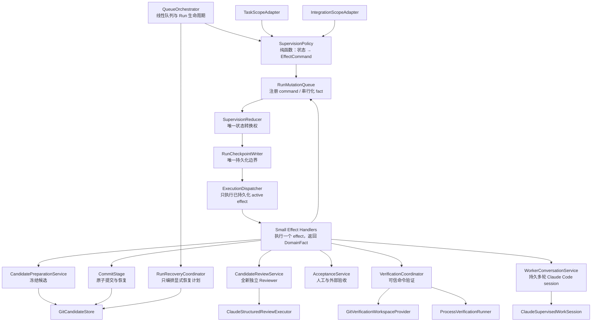

# Apex Coding Agent 监督式执行循环改造规格

## 0. 文档状态

- 文档性质：目标架构与实施规格
- 适用仓库：`apex-coding-agent`
- 目标状态版本：`RunState v7`
- 兼容策略：破坏式升级，不读取、不迁移、不恢复 v6 或更早状态，不复用旧协议完成证据
- 核心决策：保留确定性状态机、checkpoint、Git 锁、候选指纹、隔离引用和原子提交；替换一次性 Worker 执行层，建立持久多轮 Claude Code 会话、可信验证、独立审核、人工输入和全局验收闭环
- 实施就绪条件：第 21 节“阶段 0”的状态聚合、候选物化、Sandbox、平台 Runner、依赖供应和 artifact 生命周期技术验证全部通过后，才允许进入业务实现

本文是自包含实现契约。实施者不得依赖聊天记录解释本文未写明的行为。

## 1. 结论摘要

改造后的系统必须明确分成两部分：

1. 确定性控制面：继续由 Apex 掌握 Run/TASK 状态、checkpoint、资源所有权、Git 基线、候选冻结、验证证据、审核决策、人工验收、提交与恢复。
2. Claude Code 会话数据面：一个 TASK 默认绑定一个可持续多轮的 Worker session。实现反馈、验证失败、Reviewer finding 和人工反馈都作为同一 session 的后续 turn 继续发送，而不是普通失败就新建一个失忆的 repair session。

系统的完成语义必须从：

> Worker 声称完成，Reviewer 静态认可，随后提交。

升级为：

> 最终候选已冻结；规定的自动验证由宿主真实执行并通过；独立 Reviewer 审核了同一候选和同一组证据；全部必要人工或外部验收已经明确签收；Git 提交绑定完整完成证书；最后又通过全项目集成验收。

`@anthropic-ai/claude-agent-sdk` 继续作为唯一 Claude Code 执行适配器。本次改造不新增“SDK 路径”和“控制台 subprocess 路径”两套执行逻辑。

## 2. 当前代码基线与问题定位

### 2.1 必须保留的现有能力

下列现有设计已经形成可靠控制面，改造时不得重写成隐式流程：

| 能力 | 当前实现 | 保留要求 |
| --- | --- | --- |
| 严格线性队列 | `src/application/queue-orchestrator.ts:331` | 继续只开放第一个未完成 TASK；不引入 DAG 或 TASK 并发 |
| 单一 checkpoint 写边界 | `src/application/run-checkpoint-writer.ts:22` | 所有持久状态继续先通过 Schema 和语义不变量校验 |
| 项目契约冻结 | `src/infrastructure/tasks/file-project-repository.ts` | SPEC、TASK 集合、顺序和哈希仍是恢复前置事实 |
| Git worktree 锁与项目隔离 | `src/ports/workspace.ts:62` | 同一 worktree 仍只允许一个 Run 修改 HEAD、索引和工作树 |
| 候选内容指纹 | `src/infrastructure/git/git-candidate-store.ts:31` | 指纹继续覆盖 tracked、untracked、deleted、文件模式和内容哈希 |
| 审核与提交同候选 | `src/infrastructure/git/git-candidate-store.ts:92` | Review、Verification、Acceptance、Commit 都必须绑定同一个候选指纹 |
| Git 原子提交与崩溃恢复 | `src/application/commit-stage.ts:41` | 保留 expected HEAD、提交 trailer、提交成功但状态未落盘的恢复 |
| 终态候选隔离 | `src/infrastructure/git/git-candidate-quarantine.ts:23` | 仅在 repo/branch/HEAD 基线可信时归档并清理；Git 基线冲突必须零 Git 写入并原地保留现场 |
| 模型初始化握手 | `src/infrastructure/claude/claude-agent-sdk-executor.ts:172` | 每个 session epoch 仍在接受工具事实前核验实际模型并 checkpoint |
| Worker/Reviewer 权限隔离 | `src/infrastructure/claude/claude-agent-options-builder.ts:113` | Worker 和 Reviewer 继续使用不同能力配置，Reviewer 不得编辑候选 |

### 2.2 当前执行层的结构性缺口

当前执行抽象是一次性 `AgentExecutor.run(prompt: string)`：`src/ports/agent-executor.ts:16-40`。`ImplementationStage` 将一次 SDK query 同时解释为实现、修复、恢复和最终完成：`src/application/implementation-stage.ts:125-333`。Reviewer 驳回后，系统通常创建新的 repair session，只有进程中断恢复才继续原 session。

这产生以下质量上限：

1. 普通 Reviewer 反馈不能进入同一 Worker 对话，前序推理和工具上下文被丢失。
2. Worker 被 `outputFormat` 强制在单次 query 末尾宣布 TASK 终态，无法像 Claude Code 控制台一样自然进行多轮推进与 steering。
3. `verifications` 是 Worker 自报 JSON：`src/domain/agent-result.ts:10-23`。它没有工具调用 ID、真实退出码、输出摘要哈希、执行时间或候选指纹。
4. `completed` 允许空验证数组，应用层只阻止显式自报 `failed`：`src/application/implementation-stage.ts:214-270`。
5. Reviewer 只有 `Read/Glob/Grep`，不能独立执行验证：`src/infrastructure/claude/claude-agent-options-builder.ts:135-155`。
6. Reviewer findings、blockingQuestions、原始决策和 Worker 完整结果没有全部持久化；恢复和审计依赖摘要字符串。
7. Reviewer `approved` 可以直接进入 `committing`：`src/application/review-stage.ts:228-237`。人工验收只在 Run 结束后生成通用未勾选清单：`src/application/run-artifact-writer.ts:28-43`。
8. 固定 Worker/Reviewer/TASK 预算会把资源耗尽转成 blocked：`src/application/orchestrator-policy.ts:3-24`、`src/application/task-stage-support.ts:20-39`。这把运行策略误当成任务不可能完成的事实。
9. 全部 TASK 提交后没有跨 TASK 的完整系统审核、干净 checkout 验证或最终产品验收。
10. 当前源码仍包含旧版 Worker blocked 迁移逻辑：`src/domain/run-state.ts:380-459`、`src/application/queue-orchestrator.ts:304-329`，与全新系统约束冲突。

### 2.3 SDK 已具备但当前封装未使用的能力

当前锁定的 `@anthropic-ai/claude-agent-sdk@0.3.212`（内嵌 Claude Code 2.1.212）已提供：

- `prompt: string | AsyncIterable<SDKUserMessage>`；
- `Query.streamInput()` 与 `Query.interrupt()`；
- session `resume`、调用方指定的 user message UUID 和 session 历史读取；
- `PreToolUse` defer、`tool_deferred` / `deferred_tool_use`、`canUseTool`、permission request、hook、MCP elicitation 和 user dialog；
- 完整 Claude Code tools、skills、MCP、subagent 与项目设置；
- 子 Agent 文本转发、上下文使用量、模型与权限模式控制；
- `session_state_changed: idle`、后台任务变更、task 生命周期事件和 interrupt receipt。

这些能力的边界也必须按 SDK 真实契约实现：user message UUID 不是 SDK 去重承诺，`canUseTool` Promise 和 dialog/elicitation callback 不能跨进程持久化，`Query.backgroundTasks()` 不是状态查询，公开 Query API 也不存在 `compact()`。

因此，目标不是换掉 SDK，而是停止用“一次 prompt → 一个 TASK 终态”的端口压缩这些能力，同时不虚构 SDK 没有提供的 exactly-once、可重连 callback 或主动 compact 能力。

### 2.4 `china-map-3d/orchestration` 实证约束

本规格使用 `C:\code\ai-opc\china-map-3d\orchestration` 的完整长任务作为反例样本，而不是只做抽象设计。当前结果中：

1. 23 个 TASK 均已形成完成提交，但政治数据人工审核仍为 pending 时，涉及该要求的 TASK-006、TASK-015、TASK-019 已经能够提交。
2. TASK-023 对 4K/目标硬件性能有完成语义，但没有目标设备上的正式测量 evidence，仍能进入完成。
3. 在干净 Windows checkout 中，测试和资源 provenance 校验出现 5 个失败；同一内容按 LF 归一化后可以匹配，说明原流程没有证明 checkout/换行可移植性。
4. Run 结束后生成的通用人工清单不是提交门禁，无法阻止“自动流程已 completed、人工事项仍未执行”。

因此，本文的 requirement coverage、mandatory platform clean materialization、结构化人工 evidence、规范哈希和 Run 级集成证书都属于完成语义的必要条件，不是可选增强。

## 3. 系统目标

### 3.1 功能目标

1. 一个 TASK 默认只有一个逻辑 Worker session，并可跨多个监督 turn、进程 epoch 和 `resume` 延续。
2. Worker 可以自然使用 Claude Code 原生工具、skills、MCP 和 subagent，但不得获得 Git 历史、提交或远端写权限。
3. 系统可以自动把客观验证失败、Reviewer findings 和人工拒绝反馈发送回同一 Worker session。
4. Worker、Reviewer 或验收器需要外部事实时，系统建立可持久化、可回答、可恢复的输入请求，不再把自然语言问题直接变成终态 blocked。
5. 自动验证必须由宿主 VerificationRunner 真实执行，并绑定最终候选指纹。
6. Reviewer 必须审核验收条款、最终候选和真实证据覆盖矩阵，而不是只审核 diff 与实现者自报摘要。
7. 必要的人工、视觉、性能、政治数据或外部事实验收必须在 TASK 或 Run 完成之前得到显式结果。
8. 全部 TASK 完成后必须进入 Run 级集成验收循环；发现问题时允许产生受相同 Git 规则保护的集成修复提交。
9. 任意进程中断后，系统能从持久事实恢复；确定性控制面副作用保持幂等，存在送达歧义的 Agent turn 必须先对账，不能盲目重发；验证执行允许在隔离环境中安全重跑。

### 3.2 质量目标

- 完成判定不信任任何单个 Agent 的自我声明。
- 每条必要验收标准都能追踪到自动证据、静态审核结论或人工签收。
- 所有完成证据与候选内容、任务契约、前驱提交和模型会话身份可核验绑定。
- 状态流、数据流和恢复流均可由当前持久状态唯一推导。
- 模块按领域职责拆分，不构造新的巨型 Stage、Executor 或 PromptBuilder。

## 4. 非目标

1. 不引入 DAG、并行 TASK 或多个写 Worker 同时操作一个 worktree。
2. 不让 Claude 执行 `git commit`、`reset`、`checkout`、`stash`、`push`、修改引用或其他 Git 所有权操作。
3. 不自动部署、不执行不可逆外部写操作。
4. 不自动启动浏览器、Playwright、Puppeteer、Cypress、开发服务器或 watch 进程。UI 和视觉结果由操作者手工验证，再通过正式输入协议回填。
5. 不把 Claude 完整 transcript 或无限工具输出复制进 `state.json`；完整 transcript 继续由 Claude session persistence 持有。
6. 不保留 one-shot Worker 作为 fallback，不保留 v6 迁移器、feature flag、灰度路径或 deprecated 类型。
7. 不允许项目 TASK 覆盖 Git 所有权、安全硬边界或伪造验证证据。

## 5. 不可破坏的系统不变量

### 5.1 队列不变量

1. TASK 顺序只来自经校验的数字编号目录。
2. 任意时刻最多一个 TASK 处于活动、等待输入或暂停状态。
3. 已完成 TASK 必须形成连续前缀；未开放后继只能是 `pending`。
4. 当前 TASK 未完成前不得执行后继 TASK。
5. 全部 TASK 完成只代表进入 Run 级集成验收，不代表 Run 已完成。

### 5.2 状态与证据不变量

1. `RunCheckpointWriter` 是 RunState 唯一写边界。
2. 每个控制面外部事实先形成可恢复意图 checkpoint，再执行副作用，随后保存结果 checkpoint。Git 提交、归档和状态投影必须幂等；任意验证命令只承诺“隔离、可终止、可安全重跑”，不承诺进程副作用 exactly-once。
3. Worker claim 只能提供建议、摘要和验证计划，不能直接成为通过证据。
4. 自动验证通过必须来自系统 VerificationRunner。
5. Review、Acceptance 和 Commit 必须引用同一个 `CandidateIdentity`。
6. 候选内容发生任何变化后，旧 Verification、Review 和 Acceptance 全部失效，只保留历史审计记录。
7. `blocked` 只能来自操作者确认的真实不可继续条件；预算、超时、认证或可修复代码问题不得写成 blocked。
8. `completed` 必须带有可验证的 Git 提交、完成证书和完整 CompletionEvidenceBundle。
9. 所有可变交互状态只存在于 RunState，并且只能由 `RunCheckpointWriter` 更新；交互正文和附件是不可变 artifact，不得形成第二个状态源。
10. 只有 `SupervisionReducer` 可以把 EffectCommand/DomainFact 转换为新 RunState；Policy 只计划下一项 effect，command 必须先注册并 checkpoint，handler 只执行一个已持久化 effect 并返回事实，Dispatcher、Coordinator、SDK adapter、Git adapter 和 ArtifactStore 均不得直接构造状态转换。
11. 所有来自 SDK stream、Hook、MCP control report、Verification process 和 CLI response 的并发事实必须先进入单写者 `RunMutationQueue`，按 `RunState.revision` 串行归约；过期 command 必须重新计划，晚到 fact 必须按稳定对象身份判定为已包含、单调可归约、陈旧或冲突，禁止 last-write-wins。

### 5.3 Git 不变量

1. Agent 永远不能修改 HEAD、索引、引用、历史或远端。
2. VerificationRunner 不得静默修改候选；执行前后必须复核候选指纹。
3. 暂停或等待输入时，只有 repo、branch、HEAD、index 与完整 worktree 指纹均和 checkpoint 的 GitWorkspaceIdentity 匹配，才允许把当前草稿归档并清理主工作区。
4. `workspace_conflict`、分支/HEAD/index/worktree 漂移时禁止创建/修改归档引用、提交对象、target ref 或主 index，禁止清理工作区、checkout/reset/stash；系统原地保留现场并进入 `paused`，由操作者先恢复可信基线。
5. 可归档暂停的恢复顺序始终是：校验项目和仓库身份 → committing 时只读识别精确提交事实和 phase 端点 → 对任何未完成提交写入执行 phase-specific 完整 workspace guard → 校验普通 branch/HEAD/index/worktree 基线 → 恢复归档 → 重新冻结稳定身份 → checkpoint → 消费旧引用。
6. 提交成功但 checkpoint 失败时，仍通过精确 parent、candidate fingerprint 和 trailer 恢复，不能重新执行 Worker、验证或 Reviewer。
7. 提交事务不得把主 index 暴露为“已暂存、commit 尚未建立”的中间态；tree 构造只能使用产品临时 index，ref 更新和主 index 归一化分别执行显式 compare-and-swap。

## 6. 目标分层架构



### 6.1 确定性控制面

控制面包括：

- `QueueOrchestrator`：Run 创建、恢复、锁、严格队列和 phase 推进；
- `ExecutionDispatcher`：只读取已经通过 reducer/checkpoint 注册的 `activeEffect` 并调用一个小型 effect handler，不直接执行 Policy 的内存返回值，不持有业务转换规则；
- `SupervisionPolicy`：scope-neutral 纯函数，只依据当前状态计划下一项 `EffectCommand`，不执行副作用、不修改状态；
- `SupervisionReducer`：scope-neutral 纯 reducer，是唯一状态转换权威；它把已校验的 `DomainFact` 归约为新 RunState，并拒绝非法 revision、阶段和候选身份；
- `TaskScopeAdapter` / `IntegrationScopeAdapter`：只编译各自契约和 scope 身份，不复制监督流程；
- `RunMutationQueue`：把来自 stream、Hook、MCP、进程和 CLI 的并发事实串行化，并在 reducer 前核验 expected revision；
- `RunCheckpointWriter`：唯一持久化边界；
- `CommitStage`：TASK 与 Integration scope 共用的唯一 Git 提交入口；
- `RunRecoveryCoordinator`：按恢复计划编排只读校验、提交恢复、session 对账、归档恢复和证据校验；不实现任何子领域逻辑。

每个 effect handler 只执行一个外部 effect，可以使用 `RunMutationQueue` 在 effect 前后提交意图事实和结果事实，但不得自行选择下一阶段或直接拼装 RunState。禁止让 Dispatcher、Coordinator 或 scope adapter 组合完整 Worker→Verification→Review→Acceptance→Commit 链路，避免重新形成巨型 `TaskExecutionService`。

### 6.2 Claude Code 会话数据面

会话数据面包括：

- `WorkSessionFactory` / `WorkSession`：多轮写 Worker；
- `StructuredReviewer`：一次性、全新、结构化只读 Reviewer；
- `SessionHistoryInspector`：按 sessionId 和 UUID 提供 transcript 观察事实；它不能单独证明 turn 完成或提供 SDK 去重；
- `AgentProtocolProjector`：可靠投影 init、result、idle、background/task、deferred 和 interrupt 等控制事实；
- `AgentEventSink`：实时展示文本、工具、subagent、compact、usage 等非权威旁路事件；
- `AgentControlServer`：Worker 向控制面提交结构化 turn 报告的进程内 MCP，不拥有状态转换权。

应用层不得引用 SDK 的 `Query`、`SDKMessage`、Hook 或 PermissionResult 类型。AgentEventSink 失败不能改变业务结果；AgentProtocolProjector 缺失关键事件则必须进入协议对账或暂停，不能继续冻结候选。

### 6.3 唯一状态流协议

监督内核固定采用以下数据流，不允许出现第二套阶段判断：

```text
RunState(revision=N, activeEffect=none)
  → SupervisionPolicy.plan
  → EffectCommand(expectedRevision=N)
  → RunMutationQueue 串行化
  → SupervisionReducer.registerCommand
  → RunState(revision=N+1, activeEffect=planned)
  → RunCheckpointWriter
  → ExecutionDispatcher 读取已持久化 activeEffect
  → 一个 EffectHandler 执行副作用
  → DomainFact(observedRevision=N+1)
  → RunMutationQueue 串行化
  → SupervisionReducer.reduceFact
  → RunState(revision=N+2)
  → RunCheckpointWriter
```

```ts
/*
 * EffectCommand 只描述下一项允许执行的副作用，不携带可由状态重新推导的隐式阶段。
 * DomainFact 只表达已经观察到的事实；只有 reducer 可以据此产生下一版状态。
 */
interface EffectCommand {
  readonly id: string;
  readonly ownerScopeId: string;
  readonly expectedRevision: number;
  readonly kind: SupervisionEffectKind;
  readonly payloadRef: string;
}

interface DomainFact {
  readonly id: string;
  readonly causationId: string;
  readonly ownerScopeId: string;
  readonly observedRevision: number;
  readonly kind: SupervisionFactKind;
  readonly payloadRef: string;
  readonly observedAt: string;
}

type SupervisionEffectKind =
  | "open_worker_epoch"
  | "send_worker_turn"
  | "interrupt_worker_session"
  | "capture_candidate"
  | "start_verification"
  | "collect_verification_result"
  | "interrupt_verification"
  | "start_candidate_review"
  | "collect_candidate_review_result"
  | "interrupt_candidate_review"
  | "start_advisory_review"
  | "collect_advisory_review_result"
  | "interrupt_advisory_review"
  | "prepare_operator_request"
  | "preserve_workspace"
  | "restore_workspace"
  | "advance_commit_transaction"
  | "release_workspace_lease"
  | "finalize_artifacts";

type SupervisionFactKind =
  | "worker_epoch_initialized"
  | "worker_turn_observed"
  | "worker_session_interrupted"
  | "candidate_captured"
  | "verification_started"
  | "verification_completed"
  | "verification_interrupted"
  | "candidate_review_started"
  | "candidate_review_completed"
  | "candidate_review_interrupted"
  | "advisory_review_started"
  | "advisory_review_completed"
  | "advisory_review_interrupted"
  | "operator_request_prepared"
  | "workspace_preserved"
  | "workspace_restored"
  | "commit_phase_observed"
  | "workspace_lease_released"
  | "artifact_manifest_observed"
  | "effect_failed";
```

同一个 command 因崩溃重入时必须产生相同 commandId。任何 handler 只能执行已经作为 `activeEffect=planned` 成功 checkpoint 的 command，禁止拿 Policy 的内存返回值直接做副作用。handler 先检查是否已有匹配的不可变 result fact；已有则投影该事实，没有才执行副作用。

EffectCommand 的 expectedRevision 必须精确等于当前 revision。DomainFact 使用 observedRevision，因为 SDK stream、Hook 和进程结束通知可能在状态已因其他事实前进后到达；`causationId` 必须指向 commandId 或已经持久化的 session/process subscription id。RunMutationQueue 串行提交事实，Reducer 再按 ownerScopeId、session/epoch/turn、attempt/lease ID 和事实 hash 判断其为：

- 当前事实：合法归约并令 revision +1；
- 已包含事实：幂等忽略，不写新 checkpoint；
- 可晚到的单调事实：在不覆盖较新字段的前提下归约；
- 陈旧或冲突事实：保存审计 artifact，转协议对账或拒绝。

任何晚到事实都不能清空较新集合、回退 lifecycle、替换候选或覆盖其他 revision 的 operator/commit 状态。

需要跨越 checkpoint 的长副作用必须拆成 phase-specific command。例如 Verification 先以 `start_verification` 建立受控进程并返回 processGroupId/started fact，checkpoint 为 running 后，再由 `collect_verification_result` 等待结果；Worker、Reviewer、Advisory 和 Verification 的 interrupt 都使用各自独立 command。禁止一个 handler 在未持久化进程身份的情况下从 spawn 一直阻塞到命令结束。Worker Query 同理由 `open_worker_epoch` 只负责建立 lease/init，后续 stream event 以 subscription causationId 进入 mutation queue。

## 7. TASK 验收契约

### 7.1 新契约要求

当前 TASK 正文中的自然语言“验证方式”和“完成标准”不足以形成确定性门禁。v7 要求每个 TASK 在固定章节中包含唯一的结构化验收契约。前置元数据仍只允许 `id` 和 `title`，验收契约位于正文，不允许通过额外项目配置覆盖。

规范格式：

~~~markdown
### 验收契约

```yaml
criteria:
  - id: AC-001
    requirementRefs: [REQ-BUILD-001]
    kind: command
    scope: full
    execution:
      kind: package_script
      packageManager: pnpm
      script: test
     args: []
     cwdRelative: .
     timeoutMs: 900000
     envProfile: project_test
     dependencyProfile: pnpm_frozen
    success: exit_code_zero
    allowNotApplicable: false
    description: 全量测试通过
  - id: AC-002
    requirementRefs: [REQ-ARCH-001]
    kind: static
    allowNotApplicable: false
    description: 新模块不能反向依赖基础设施层
  - id: AC-003
    requirementRefs: [REQ-UX-4K-001]
    kind: human
    description: 人工检查 4K 页面视觉结果和交互流畅度
    procedure:
      - 在目标设备以 3840x2160 打开规定页面
      - 按场景清单执行交互并采集帧时间
    expected:
      metric: frame_time_p95_ms
      operator: less_than_or_equal
      value: 16.7
    requiredEvidence:
      - environment_manifest
      - scenario_checklist
      - metric_samples
    responseSchema: performance_acceptance_v1
    allowNotApplicable: false
```
~~~

允许的 `kind`：

- `command`：由 VerificationRunner 执行；
- `static`：由独立 Reviewer 逐条给出 disposition；
- `human`：由操作者按规定 procedure 提供验收决定和必需证据；
- `external`：依赖项目外事实、凭据已就绪声明、合规结论或不可逆产品决策。

criterion 的规范键为 `task:<TASK-ID>/<criterion-id>` 或 `integration/<criterion-id>`；任何 evidence、finding、acceptance 和 certificate 只保存规范键，禁止保存会跨 TASK 冲突的裸 ID。`validate` 必须在 Agent 启动前严格拒绝缺少验收契约、未知 kind、局部或规范键重复、空描述、未知 requirement、非法执行描述或必要字段缺失。不存在旧正文推测、自动补全或宽松 fallback。

`command` 不接受 raw shell 字符串。执行描述只允许：

- `package_script`：显式 package manager、script、参数数组、项目内相对 cwd、timeout、宿主拥有的 env profile 和 dependency profile；
- `argv`：显式 executable 与参数数组，其中 executable 必须在宿主安全 allowlist 中。

参数不得包含 shell 拼接语义，Runner 不经 shell 解析。`scope` 只允许 `targeted`、`full` 或 `clean_platform`；`success` 初始只允许 `exit_code_zero`。`envProfile`、`dependencyProfile`、package manager 和 executable 都必须引用 Run 启动时冻结的宿主 `HostExecutionPolicySnapshot` 中已有的稳定 ID，TASK/SPEC 不得定义或覆盖其实现。`allowNotApplicable` 默认且通常为 `false`；只有契约显式设为 `true` 时 Reviewer 才能给出带理由的 `not_applicable`。

`human` / `external` 必须包含 `procedure`、机器可判定或结构化的 `expected`、非空 `requiredEvidence` 和版本化 `responseSchema`。AcceptanceService 必须按 Schema 校验内容和附件：

- 性能验收至少要求设备/OS/架构/运行时环境清单、场景清单、原始样本或分布统计及阈值比较结果；
- 政治或合规数据验收至少要求逐项审核清单、数据来源/provenance、审核身份或角色声明及不可变附件哈希；
- 视觉验收至少要求场景与 viewport 清单、逐项结果和契约要求的截图/录屏引用；
- 单独一个 `approve: true`、自由文本“看起来正常”或缺失 required evidence 永远不能满足 criterion。

### 7.2 项目级集成契约

`orchestration/SPEC.md` 必须定义稳定的 `requirements`、`supportedPlatformMatrix` 和同构的 `integrationCriteria`，至少覆盖：

- 项目可用的完整 lint、typecheck、test、build 门禁；
- 跨模块架构和数据流验收；
- 干净 checkout 或等价可移植性验证；
- 项目要求的性能、视觉、数据来源和人工验收。

每条 requirement 还必须声明最低证据强度，例如：

```yaml
requirements:
  - id: REQ-UX-4K-001
    mandatory: true
    evidencePolicy:
      allowedCriterionKinds: [human]
      requiredPlatformIds: [windows-4k-target-gpu]
      requiredResponseSchemas: [performance_acceptance_v1]
      requiredEvidence:
        - environment_manifest
        - scenario_checklist
        - metric_samples
      finalCandidateRequired: true
```

每条 TASK/integration criterion 必须通过 `requirementRefs` 引用存在的 SPEC requirement。`RequirementCoverageValidator` 不只计算“是否被引用”，还必须证明 criterion kind、platformId、responseSchema、requiredEvidence 和 final-candidate policy 满足 requirement 的最低强度；错误 kind、弱证据或其他平台不能冒充覆盖。

每条 mandatory requirement 都必须至少有一个 integration criterion。TASK criterion 只证明里程碑候选，不足以证明最终 Run；集成阶段必须在 `finalCandidate` 上重新执行、复审或人工签收所有 mandatory requirement，并生成 requirement→final evidence 矩阵。

`supportedPlatformMatrix` 为每个目标声明稳定 platformId、OS、架构、runtime/toolchain、包管理器和换行策略。`clean_platform` evidence 必须记录实际环境并与 platformId 完整匹配；当前宿主的结果不能替代其他目标平台。

平台能力必须遵守以下强度规则：

1. `command` criterion 只能由与目标 platformId 匹配的受信 Local/Remote VerificationRunner 生成 `system_verification`；human/external 回答永远不能冒充命令退出码。
2. Run 启动前，`HostCapabilityValidator` 必须证明每个 mandatory command/platform 组合都有可用 RunnerCapability、SandboxCapability、env profile 和 dependency profile。缺失时 `validate` 失败；已经创建的 Run 进入 `paused/configuration`，等待操作者配置能力，不能创建一个可批准的人工替代请求。
3. 只有 requirement 的 evidencePolicy 显式允许 `human` 或 `external` 时，才可以用对应 criterion 满足该 requirement；这类证据仍不能满足另一个 command criterion。
4. Remote Runner 的结果必须经过宿主注册的信任通道校验，至少绑定 runnerId、policy snapshot hash、request nonce、CandidateIdentity、platformId、record hash 和签名/受认证传输身份。任一绑定缺失时只作为外部附件，不属于 `system_verification`。
5. 新 Run 即使复用了全部 TASK 完成提交，也必须重新检查当前 Host capability，并重新执行集成契约、requirement coverage 校验和 final-candidate evidence。

`HostExecutionPolicySnapshot` 是产品级只读输入，由 composition root 从宿主配置编译并在 Run 创建时计算规范哈希。项目文档只能引用其中的 ID，不能通过 TASK、SPEC、项目 settings、skill、MCP 或 CLI 参数扩大 executable、网络、凭据、平台和 Sandbox 权限。

## 8. RunState v7

### 8.1 顶层状态

```ts
type RunStatus =
  | "running"
  | "awaiting_input"
  | "paused"
  | "completed"
  | "blocked"
  | "failed";

type RunPhase =
  | "task_execution"
  | "integration_acceptance"
  | "artifact_finalization";
```

v7 的完整顶层聚合固定如下。后文定义的 session、candidate、verification、review、acceptance、interaction、lease 和 commit 对象只能通过这些字段进入状态，不允许基础设施层追加未声明的旁路状态文件：

```ts
/*
 * RunState 是一个带 revision 的完整聚合。所有状态 Schema 必须 strict，
 * artifact hash 指向不可变内容；正文、完整输出和历史明细不直接内嵌。
 */
interface RunState {
  readonly version: 7;
  readonly revision: number;
  readonly runId: string;
  readonly status: RunStatus;
  readonly phase: RunPhase;
  readonly activeScopeId?: string;
  readonly contract: RunContractIdentity;
  readonly projectRoot: string;
  readonly workspace: RunWorkspaceState;
  readonly reservation: DurableWorkspaceReservation;
  readonly taskOrder: readonly string[];
  readonly tasks: Readonly<Record<string, TaskRunState>>;
  readonly integration: IntegrationAcceptanceState;
  readonly activeEffect?: ActiveEffectState;
  readonly activeRequest?: DurableOperatorRequest;
  readonly pause?: PauseState;
  readonly preservation?: WorkspacePreservationIntent;
  readonly workspaceLeases: readonly CandidateWorkspaceLease[];
  readonly activeWorkspaceCheckpoint?: ActiveWorkspaceCheckpoint;
  readonly artifactRoots: ArtifactRootState;
  readonly finalization: ArtifactFinalizationState;
  readonly createdAt: string;
  readonly updatedAt: string;
}

interface RunContractIdentity {
  readonly projectHash: string;
  readonly specSourceHash: string;
  readonly specContractHash: string;
  readonly taskSetHash: string;
  readonly requirementSetHash: string;
  readonly platformMatrixHash: string;
  readonly hostExecutionPolicyHash: string;
}

interface RunWorkspaceState {
  readonly repositoryRoot: string;
  readonly projectPrefix: string;
  readonly branch: string;
  readonly targetRef: string;
  readonly expectedHead: string;
}

interface DurableWorkspaceReservation {
  readonly repositoryRoot: string;
  readonly projectPrefix: string;
  readonly branch: string;
  readonly ownerRunId: string;
  readonly state: "active" | "released";
}

interface TaskRunState {
  readonly scopeId: string;
  readonly taskId: string;
  readonly status: TaskStatus;
  readonly taskContractHash: string;
  readonly supervision: SupervisionState;
  readonly completionCertificateHash?: string;
  readonly completionEvidenceBundleHash?: string;
  readonly commitSha?: string;
  readonly updatedAt: string;
}

interface IntegrationAcceptanceState {
  readonly scopeId: "integration";
  readonly status: TaskStatus;
  readonly integrationContractHash: string;
  readonly supervision: SupervisionState;
  readonly completionCertificateHash?: string;
  readonly completionEvidenceBundleHash?: string;
  readonly commitSha?: string;
  readonly updatedAt: string;
}

/*
 * SupervisionState 只保留恢复当前阶段所需的活跃对象和有界历史索引。
 * 完整历史由对应 manifest artifact 持有，避免长任务让 state.json 无限增长。
 */
interface SupervisionState {
  readonly stage: TaskStatus;
  readonly activeWorkerSession?: WorkerSessionState;
  readonly workerSessionHistoryManifestHash?: string;
  readonly candidate?: CandidateCapture;
  readonly activeVerificationAttempt?: VerificationAttempt;
  readonly verificationHistoryManifestHash?: string;
  readonly activeReviewAttempt?: ReviewAttemptState;
  readonly reviewHistoryManifestHash?: string;
  readonly activeAdvisoryAttempt?: AdvisoryAgentAttemptState;
  readonly advisoryHistoryManifestHash?: string;
  readonly acceptance: ScopeAcceptanceState;
  readonly commitTransaction?: CommitTransactionState;
  readonly staleEvidenceManifestHash?: string;
  readonly currentRiskLedgerHash?: string;
}

interface ReviewAttemptState {
  readonly id: string;
  readonly ordinal: number;
  readonly kind: "candidate_review";
  readonly state: "queued" | "running" | "completed" | "interrupted";
  readonly candidate: CandidateIdentity;
  readonly verificationSetHash: string;
  readonly requestArtifactHash: string;
  readonly processLease: AgentProcessLeaseState;
  readonly executionId?: string;
  readonly sessionId?: string;
  readonly requestedModel: string;
  readonly resolvedModel?: string;
  readonly rawResultArtifactHash?: string;
  readonly normalizedResultArtifactHash?: string;
  readonly startedAt?: string;
  readonly finishedAt?: string;
}

interface AdvisoryAgentAttemptState {
  readonly id: string;
  readonly ordinal: number;
  readonly kind: "diagnostic" | "blocker_audit";
  readonly state: "queued" | "running" | "completed" | "interrupted";
  readonly inputArtifactHash: string;
  readonly processLease: AgentProcessLeaseState;
  readonly executionId?: string;
  readonly sessionId?: string;
  readonly requestedModel: string;
  readonly resolvedModel?: string;
  readonly resultArtifactHash?: string;
  readonly startedAt?: string;
  readonly finishedAt?: string;
}

interface ScopeAcceptanceState {
  readonly pendingCriterionKeys: readonly string[];
  readonly decisionManifestHash?: string;
  readonly activeCriterionKey?: string;
}

interface ActiveEffectState {
  readonly command: EffectCommand;
  readonly state: "planned";
}

interface ArtifactRootState {
  readonly scopeHistoryManifestHashes: readonly string[];
  readonly activeReceiptHashes: readonly string[];
  readonly finalManifestHash?: string;
}

interface ArtifactFinalizationState {
  readonly state: "not_started" | "writing" | "manifest_ready" | "completed";
  readonly manifestHash?: string;
}
```

`RunState.revision` 从 1 开始，每次 reducer 成功归约恰好加一。`status`、TASK `status`、Integration `status` 和 `supervision.stage` 是持久化查询投影，但必须分别等于 `deriveRunStatus` 与 `deriveScopeStatus` 的结果；任何不一致都属于损坏状态，不能以“较新的字段”为准猜测修复。

同一 repositoryRoot/projectPrefix/branch 上只允许一个 reservation 为 active 的非终态 Run。`awaiting_input` 或 `paused` 可以释放 OS 文件锁，但不得释放 durable reservation；新 Run 必须扫描同一项目状态目录并拒绝抢占。只有原 Run 完成、进入合法终态并完成候选 preservation，或操作者先通过正式输入把它收敛为终态后，reservation 才能由 reducer 转为 released。

语义：

- `running`：驱动器可以继续自动推进；
- `awaiting_input`：存在一个尚未被恢复流程消费的正式人工请求；它可以仍未回答，也可以已回答但候选尚未恢复；
- `paused`：安全策略、认证、资源或基础设施需要操作者处理，但任务本身没有失败；
- `blocked`：操作者明确确认缺失条件当前无法提供，Run 不能继续；
- `failed`：当前状态仍可被 v7 Schema 解析，但存在已持久化证据证明契约不一致或不可恢复控制面错误；
- `completed`：TASK、集成验收、人工验收、完成证书和最终产物全部完成。

`RunStatus` 虽然持久化以便查询，但不是独立决策源；每次 checkpoint 必须满足 `status === deriveRunStatus(activeScope, durableRequest, pauseState, terminalFacts)`，派生优先级为 terminal → pause → interaction → running：

- 存在属于活动 scope 的 `PauseState` 时，scope/Run 必须为 `paused`；answered request 或 deferred dispatching 审计记录允许与 reconcile/workspace_conflict pause 共存，pause 优先；
- 不存在 PauseState 时，活动 scope 为 `awaiting_input` 当且仅当存在一个属于该 scope、状态为 `pending` 或 `answered` 的 `DurableOperatorRequest`，此时 Run 同为 `awaiting_input`；
- scope 为 `blocked` / `failed` 时 Run 必须同值；
- 只有 finalization manifest 完成时 Run 才能为 `completed`；
- 其余非终态均为 `running`。

恢复或 checkpoint 时发现双字段不满足上述 iff 关系，必须判定为状态损坏，禁止凭“较新的一个字段”猜测修复。若 `state.json` 本身无法通过 JSON、v7 Schema 或规范字段校验，系统不得覆盖原文件写成 `failed`；CLI 必须只读保留原文件、输出独立诊断并以失败退出。只有当前状态仍可解析且 reducer 能产生合法失败事实时，才允许持久化 `failed`。

第一次 SIGINT 在 interrupt receipt、outbox、quiescence 和 `before_unlock ActiveWorkspaceCheckpoint` 均能证明安全时，让 Run 保持 `running`；若仍有 `still_queued`、送达歧义或未对账磁盘写入，则进入 `paused/reconcile`。SIGINT 本身不等于任务失败。

### 8.2 TASK 状态

```ts
type TaskStatus =
  | "pending"
  | "executing"
  | "candidate_pending"
  | "verifying"
  | "reviewing"
  | "accepting"
  | "retry_pending"
  | "awaiting_input"
  | "paused"
  | "committing"
  | "completed"
  | "blocked"
  | "failed";
```

合法主路径：

```text
pending
  → executing
  → candidate_pending
  → verifying
  → reviewing
  → accepting
  → committing
  → completed
```

合法反馈路径：

```text
executing / verifying / reviewing / accepting
  → retry_pending
  → executing
```

合法人工路径：

```text
executing / verifying / reviewing / accepting
  → awaiting_input
  → 请求中受限的 resumeStage
```

合法暂停路径：

```text
executing / candidate_pending / verifying / reviewing / accepting / committing
  → paused
  → 恢复计划核验得到的 resumeStage
```

Reviewer 要求补充自动证据时允许 `reviewing → verifying`。候选漂移时允许 `verifying/reviewing/accepting → retry_pending`，旧证据全部标记 stale。`committing` 发现指纹变化时禁止直接回到 Worker：先按 CommitRecoveryService 检查提交是否已经成功；只有证明尚未产生提交，才能使证书和证据 stale 后回到 `retry_pending`。`completed`、`blocked`、`failed` 为终态。

`awaiting_input` 和 `paused` 都必须持久化 owner scope、进入前阶段、恢复阶段、候选 capture、archiveId 或 `workspace_conflict` 原地保留原因。`committing` 暂停只能以 `commit_recovery` 恢复，不能直接跳回 committing。不存在无恢复边的“泛化暂停”。

### 8.3 Worker session、epoch 与 turn

旧 `TaskAttemptState` 必须删除，以三个不同概念替代：

```ts
interface WorkerSessionState {
  readonly number: number;
  readonly sessionId: string;
  readonly requestedModel: string;
  readonly resolvedModel?: string;
  readonly status: "starting" | "active" | "closed";
  readonly createdAt: string;
  readonly closedAt?: string;
  readonly nextEpochNumber: number;
  readonly activeEpoch?: WorkerSessionEpochState;
  readonly epochHistoryManifestHash?: string;
  readonly nextTurnNumber: number;
  readonly activeTurn?: WorkerTurnState;
  readonly recentTurnRefs: readonly string[];
  readonly turnHistoryManifestHash?: string;
}

interface WorkerSessionEpochState {
  readonly number: number;
  readonly startedAt: string;
  readonly initializedAt?: string;
  readonly finishedAt?: string;
  readonly outcome?: "idle" | "interrupted" | "infrastructure_failed";
  readonly activity: SessionActivityState;
  readonly processLease: AgentProcessLeaseState;
}

interface SessionActivityState {
  readonly sessionState: "running" | "idle" | "requires_action" | "unknown";
  readonly backgroundTaskIds: readonly string[];
  readonly openTaskIds: readonly string[];
  readonly lastProjectedAt?: string;
}

/*
 * RunState 只持有产品生成的 leaseId 和可核验进程身份，不保存任意 OS handle。
 * 基础设施层把 leaseId 映射到私有 job/process-group 记录，并保证宿主崩溃后可终止或证明其已退出。
 */
interface AgentProcessLeaseState {
  readonly id: string;
  readonly controller: "windows_job" | "posix_process_group" | "remote_worker";
  readonly lifecycle: "allocating" | "running" | "stopping" | "stopped";
  readonly processId?: number;
  readonly processStartIdentity?: string;
  readonly remoteExecutionId?: string;
}

interface WorkerTurnState {
  readonly number: number;
  readonly turnId: string;
  readonly kind:
    | "initial"
    | "continue"
    | "verification_feedback"
    | "review_feedback"
    | "acceptance_feedback"
    | "operator_answer"
    | "compact_request"
    | "resume_instruction"
    | "handoff";
  readonly directiveRef: string;
  readonly directiveHash: string;
  readonly status:
    | "queued"
    | "send_started"
    | "delivered"
    | "completed"
    | "interrupted"
    | "ambiguous";
  readonly queuedAt: string;
  readonly sendStartedAt?: string;
  readonly deliveredAt?: string;
  readonly completedAt?: string;
  readonly report?: WorkerTurnReportReceipt;
  readonly telemetry?: AgentTurnTelemetry;
}

interface WorkerTurnReportReceipt {
  readonly reportId: string;
  readonly reportArtifactHash: string;
  readonly receivedAt: string;
}

interface AgentTurnTelemetry {
  readonly inputTokens: number;
  readonly outputTokens: number;
  readonly cacheReadTokens: number;
  readonly cacheCreationTokens: number;
  readonly costUsd: number;
  readonly durationMs: number;
  readonly apiRetryCount: number;
  readonly apiRetryDelayMs: number;
  readonly toolCallCount: number;
  readonly contextUsageTokens?: number;
}
```

一个 TASK 默认只有一个 active Worker session，并且每个 session 最多一个 queued/in-flight user turn；上一个 turn 达到 result 已处理、session idle 且后台集合为空之前禁止 `send` 下一 turn。Reviewer rejected、验证失败和人工拒绝都追加 turn，不追加 session。

`background_tasks_changed` 是 CLI 进程/epoch 级 level state，SDK 启动时不会补发初始快照。每个新 epoch 在 init 前必须把该 epoch 的 backgroundTaskIds/openTaskIds 初始化为空、sessionState 设为 unknown，禁止复制旧 epoch 集合；创建新 epoch 前必须先对旧 epoch stop/close/reconcile。随后每个 background event 在当前 epoch 内按 replace-semantics 覆盖集合，不能跨 epoch 合并。SDK 的 `session_state_changed` 必须无损投影 `running | idle | requires_action`；`requires_action` 必须与 live callback 或 durable request 对账，不能折叠为 active/unknown 后继续冻结候选。

打开任何 Worker/Reviewer/Advisory Query 前必须先 checkpoint process lease 为 `allocating`；进程建立并获得 PID/start identity、OS job 或 remote execution identity 后 checkpoint `running`。正常 close/interrupt 先转 `stopping`，确认整个进程树退出后转 `stopped`。恢复时 `AgentProcessLeaseProvider` 必须按精确 leaseId 终止或查询遗留进程；无法证明旧进程不再写入时进入 `paused/reconcile`，禁止仅凭原 `Query` 对象已经丢失就启动新 Agent 进程。

`recentTurnRefs` 最多保存最近 32 个不可变摘要引用，active turn 单独保存；更早 turn 和已结束 epoch 追加到内容寻址 history manifest。`nextTurnNumber` / `nextEpochNumber` 与 manifest 尾项共同证明编号连续，不能依靠无限增长的内嵌数组。

只有以下情况允许关闭当前 session 并创建显式 handoff session：

- Claude transcript 无法恢复；
- 上下文已不可继续，自动 compact 或显式 `/compact` turn 并等待 compact boundary 后仍不能解决；
- session 协议损坏；
- 操作者明确要求换模型或重建上下文。

handoff 必须持久化原因、原 sessionId、候选身份、最新验证、findings、未完成标准和下一条指令。不能把“新建 repair session”作为普通重试策略。

### 8.4 Worker turn 报告

Worker 不再使用 query 级 `outputFormat` 宣布 TASK 终态。自然对话期间通过受控的进程内 `AgentControlServer` 提交：

```ts
interface WorkerTurnReport {
  readonly action: "continue" | "candidate_ready" | "request_input";
  readonly summary: string;
  readonly completedCriterionKeys: readonly string[];
  readonly verificationRequests: readonly VerificationRequest[];
  readonly openRisks: readonly RiskClaimInput[];
  readonly questions: readonly string[];
}

interface RiskClaimInput {
  readonly severity: "critical" | "high" | "medium" | "low" | "informational";
  readonly summary: string;
  readonly affectedRequirementIds: readonly string[];
  readonly evidenceRefs: readonly string[];
}

interface RiskClaim {
  readonly sourceRiskHash: string;
  readonly semanticHash: string;
  readonly source: "worker" | "reviewer" | "verification" | "operator";
  readonly sourceArtifactHash: string;
  readonly sourceOrdinal: number;
  readonly workspaceCheckpointHash: string;
  readonly candidate?: CandidateIdentity;
  readonly claim: RiskClaimInput;
}
```

该报告仍是 Worker claim。控制面保存 report artifact 后，根据 source artifact hash、ordinal、当前 ActiveWorkspaceCheckpoint hash 和规范 claim 计算 `sourceRiskHash`，追加到 Run 级 risk ledger；尚未冻结候选时 candidate 可以为空，但 workspace checkpoint 不能为空。后续 turn 省略风险不能把历史 claim 删除。控制面可以拒绝 `candidate_ready`、补充验证要求或把 `request_input` 送入独立阻塞审计。Worker 未提交报告而停止时，Supervisor 自动追加一条同 session turn，要求它在继续工作、送审和请求输入中明确选择，不从自由文本猜测状态。

AgentControl MCP 的输入 Schema 不接受 runId、scopeId、sessionId、turnId 或 reportId。宿主根据当前唯一 in-flight turn 计算：

```text
reportId = SHA-256(runId || scopeId || sessionId || turnId || "report:1")
```

每个普通 turn 只允许一个逻辑 report。handler 先把完整报告写入以 reportId 为确定性键的不可变 receipt artifact，再经 `RunMutationQueue` 提交 `WorkerTurnReportReceipt`；同 reportId、同内容重试幂等返回成功，同 reportId、不同内容必须拒绝为协议冲突。checkpoint 前崩溃时，恢复器只读取当前 turn 的确定性 receipt 路径并与 transcript/result 对账，不扫描宽泛 artifact 目录，也不把孤立的其他 report 自动接纳为状态。receipt 是不可变输入事实，不拥有阶段转换权，因此不构成第二个可变状态源。

### 8.5 CandidateIdentity

```ts
interface CandidateIdentity {
  readonly scopeId: string;
  readonly baselineTreeOid: string;
  readonly fingerprint: string;
  readonly projectedTreeOid: string;
}

interface CandidateCapture {
  readonly identity: CandidateIdentity;
  readonly manifestRef: string;
  readonly expectedHead: string;
  readonly capturedAt: string;
}

/*
 * CandidateManifest 是从 baseline tree 重建候选的唯一规范输入。
 * fingerprint 等于该 manifest 经过 strict Schema 与 JCS 规范化后的 SHA-256。
 */
interface CandidateManifest {
  readonly schemaVersion: 1;
  readonly scopeId: string;
  readonly baselineTreeOid: string;
  readonly projectedTreeOid: string;
  readonly entries: readonly CandidateManifestEntry[];
}

type CandidateManifestEntry =
  | {
      readonly path: string;
      readonly kind: "file" | "symlink";
      readonly gitMode: "100644" | "100755" | "120000";
      readonly contentHash: string;
      readonly contentArtifactRef: string;
    }
  | {
      readonly path: string;
      readonly kind: "deleted";
    };

interface GitWorkspaceIdentity {
  readonly head: string;
  readonly indexFingerprint: string;
  readonly worktreeFingerprint: string;
}

interface ActiveWorkspaceCheckpoint {
  readonly ownerScopeId: string;
  readonly epoch: number;
  readonly turnId?: string;
  readonly identity: GitWorkspaceIdentity;
  readonly observation:
    | "before_turn"
    | "after_tool"
    | "turn_quiescent"
    | "before_unlock";
  readonly sourceEventHash?: string;
  readonly capturedAt: string;
}
```

`CandidateIdentity` 只包含决定内容相等性的稳定字段。`baselineTreeOid` 和 `projectedTreeOid` 必须使用当前仓库对象格式的完整 Git OID，不能混用 SHA-1/SHA-256 或截断值。`fingerprint` 是 `CandidateManifest` 的规范 SHA-256；ArtifactStore 必须能按该 hash 读取 manifest，且 `CandidateCapture.manifestRef` 读取到的对象必须重算为同一 fingerprint。`capturedAt` 是观察元数据，`expectedHead` 是 Git 提交前置条件，二者都不得参与 identity equality。Verification、ReviewAttempt、AcceptanceDecision 和 CompletionCertificate 必须保存完整 `CandidateIdentity`；CommitState 额外保存 `CandidateCapture`。

manifest 只记录相对 baseline 发生变化的项目路径，按经过严格校验的仓库相对 POSIX 路径字节序排序；文件与符号链接内容先写入内容寻址 artifact，再引用 hash。`CandidatePreparationService` 必须使用产品临时 index 从 `expectedHead` 初始化，按 manifest 应用新增、修改和删除，执行 `write-tree` 得到 `projectedTreeOid`，再反向读取 tree 与 manifest 逐项核对。fingerprint、tree OID 或内容 artifact 任一不一致都拒绝冻结候选。由此，候选不是“只有摘要、无法恢复的声明”，而是可以从 baseline tree + manifest 确定性重建并验证的内容能力。

草稿阶段允许使用不进入证据链的 `DraftFingerprint` 做停滞检测；只有完成上述 manifest 与 tree 物化后才产生 `CandidateIdentity`。Verification、Review、Acceptance、Commit 和证书禁止引用 DraftFingerprint。

从归档恢复后重新捕获候选：manifest fingerprint、baselineTreeOid 和 projectedTreeOid 全部一致时，才可回到原 resume stage 并复用仍有效证据；identity 不同则所有旧证据 stale，并统一回到 `verifying` 或 `retry_pending`。HEAD/baseline 冲突不属于“相同候选”，必须走 `workspace_conflict` 暂停协议。

executing scope 还必须持久化最新 `ActiveWorkspaceCheckpoint`：每个 turn 前捕获 `before_turn`；每次可能写文件的工具在 PostToolUse/PostToolUseFailure 后捕获 `after_tool` 并绑定 source event；turn 通过 quiescence 后捕获 `turn_quiescent`；任何安全 SIGINT、进程退出或释放锁前必须先 quiesce，再捕获并 checkpoint `before_unlock`。捕获失败时不得安全退出并接纳当前草稿。

硬崩溃恢复在停止宿主进程后，将磁盘 GitWorkspaceIdentity 与最新 active checkpoint 对账。若存在无法由更晚 CandidateCapture、WorkspaceMutationManifest 或已 checkpoint 的 after_tool/quiescent observation 解释的差异，进入 `paused/reconcile`；不得把磁盘现状自动认作 Worker 结果，也不得自动清理。

### 8.6 DurableOperatorRequest 与 SDK 实时交互

```ts
type ResumeStage =
  | "executing"
  | "verifying"
  | "reviewing"
  | "accepting"
  | "integration_acceptance";

type PauseResumeStage = ResumeStage | "candidate_pending" | "commit_recovery";

interface DurableOperatorRequest {
  readonly id: string;
  readonly ownerScopeId: string;
  readonly kind:
    | "external_fact"
    | "manual_verification"
    | "permission"
    | "user_dialog"
    | "resource_decision"
    | "configuration";
  readonly sourceStage: "worker" | "verification" | "review" | "acceptance" | "integration";
  readonly resumeStage: ResumeStage;
  readonly status:
    | "preparing"
    | "pending"
    | "answered"
    | "decision_dispatching"
    | "effect_observed"
    | "denial_observed"
    | "consumed";
  readonly prompt: string;
  readonly requestHash: string;
  readonly candidate?: CandidateIdentity;
  readonly archiveId?: string;
  readonly manualWorkspaceLeaseId?: string;
  readonly deferredTool?: DeferredToolState;
  readonly responseRef?: string;
  readonly responseHash?: string;
  readonly createdAt: string;
  readonly answeredAt?: string;
  readonly consumedAt?: string;
}

interface DeferredToolState {
  readonly sessionId: string;
  readonly epoch: number;
  readonly toolUseId: string;
  readonly toolName: string;
  readonly inputHash: string;
  readonly safeInputRef: string;
  readonly decision?: "allow" | "deny";
  readonly updatedInputRef?: string;
  readonly dispatchAttempt?: number;
  readonly effectObservationRef?: string;
}

interface PauseState {
  readonly ownerScopeId: string;
  readonly reason:
    | "workspace_conflict"
    | "authentication"
    | "configuration"
    | "resource_unavailable"
    | "protocol"
    | "reconcile"
    | "infrastructure";
  readonly resumeStage: PauseResumeStage;
  readonly preservation: "archive" | "in_place";
  readonly candidate?: CandidateIdentity;
  readonly archiveId?: string;
  readonly expectedWorkspace: GitWorkspaceIdentity;
  readonly observedWorkspace: GitWorkspaceIdentity;
  readonly createdAt: string;
}

interface WorkspacePreservationIntent {
  readonly id: string;
  readonly ownerScopeId: string;
  readonly purpose: "awaiting_input" | "paused" | "blocked" | "failed";
  readonly requestId?: string;
  readonly resumeStage?: PauseResumeStage;
  readonly terminalTarget?: "blocked" | "failed";
  readonly candidateCapture: CandidateCapture;
  readonly archiveId: string;
  readonly state:
    | "preparing"
    | "archived"
    | "cleaning"
    | "workspace_clean"
    | "restoring"
    | "restored";
  readonly mutationManifestHash?: string;
  readonly expectedCleanWorkspace?: GitWorkspaceIdentity;
}

/*
 * Mutation manifest 完整描述一次 archive clean 或 restore 的 from/to 端点。
 * 路径内容通过 artifact hash 引用，index snapshot 也必须是内容寻址对象。
 */
interface WorkspaceMutationManifest {
  readonly schemaVersion: 1;
  readonly id: string;
  readonly ownerScopeId: string;
  readonly expectedHead: string;
  readonly direction: "clean" | "restore";
  readonly entries: readonly WorkspaceMutationEntry[];
  readonly fromIndexSnapshotHash: string;
  readonly toIndexSnapshotHash: string;
}

interface WorkspaceMutationEntry {
  readonly path: string;
  readonly from: WorkspacePathState;
  readonly to: WorkspacePathState;
}

type WorkspacePathState =
  | { readonly kind: "absent" }
  | {
      readonly kind: "file" | "symlink";
      readonly gitMode: "100644" | "100755" | "120000";
      readonly contentHash: string;
      readonly contentArtifactRef: string;
    };
```

`DurableOperatorRequest` 是唯一可跨进程等待的交互对象，同一 Run 最多一个未消费 request。`preparing` 表示 suspension 尚未安全完成，不触发 awaiting_input；归档、清理和 clean workspace identity 全部 checkpoint 后，才原子转 `pending + awaiting_input`。`respond` 只把 pending 变为 answered；普通回答进入目标阶段后才 consumed。deferred permission 必须经历 `answered → decision_dispatching → effect_observed/denial_observed → consumed`，不能把 hook 返回与工具副作用伪装成一个原子事务。工具输入中可能包含 secret 的完整内容不得写入状态；状态只保存安全摘要和哈希。凭据响应只记录“已配置并可重试”，不得持久化 token、密码或私钥。

`PauseState` 不表示正在等待一个可回答问题。除 `workspace_conflict` 必须 `in_place` 且禁止 archiveId 外，只有 Git 基线可信、已完成 archive 且同时保存 candidate/archiveId 的暂停才能使用 `preservation: "archive"`。恢复时必须先满足原因对应的外部条件，再按 `resumeStage` 转换。

`GitWorkspaceIdentity` 覆盖 HEAD、完整 index entries/stages/modes/blob IDs，以及工作树 tracked/untracked/deleted/mode/content 指纹。`WorkspacePreservationIntent`、归档后的预期 clean workspace 和所有 in-place pause 都必须保存该身份；只比较 HEAD 不足以授权 restore 或 clean。

`WorkspacePreservationIntent` 覆盖所有 archive purpose，而不只人工请求：`awaiting_input` 必须有 requestId + resumeStage；`paused` 必须有 resumeStage；`blocked/failed` 必须有 terminalTarget。任何 pause/terminal archive 都使用同一 preparing→archived→cleaning→workspace_clean→restoring→restored 与 CAS 协议。

归档清理和恢复使用内容寻址 `WorkspaceMutationManifest`。manifest 对每个路径记录 from/to 的存在性、mode、内容 hash，并记录 from/to index snapshot hash。任何多文件 mutation 前先 checkpoint `cleaning` 或 `restoring` 与 manifest hash。执行时先对整个 manifest 做只读 preflight：每个当前值必须等于 from（待写）或 to（已完成），index 也必须等于两端之一；出现第三值时本次恢复零新增写入并转 workspace_conflict。preflight 全部通过后才逐路径 CAS：等于 from 才写 to，等于 to 则跳过，最后原子替换已校验的 index。这样清理/恢复中途崩溃可以重入，也不会覆盖崩溃后用户新增的修改。

SDK 交互分成两类，禁止混用：

1. 持久 permission：`PreToolUse` 返回 `permissionDecision: "defer"`，SDK 以 `terminal_reason: "tool_deferred"` 和 `deferred_tool_use` 结束当前 turn；控制面据此创建带 `DeferredToolState` 的 durable request。恢复同一 session 后，PreToolUse 按 toolUseId/inputHash 幂等返回 allow、deny 或 updatedInput。
2. 活进程 callback：`canUseTool`、`onUserDialog` 和 MCP elicitation 只能在当前 Query 进程存活期间完成。若不能立即回答，adapter 必须取消/拒绝该 callback，把需求转换为普通 durable request，结束或中断旧 turn；操作者回答后以新的 `operator_answer` turn 让 Worker 重试，绝不声称重连旧 Promise/control request。

同一 assistant turn 并行触发多个需人工审批的工具时，只接受首个可 defer 动作；其余动作返回明确可重试拒绝，要求 Worker 在后续 turn 串行重发，保证持久状态只有一个未消费 request。`onUserDialog` 必须声明精确 `supportedDialogKinds`，未知 kind 一律 cancelled。

### 8.7 Run 级集成状态

`RunState` 必须包含一个独立 `IntegrationAcceptanceState`，其内部复用同一个 `SupervisionState` 聚合，但不伪装成用户 TASK。它有自己的 Worker session、候选、验证、Reviewer、Acceptance、commit 和 certificate。

TASK 状态和 Run 集成状态必须共享领域对象与纯规则，禁止复制两套验证、审核或候选逻辑。

## 9. 监督式执行循环

### 9.1 初始 Worker 会话

1. `pending` 任务进入 `executing` 前，系统校验工作区干净。
2. 解析当前 Claude 用户模型，创建 session 与 epoch，并先 checkpoint `starting` 状态。
3. 启动 SDK streaming query，收到 `system/init` 后核验 sessionId 和模型，再 checkpoint `active`。
4. 初始 user turn 使用稳定 UUID。系统先保存 `queued` turn 和指令 artifact，再发送消息。
5. Worker 使用完整 Claude Code 工具进行分析、修改和诊断。Git 写操作始终由硬策略拒绝。
6. Worker 通过 `AgentControlServer` 报告 `continue`、`candidate_ready` 或 `request_input`。

AgentControlServer handler 只记录绑定当前 in-flight turn 的幂等 report，不直接转换 TASK 状态。handler 不接受模型传入的 sessionId/turnId；reportId 由宿主当前 turn 作用域校验。任何带 `agent_id` 的 subagent 调用都由 PreToolUse 拒绝，显式 AgentDefinition 也不得包含控制 MCP。

### 9.2 自动继续

当 Worker 报告 `continue` 时：

1. 控制面保存完整结构化报告；
2. 检查是否发生实际进展，包括候选草稿指纹、已完成标准、验证请求和 open risks；
3. 通过 `CandidateQuiescenceGate` 后，有进展时才自动构造下一条紧凑指令，继续同 session；
4. 连续相同草稿指纹、相同失败和相同 next action 构成停滞时，启动一个全新的只读 Diagnostic Reviewer；
5. Diagnostic Reviewer 提供新方向后继续同 Worker session；仍无法推进时进入 `awaiting_input`，不得谎报完成或因固定次数自动 blocked。

### 9.3 候选送审

当 Worker 报告 `candidate_ready` 时：

1. 先等待 `CandidateQuiescenceGate`；
2. `executing → candidate_pending`，保存 Worker turn 终态；
3. `CandidatePreparationService` 捕获 `CandidateCapture`；
4. 编译当前 TASK 的验收条款覆盖矩阵；
5. 合并契约 command、Worker verificationRequests 和 Reviewer 后续补充请求；
6. 转入 `verifying`。

`candidate_pending` 继续承担现有“Agent 已结束、Git 候选尚未冻结”的独立崩溃边界。

`CandidateQuiescenceGate` 只有同时满足以下事实才开放：

- 当前 turn 的 SDK result 已消费，并且 terminal reason 不是 `background_requested` 或 `tool_deferred`；
- 已观察到 `session_state_changed: "idle"`；
- 按 replace-semantics 维护的 `background_tasks_changed` 集合为空；
- 所有已知 task/subagent 都处于 completed、failed、stopped 等终态；
- gate 前后草稿指纹一致。

`SuspensionQuiescenceGate` 专用于 deferred、人工等待、暂停和 handoff。它不要求普通 turn completed，也允许已持久化的 `tool_deferred` terminal result，但必须满足：deferred/request payload 已 checkpoint；Query 已停止写入或关闭；全部已知 taskId 已 `stopTask()` 并达到终态；后台集合为空；停止前后候选指纹稳定。

`Query.backgroundTasks()` 只能把前台任务转为后台，禁止把它当查询接口。暂停、中断、handoff 或归档前必须通过 `SuspensionQuiescenceGate`；无法收敛时关闭 Query、对账 transcript 与候选并进入 `paused`，不得冻结或归档一个仍可能被后台写入的候选。

### 9.4 验证失败

任一必要 command 验证失败、超时或导致候选漂移时：

1. 保存宿主真实执行记录；
2. 将当前 Verification/Review/Acceptance 标记为对该候选无效；
3. 生成包含命令、退出码、事实摘要和 criterion ID 的反馈；
4. `verifying → retry_pending → executing`；
5. 把反馈作为同一 Worker session 的下一条 `verification_feedback` turn。

### 9.5 Reviewer 驳回

Reviewer 返回 material findings 时：

1. 保存原始结果、归一化结果、findings、条款 disposition、完整 CandidateIdentity 和 verification-set hash；
2. `reviewing → retry_pending → executing`；
3. 将 findings 作为同一 Worker session 的 `review_feedback` turn；
4. Worker 修改后产生新 CandidateIdentity，旧验证和审核不得复用。

### 9.6 请求人工输入

Worker 或 Reviewer 的 `request_input` 不能直接终结 TASK：

1. 先由全新的 Blocker Auditor 检查是否仍有项目内可推导、可修复或可验证工作；
2. 阻塞不成立时，形成 finding 并继续同 Worker session；
3. 阻塞成立时，先 checkpoint 状态为 `preparing` 的 `DurableOperatorRequest` 与 `WorkspacePreservationIntent`；此时 Run 仍非 awaiting_input；
4. 中断/结束旧 turn 并通过 `SuspensionQuiescenceGate`；
5. 校验完整 GitWorkspaceIdentity；只有基线可信时，才幂等归档当前草稿，生成 WorkspaceMutationManifest，checkpoint intent `archived → cleaning`，按全量 preflight + 逐路径 CAS 清理主工作区，最后 checkpoint `workspace_clean` 与预期 clean workspace identity；
6. 在同一 checkpoint 中把 request 转为 `pending`，TASK/Run 转为 `awaiting_input`，随后释放锁；
7. 操作者回答后，按 restore→refreeze→checkpoint→consume 顺序恢复，校验稳定 CandidateIdentity，再把回答送到指定 resumeStage；
8. 操作者明确声明当前条件无法提供时，才允许转 `blocked`。

崩溃恢复看到 `WorkspacePreservationIntent.preparing/archived` 时，必须先幂等完成或安全回滚 preservation，绝不能因为 request 已存在就直接返回 awaiting_input 并遗留脏主工作区。

SDK result 的分流优先级必须固定为：认证/模型握手错误 → `tool_deferred` / `deferred_tool_use` → `background_requested` → 普通成功/失败。`tool_deferred` 永远不能被解释为 Worker 完成：

1. 校验 result 的 `terminal_reason` 和 deferred payload，在 preparing request/WorkspacePreservationIntent 中持久化 `DeferredToolState`；不存在自定义“defer init capability”前提；
2. 通过 `SuspensionQuiescenceGate`，按完整 GitWorkspaceIdentity 归档并清理可信基线下的草稿，完成 suspension checkpoint 后才转 pending/`awaiting_input`；
3. 回答后先恢复候选，再用 `resume=<sessionId>` 启动新 epoch；
4. PreToolUse 只对完全匹配的 toolUseId/toolName/inputHash 处理持久决定；返回 allow/deny 前先 checkpoint `decision_dispatching`；
5. allow 后由 PostToolUse/PostToolUseFailure 与 SDK result 对账为 `effect_observed`，deny 后对账为 `denial_observed`，随后才 checkpoint `consumed`；
6. `decision_dispatching` 崩溃窗口进入 `paused/reconcile`。只有被策略分类为可观察、可安全重放的项目内动作才允许 durable allow；外部不可逆动作始终永久拒绝；
7. `tool_deferred_unavailable` 或 payload 不完整进入可诊断 `paused`，禁止自动 allow 或当普通失败重试。

### 9.7 Acceptance

Reviewer 通过后统一进入 `accepting`：

- 没有 `human` 或 `external` 条款时，AcceptanceService 基于已有自动和静态证据立即完成；
- 有人工条款时，创建逐条输入请求，不生成通用空清单代替验收；
- 人工批准必须绑定完整 CandidateIdentity，并通过 criterion 的 responseSchema、procedure、expected 和 requiredEvidence 校验；
- 人工拒绝生成 `acceptance_feedback`，继续同 Worker session；
- 必需人工附件复制到内容寻址 artifact 目录并计算规范哈希，不能只保存易失外部路径；
- UI、浏览器和视觉验收始终走本流程，由操作者手工执行。

需要操作者运行项目或查看 UI 时，`ManualAcceptanceWorkspaceProvider` 从已冻结 CandidateIdentity 创建独立、可丢弃的人工验收 workspace，request 保存 ready leaseId，并向操作者展示绝对路径、platform、场景步骤和目标 candidate hash。系统不得自动启动浏览器、dev server 或 UI 测试。`respond` 接受批准前必须复核该 workspace 的项目内容仍等于目标 CandidateIdentity；ignored cache 可以存在，tracked/untracked/deleted 漂移使本次批准无效。request consumed 后 provider 按 lease 幂等回收 workspace。

`AcceptanceDecision` 必须是逐条 criterion 的结构化对象：

```ts
interface AcceptanceDecision {
  readonly id: string;
  readonly criterionKey: string;
  readonly candidate: CandidateIdentity;
  readonly responseSchema: string;
  readonly decision: "approved" | "rejected";
  readonly procedureResultsRef: string;
  readonly evidenceRefs: readonly string[];
  readonly evidenceManifestHash: string;
  readonly operatorRole: string;
  readonly decidedAt: string;
}
```

`approved` 只有在 procedure 每一步均有 disposition、expected 阈值比较通过、requiredEvidence 类型和数量完整、所有 artifact hash 可读取且 candidate identity 相同时有效。拒绝、缺项或阈值失败都生成反馈；AcceptanceService 不允许 Reviewer 或 Worker 代替操作者签名。

## 10. 可信验证协议

### 10.1 证据可信等级

系统区分四类事实：

| 类型 | 来源 | 是否可作为提交门禁 |
| --- | --- | --- |
| `worker_claim` | Worker turn report | 否 |
| `tool_observation` | SDK tool message / PostToolUse hook | 仅作诊断，不单独满足必要 criterion |
| `system_verification` | VerificationRunner | 是 |
| `operator_attestation` | 正式人工输入 | 只满足 human/external criterion |

### 10.2 VerificationAttempt 与 VerificationRecord

```ts
interface VerificationAttempt {
  readonly id: string;
  readonly criterionKeys: readonly string[];
  readonly candidate: CandidateIdentity;
  readonly executionSpecHash: string;
  readonly workspaceLeaseId: string;
  readonly platformId: string;
  readonly requestNonce: string;
  readonly ordinal: number;
  readonly state: "queued" | "running" | "completed" | "interrupted";
  readonly queuedAt: string;
  readonly startedAt?: string;
  readonly finishedAt?: string;
  readonly executionId?: string;
  readonly runnerId?: string;
  readonly processGroupId?: string;
  readonly remoteExecutionId?: string;
  readonly record?: VerificationRecord;
}

interface VerificationRecord {
  readonly attemptId: string;
  readonly criterionKeys: readonly string[];
  readonly candidate: CandidateIdentity;
  readonly executionSpecHash: string;
  readonly cwdRelative: string;
  readonly platform: VerificationEnvironment;
  readonly startedAt: string;
  readonly finishedAt: string;
  readonly exitCode?: number;
  readonly outcome: "passed" | "failed" | "timeout" | "interrupted";
  readonly stdoutHash: string;
  readonly stderrHash: string;
  readonly outputSummary: string;
  readonly artifactRef: string;
  readonly runnerAttestation: RunnerAttestation;
}

interface VerificationEnvironment {
  readonly platformId: string;
  readonly os: string;
  readonly architecture: string;
  readonly runtimeVersions: Readonly<Record<string, string>>;
  readonly toolchainVersions: Readonly<Record<string, string>>;
  readonly packageManagerVersions: Readonly<Record<string, string>>;
  readonly locale: string;
  readonly lineEndingPolicy: string;
  readonly sandboxCapabilityId: string;
  readonly dependencyLayerHash: string;
  readonly hostExecutionPolicyHash: string;
}

type VerificationExecutionSpec =
  | {
      readonly kind: "package_script";
      readonly packageManager: string;
      readonly script: string;
      readonly args: readonly string[];
      readonly cwdRelative: string;
      readonly timeoutMs: number;
      readonly envProfile: string;
      readonly dependencyProfile: string;
    }
  | {
      readonly kind: "argv";
      readonly executableId: string;
      readonly args: readonly string[];
      readonly cwdRelative: string;
      readonly timeoutMs: number;
      readonly envProfile: string;
      readonly dependencyProfile: string;
    };

interface VerificationRequest {
  readonly id: string;
  readonly source: "contract" | "worker" | "reviewer";
  readonly criterionKeys: readonly string[];
  readonly platformId: string;
  readonly scope: "targeted" | "full" | "clean_platform";
  readonly execution: VerificationExecutionSpec;
}

/*
 * 本地与远程 Runner 使用同一 attestation 形状。
 * 本地结果由进程隔离适配器签发，远程结果由已注册信任通道签发。
 */
interface RunnerAttestation {
  readonly runnerId: string;
  readonly runnerKind: "local" | "remote";
  readonly policySnapshotHash: string;
  readonly requestNonce: string;
  readonly candidate: CandidateIdentity;
  readonly platformId: string;
  readonly recordHash: string;
  readonly authenticatedIdentity: string;
  readonly signature?: string;
}

interface VerificationRunner {
  start(
    request: VerificationRequest,
    capability: VerificationWorkspaceCapability,
    requestNonce: string,
  ): Promise<VerificationExecutionHandle>;
  collect(executionId: string): Promise<VerificationRecord>;
  interrupt(executionId: string): Promise<void>;
}

interface VerificationExecutionHandle {
  readonly executionId: string;
  readonly runnerId: string;
  readonly processGroupId?: string;
  readonly remoteExecutionId?: string;
  readonly startedAt: string;
}
```

完整 stdout/stderr 写入内容寻址 artifact，RunState 只保存受长度限制的摘要、哈希和引用。`RunnerAttestation.recordHash` 对不含 attestation 自身的规范 VerificationRecord 计算，避免循环哈希；本地适配器由受锁宿主身份签发，远程适配器必须验证注册密钥或等价受认证传输。未经验证的外部日志只能作为 human/external 附件。

控制面先 checkpoint `queued`，创建受控进程组后 checkpoint `running`，最后 checkpoint `completed` 或 `interrupted`。崩溃恢复先确认并终止遗留进程组，再把不确定的 running attempt 标记为 interrupted，随后以更高 ordinal 安全重跑。这里承诺的是状态投影幂等；命令执行是隔离环境中的 at-least-once，不承诺任意进程副作用 exactly-once。

### 10.3 Verification workspace capability

`VerificationRunner` 不拥有 Git。`VerificationWorkspaceProvider` 由 Git 基础设施实现，在持有 worktree 锁且基线可信时返回不可伪造的 workspace capability：

```ts
interface VerificationWorkspaceCapability {
  readonly id: string;
  readonly rootPath: string;
  readonly mode: "active_candidate" | "clean_materialization";
  readonly candidate: CandidateIdentity;
  readonly platform: VerificationEnvironment;
  readonly gitAccess: "none" | "isolated_read_only";
  readonly dependencyLayerPath?: string;
}

interface CandidateWorkspaceLease {
  readonly id: string;
  readonly ownerScopeId: string;
  readonly kind: "verification" | "reviewer" | "manual_acceptance";
  readonly absolutePath: string;
  readonly candidate: CandidateIdentity;
  readonly expectedHead: string;
  readonly lifecycle: "allocating" | "ready" | "releasing" | "released";
  readonly createdAt: string;
}

interface ReviewerWorkspaceCapability {
  readonly id: string;
  readonly rootPath: string;
  readonly candidate: CandidateIdentity;
  readonly access: "read_only";
  readonly gitAccess: "none";
}
```

- `active_candidate` 指向当前受锁项目根；
- `clean_materialization` 由 provider 在受产品约束的临时目录创建，可以先使用 detached Git worktree，也可以从 Git 对象安全导出并物化最终候选；交给 Runner 前不得保留指向真实仓库管理目录的可写 `.git` 链接；
- 创建/删除 worktree、对象读取、候选物化与清理全部属于 provider，Runner 不能调用 `git worktree`；
- capability 发放前后都校验基线和 CandidateIdentity，临时目录只能由 provider 按记录的绝对路径回收；
- `workspace_conflict` 时不得创建 capability；
- 不同目标平台由匹配 platformId 的 provider/runner 产生证据；不能以宿主平台 evidence 冒充。

Verification、Reviewer 与 manual acceptance workspace 都必须通过 RunState 中的 `CandidateWorkspaceLease` 管理。应用层先选择受产品临时根约束的确定性绝对路径并 checkpoint `allocating`，再允许 provider 创建目录或 Git metadata；创建完成 checkpoint `ready` 后才能发放 capability。回收先 checkpoint `releasing`，精确删除记录路径/linked-worktree metadata，再 checkpoint `released`。恢复必须处理 allocating/releasing lease；禁止扫描宽泛目录猜测删除。`workspace_conflict` 时只停止 lease 中的进程，不执行 Git lease 清理，待基线恢复后继续。

所有能满足必要 criterion 的 `system_verification` 必须在可丢弃的 `clean_materialization` 中运行。`active_candidate` 只允许用于 Worker 的非门禁诊断；其结果降级为 tool observation，不能签发 VerificationRecord。这样崩溃后的 at-least-once 重跑不会污染主候选。

### 10.3.1 Host capability、依赖供应与远程执行

composition root 必须把产品级宿主配置编译为不可变 `HostExecutionPolicySnapshot`，至少包含：

```ts
/*
 * 项目契约只能引用这些稳定 ID，不能携带可执行实现、绝对路径或凭据。
 * Snapshot hash 进入 Run contract、VerificationEnvironment 和 RunnerAttestation。
 */
interface HostExecutionPolicySnapshot {
  readonly schemaVersion: 1;
  readonly id: string;
  readonly platformCapabilities: readonly PlatformRunnerCapability[];
  readonly envProfiles: readonly HostEnvironmentProfile[];
  readonly dependencyProfiles: readonly DependencyProfile[];
  readonly executablePolicies: readonly ExecutablePolicy[];
  readonly hash: string;
}

interface PlatformRunnerCapability {
  readonly platformId: string;
  readonly runnerId: string;
  readonly kind: "local" | "remote";
  readonly sandboxCapabilityId: string;
  readonly trustIdentity: string;
}

interface DependencyProfile {
  readonly id: string;
  readonly supportedPackageManagers: readonly string[];
  readonly networkPolicy: "offline_only" | "provision_then_offline";
  readonly lifecycleScriptPolicy: "deny" | "sandboxed_allowlist";
}

interface HostEnvironmentProfile {
  readonly id: string;
  readonly allowedVariableNames: readonly string[];
  readonly secretBindingIds: readonly string[];
}

interface ExecutablePolicy {
  readonly id: string;
  readonly executable: string;
  readonly fixedArgumentPrefix: readonly string[];
  readonly allowedPlatformIds: readonly string[];
}

interface DependencyLayerIdentity {
  readonly profileId: string;
  readonly platformId: string;
  readonly lockfileHash: string;
  readonly toolchainHash: string;
  readonly layerHash: string;
}
```

`DependencyProvisioner` 在 VerificationRunner 启动前，根据 candidate lockfile/manifest hash、platformId、runtime/toolchain 和 dependencyProfile 生成不可变 `DependencyLayerIdentity`。依赖准备也必须在 disposable Sandbox 中进行；若 profile 允许联网，只能在独立 provisioning phase 使用受限 registry allowlist，不能获得部署、Git remote 或用户通用凭据。真正的 verification phase 一律断网，只挂载候选可写层和只读/写时复制 dependency layer。依赖层 hash、包管理器版本、lockfile hash 和 lifecycle-script policy 必须进入 VerificationEnvironment。

禁止默认假设 clean materialization 已经包含 `node_modules`、虚拟环境、编译缓存或系统依赖。依赖能力缺失时是 `paused/configuration`，不是测试失败，也不能降级到主工作区执行。

`VerificationRunnerRouter` 按 platformId 选择本地或远程 Runner。Remote Runner 请求必须携带不可重放 nonce、CandidateManifest 及内容 hash、executionSpecHash、policy snapshot hash 和超时；返回记录必须通过 RunnerAttestation 校验后才能写成 `system_verification`。远程不可用属于 `paused/resource_unavailable`；操作者上传一份普通日志不能替代受信 Runner。

### 10.4 VerificationRunner 约束

1. cwd 只能位于当前 `VerificationWorkspaceCapability.rootPath` 内。
2. 整个进程树必须运行在宿主 `VerificationSandbox` 中：仅 disposable workspace 可写，真实仓库与状态目录不可写，默认断网，不注入用户凭据/部署 token，子进程继承相同限制；env profile 只能由宿主配置，无法落实时 fail closed。
3. 禁止 Git 写、包发布、部署、外部不可逆写、浏览器、UI 自动化、开发服务器和 watch；限制适用于 package script 启动的全部后代进程，不只检查顶层 argv。
4. 只执行契约解析后的 package script 或 argv，不经调用方 shell 拼接；使用非交互环境、显式 timeout/env profile 和可中止 OS job/process group。
5. 命令执行前后分别捕获候选指纹。
6. disposable workspace 中的测试输出不会回写主候选；任何与期望 source projection 不一致的项目文件漂移都记录为诊断事实。
7. `command` criterion 只有 `system_verification/passed` 且完整 CandidateIdentity 完全一致时才满足。
8. `static` criterion 必须由 Reviewer 给出 `satisfied` 或带 finding 的 `unsatisfied`；不能缺省。
9. `not_applicable` 必须有 Reviewer 明确理由，且该 criterion 契约允许不适用。

`VerificationSandbox` 不是命令过滤器，而是必须通过平台一致性测试的 OS capability。至少证明：

- 子进程、孙进程、daemonize/detach 尝试和崩溃遗留进程都受同一 job/process-group/remote worker 生命周期控制；
- 对真实 repository、Git common dir、RunState、artifact store、其他项目、用户配置和凭据目录的读写均被拒绝；
- 对 disposable workspace 以外的写入被 OS 层拒绝，不能只依赖 PreToolUse、argv 正则或约定；
- verification phase 网络为 deny，provisioning phase 只开放 profile 声明的 registry；
- 环境变量从空白基线按 HostEnvironmentProfile 构造，未声明变量和 secret 不得继承；
- 浏览器、UI automation、开发服务器、watch、部署和发布进程即使由 package script 间接启动也被拒绝或终止；
- timeout/interrupt 后整个进程树确实退出。

Windows 实现至少需要能提供文件系统 ACL/token/AppContainer/Windows Sandbox/容器等效隔离和 Job Object 进程树控制；POSIX 实现至少需要 namespace/container/sandbox profile 与 process group 等效能力。仅实现 Node `child_process`、Hook 和命令正则不满足本规格。任一受支持宿主没有通过 conformance suite 时，`HostCapabilityValidator` 不得发布对应 SandboxCapability。

### 10.5 Reviewer 补充验证

Reviewer 可以返回新的 `VerificationRequest`，但不能伪造执行结果。请求必须使用与 TASK 契约相同的结构化 execution schema，经宿主 allowlist 和去重策略校验后转回 `verifying`；执行完成再启动一个全新 Reviewer。Reviewer 不获得普通 Bash，只获得读取工具和一个受控的 verification request 工具。

### 10.6 最终完整验证

Run 集成验收必须：

1. 运行 SPEC 定义的全部 full command；
2. 对 `supportedPlatformMatrix` 中每个 mandatory platform 执行受控的 `clean_materialization` 验证，证明提交后的文件归一化、换行和忽略规则不会破坏测试；
3. 验证完成后工作树仍与最终候选一致；
4. 对无法自动执行的目标平台、视觉、性能或外部数据检查创建带 required evidence 的正式验收请求。

该规则必须能阻止以下实际误完成场景：干净 Windows checkout 后因 CRLF 导致测试或 provenance SHA 失败、目标硬件性能未实测、政治数据人工审核仍为 pending，却把 Run 标成 completed。

## 11. Reviewer 协议

### 11.1 Reviewer 输入

Reviewer 必须收到：

- SPEC 和当前 TASK 的冻结契约；
- 每条验收 criterion；
- `CandidateIdentity`、完整变更文件列表和受限 diff 投影；
- Worker 完整结构化 turn report，明确标注为 claim；
- 宿主 VerificationRecord 与 verification-set hash；
- criterion → evidence 覆盖矩阵；
- 前轮 findings、Worker 修复声明和仍未解决风险；
- Run 级 append-only RiskLedgerSnapshot hash、全部 claim 与精确未处置集合；
- 项目导航清单与直接依赖读取能力。

Reviewer 只能从由 `ReviewerWorkspaceProvider` 发放的只读 `clean_materialization` capability 读取候选。该 workspace 必须由同一 CandidateManifest 物化，移除可写 `.git` 链接，并在 Reviewer 前后复核 projectedTreeOid。Reviewer 不得以真实主工作区、RunState 目录、artifact 根或用户目录为 cwd；读取必要 artifact 只能通过应用层生成的有界审核 envelope。Reviewer workspace 同样使用 CandidateWorkspaceLease 管理，但挂载为只读，不复用 Verification 进程目录。

### 11.2 Reviewer 输出

```ts
/*
 * 每条 criterion 都必须有一个显式 disposition。
 * command 只能引用可信 VerificationRecord，static 才允许 Reviewer 自行判断。
 */
interface CriterionDisposition {
  readonly criterionKey: string;
  readonly kind: "command" | "static" | "human" | "external";
  readonly disposition:
    | "satisfied"
    | "unsatisfied"
    | "not_applicable"
    | "pending_operator";
  readonly candidate: CandidateIdentity;
  readonly evidenceRefs: readonly string[];
  readonly rationale: string;
}

interface ReviewFinding {
  readonly severity: "critical" | "high" | "medium" | "low" | "informational";
  readonly summary: string;
  readonly details: string;
  readonly criterionKeys: readonly string[];
  readonly requirementIds: readonly string[];
  readonly evidenceRefs: readonly string[];
  readonly locations: readonly {
    readonly path: string;
    readonly line?: number;
  }[];
}

interface RiskDisposition {
  readonly id: string;
  readonly sourceRiskHash: string;
  readonly severity: "critical" | "high" | "medium" | "low" | "informational";
  readonly disposition: "resolved" | "finding" | "waived" | "accepted_low" | "duplicate";
  readonly candidate: CandidateIdentity;
  readonly basedOnLedgerHash: string;
  readonly rationale: string;
  readonly evidenceRefs: readonly string[];
  readonly waiverDecisionRef?: string;
  readonly duplicateOfRiskHash?: string;
}

interface RiskLedgerSnapshot {
  readonly schemaVersion: 1;
  readonly previousLedgerHash?: string;
  readonly claims: readonly RiskClaim[];
  readonly dispositionHistory: readonly RiskDisposition[];
  readonly currentDispositions: readonly {
    readonly sourceRiskHash: string;
    readonly dispositionHash: string;
  }[];
}

interface CandidateReviewResult {
  readonly rawDecision: "approved" | "rejected" | "request_input";
  readonly summary: string;
  readonly candidate: CandidateIdentity;
  readonly verificationSetHash: string;
  readonly criteria: readonly CriterionDisposition[];
  readonly findings: readonly ReviewFinding[];
  readonly risks: readonly RiskDisposition[];
  readonly verificationRequests: readonly VerificationRequest[];
  readonly questions: readonly string[];
}

interface StructuredReviewRequest {
  readonly ownerScopeId: string;
  readonly candidate: CandidateIdentity;
  readonly candidateManifestHash: string;
  readonly verificationSetHash: string;
  readonly riskLedgerHash: string;
  readonly reviewEnvelopeArtifactHash: string;
}

interface StructuredReviewOutcome {
  readonly sessionId: string;
  readonly rawResultArtifactHash: string;
  readonly parsedResult: CandidateReviewResult;
  readonly telemetry: AgentTurnTelemetry;
}
```

跨字段规则：

- `approved`：所有 static/command criterion 已满足；没有 critical/high/medium finding；没有 questions；没有新增 verification request；
- `rejected`：至少一条 material finding 或 unsatisfied criterion；
- `request_input`：必须有无法从项目推导的外部问题，且不能同时存在可修复 material finding；
- 返回的 CandidateIdentity 或 verification-set hash 与请求不一致时，结果无效；
- 应用层同时保存 rawDecision 和 normalizedDecision，不能只保存摘要。

Risk ledger snapshot 是内容寻址、逻辑 append-only 的：新 snapshot 的 claims 和 dispositionHistory 必须分别是前一 snapshot 的超集，既有 sourceRiskHash、disposition id 及内容不可变化。`currentDispositions` 是宿主根据历史构造的规范索引，而不是 Reviewer 自报任意 map：

- 新 claim 允许暂时没有 current disposition，此时它属于精确未处置集合；
- 同一 sourceRiskHash 在同一 CandidateIdentity 上最多一个 current disposition；
- 候选改变后，绑定旧候选的 disposition 保留在 history，但不再 current；`duplicate` 只有在其目标仍 current 且 semanticHash 相同时有效；
- `waived`、`accepted_low` 和 `resolved` 都必须绑定当前候选及有效 evidence；证据 stale 时 disposition 同步退出 current；
- `sourceRiskHash` 和 disposition id/hash 都由宿主根据源 artifact、ledger hash、candidate 和规范内容计算，Reviewer 不能用任意 ID 替换风险。

Worker `openRisks`、验证/操作者风险和 Reviewer 发现都先进入 ledger。Reviewer 输入必须包含 ledger hash 和针对当前 candidate 重新计算的完整未处置集合；返回的 dispositions 必须精确覆盖调用开始时的该集合，漏项、额外 ID、重复 disposition 或 severity 不一致都会使结果无效。`approved` 还要求不存在未处置的 critical/high/medium risk：

Reviewer 新 finding 在原始 review artifact 落盘后由宿主转成新的 RiskClaim；因为其 sourceRiskHash 在调用前不存在，本次 review 不能同时伪造 disposition。任何新增 claim 都会使本次 normalized approval 无效，必须在修复/下一次独立 review 中处置。

- 已修复风险绑定修复后的 CandidateIdentity 和验证证据；
- critical/high/medium 风险只能转成 material finding，或由一个显式 human/external waiver criterion 在同一 final candidate 上签收；
- waiver 必须包含风险范围、理由、后果、操作者角色和 evidence hash；除非 requirement 的 evidencePolicy 明确允许，waiver 不能覆盖 mandatory requirement 失败；
- low/informational 风险可以保留，但必须有 Reviewer 理由、owner 和“不影响任何 mandatory criterion”的证明。

Reviewer 每次使用全新 session，不继承 Worker 对话、项目 settings、skills、MCP 或写权限。验证命令由宿主执行，因此不需要给 Reviewer 普通 Bash。

### 11.3 Diagnostic Reviewer 与 Blocker Auditor

Diagnostic Reviewer 和 Blocker Auditor 都是只读 advisory agent，不得复用 Candidate Reviewer 的 approved/rejected 语义，也不得直接转换 scope：

```ts
/*
 * Advisory 结果只提供下一步建议或外部阻塞判断。
 * 宿主仍需把结果转换为 finding、Worker feedback 或正式 operator request。
 */
interface AdvisoryAgentResult {
  readonly kind: "diagnostic" | "blocker_audit";
  readonly summary: string;
  readonly suggestedActions: readonly string[];
  readonly findings: readonly ReviewFinding[];
  readonly externalBlocker?: {
    readonly established: boolean;
    readonly missingFacts: readonly string[];
    readonly exhaustedProjectEvidenceRefs: readonly string[];
    readonly rationale: string;
  };
}
```

两者使用与 Reviewer 相同的只读 workspace、全新 session、模型握手、原始/归一化 artifact 和 `AdvisoryAgentAttemptState` 崩溃协议。Diagnostic Reviewer 只能给出方向；Blocker Auditor 只有在 `established=true`、missingFacts 非空且没有 material finding 时，才允许 Policy 计划 `prepare_operator_request`。advisory 超时或失败属于可恢复基础设施事实，不得被解释为候选通过、真实阻塞或 TASK 失败。

## 12. Claude Code 会话协议

### 12.1 端口拆分

删除统一 `AgentExecutor`，新增职责互不耦合的端口族：

```ts
/*
 * 应用端口只暴露规范 DTO，不泄漏 SDK Query/SDKMessage/Hook 类型。
 * payloadRef 指向由 Claude adapter 写入并经 Schema 校验的不可变协议 artifact。
 */
interface OpenWorkSessionRequest {
  readonly ownerScopeId: string;
  readonly sessionId: string;
  readonly epoch: number;
  readonly requestedModel: string;
  readonly configurationSnapshotHash: string;
  readonly processLeaseId: string;
  readonly resume: boolean;
}

interface WorkSessionTurn {
  readonly turnId: string;
  readonly kind: WorkerTurnState["kind"];
  readonly directiveRef: string;
  readonly directiveHash: string;
}

interface AgentSessionEvent {
  readonly id: string;
  readonly sessionId: string;
  readonly epoch: number;
  readonly kind:
    | "init"
    | "result"
    | "session_state"
    | "background_tasks"
    | "task_lifecycle"
    | "tool_deferred"
    | "interrupt_receipt"
    | "compact_boundary"
    | "protocol_error";
  readonly payloadRef: string;
  readonly observedAt: string;
}

interface WorkSessionFactory {
  open(request: OpenWorkSessionRequest): Promise<WorkSession>;
}

interface InterruptReceipt {
  readonly capability: "interrupt_receipt_v1" | "missing";
  readonly stillQueuedMessageUuids: readonly string[];
  readonly knownTurnIds: readonly string[];
  readonly unknownMessageUuids: readonly string[];
  readonly reconciliationRequired: boolean;
}

interface TranscriptObservation {
  readonly userMessage: "absent" | "present";
  readonly assistantMessageUuids: readonly string[];
  readonly controlReport: "absent" | "tool_call_observed" | "tool_result_observed";
  readonly streamTerminalObserved: boolean;
  readonly observedAt: string;
}

interface WorkSession {
  send(turn: WorkSessionTurn): Promise<void>;
  interrupt(): Promise<InterruptReceipt>;
  events(): AsyncIterable<AgentSessionEvent>;
  close(): Promise<void>;
}

interface StructuredReviewer {
  start(
    request: StructuredReviewRequest,
    processLeaseId: string,
  ): Promise<StructuredAgentExecution>;
  collect(executionId: string): Promise<StructuredReviewOutcome>;
  interrupt(executionId: string): Promise<void>;
}

interface StructuredAdvisoryAgent {
  start(
    request: StructuredAdvisoryRequest,
    processLeaseId: string,
  ): Promise<StructuredAgentExecution>;
  collect(executionId: string): Promise<AdvisoryAgentResult>;
  interrupt(executionId: string): Promise<void>;
}

interface StructuredAgentExecution {
  readonly executionId: string;
  readonly sessionId: string;
}

interface StructuredAdvisoryRequest {
  readonly kind: "diagnostic" | "blocker_audit";
  readonly ownerScopeId: string;
  readonly inputArtifactHash: string;
  readonly candidate?: CandidateIdentity;
}

interface SessionHistoryInspector {
  inspectTurn(sessionId: string, turnId: string): Promise<TranscriptObservation>;
}

interface AgentProcessLeaseProvider {
  allocate(input: {
    readonly runId: string;
    readonly scopeId: string;
    readonly agentKind: "worker" | "reviewer" | "diagnostic" | "blocker_audit";
    readonly ordinal: number;
  }): Promise<AgentProcessLeaseState>;
  inspect(leaseId: string): Promise<AgentProcessLeaseInspection>;
  terminate(leaseId: string): Promise<AgentProcessLeaseInspection>;
}

interface AgentProcessLeaseInspection {
  readonly leaseId: string;
  readonly state: "running" | "stopped" | "unknown";
  readonly processIdentityMatches: boolean;
  readonly inspectedAt: string;
}
```

`InterruptReceipt` 必须原样保留 SDK 的全部 `still_queued` message UUID，再分别投影 known turn 与 unknown/internal UUID；不得先过滤成 Apex turn。任意非空全集都阻止下一次 send。`TranscriptObservation` 只能表达 user UUID、control report tool call/result 和 stream terminal 的观察事实，不能直接返回业务 `completed`；报告正文仍以确定性 receipt artifact 为准。`WorkSession` 不知道 TASK 状态、Git、Reviewer 或 Commit；`StructuredReviewer` 不知道 Worker session 生命周期。AgentProcessLeaseProvider 只管理 Agent 进程所有权，不解析 SDK 消息或 scope 阶段。

### 12.2 Worker SDK 配置

Worker 使用：

- `prompt: AsyncIterable<SDKUserMessage>`；
- `tools: { type: "preset", preset: "claude_code" }`；
- 经 `TrustedClaudeConfigurationCompiler` 冻结的 user/project/local settings 投影；
- 经宿主 allowlist 核验的项目 skills、strict MCP 和显式只读 subagent；
- `persistSession: true`；
- `forwardSubagentText: true`；
- `permissionMode: "acceptEdits"`，禁止 `bypassPermissions`；
- `PreToolUse`、`canUseTool`、必要 hooks 和进程内 `AgentControlServer`；
- 调用方提供的稳定 user message UUID；
- 原生 session resume、interrupt 和自动 compact 观察能力。

Worker 不使用 query 级 JSON outputFormat。结构化控制信息只通过 `AgentControlServer` 上报。

`TrustedClaudeConfigurationCompiler` 在 Worker 启动前读取用户、项目和本地配置，但输出的是不可变安全投影及其 hash，而不是把原始配置直接交给 SDK：

- instructions、CLAUDE.md 和允许的 skill 内容可以保留；
- settings hook、plugin、channel、自动连接器和 MCP 默认全部关闭，只有 HostExecutionPolicy 明确 allowlist 的条目才能进入投影；
- MCP 必须使用 `strictMcpConfig`，并按 server/tool 声明读写、网络、凭据和外部副作用能力；未知能力拒绝；
- 项目在 Worker 执行期间修改 `.claude`、skill、plugin 或 MCP 配置，只能成为下一次重新编译后的候选内容，不能动态扩大当前 epoch 权限；
- 用户配置中的 model、认证连接事实与安全权限分别投影，任何项目配置都不能覆盖永久拒绝规则；
- snapshot hash 写入 Worker epoch、prompt envelope 和完成证据。

Claude session 持久化目录必须是产品专用目录。若需要复用用户 settings，compiler 读取后生成投影；不得为了加载用户配置而允许 Worker 写入真实用户 Claude 配置目录。`SessionHistoryInspector` 必须使用该专用目录或显式 SessionStore 定位 transcript。

epoch options 必须互斥：

- 新 session 的 epoch 1 使用调用方预生成的 `sessionId`，不传 `resume`、`continue` 或 `forkSession`；
- 恢复 epoch 只传 `resume=<既有 sessionId>`，不得再传 `sessionId`、`continue` 或 `forkSession`；
- `resumeSessionAt` 只能使用真实 assistant message UUID，禁止传 user turn UUID；
- 每个 epoch 都在 `system/init` 核验返回 session_id 和 model；只有使用 interrupt receipt 时要求公开命名的 `interrupt_receipt_v1`。defer 支持只按实际 result/payload 与 `tool_deferred_unavailable` 判断，禁止发明 capability 名称。

公开 Query 没有 `compact()`。系统只能观察自动 compact boundary，或把 `/compact` 作为带 UUID 的显式 `compact_request` user turn 发送，并等待 compact boundary、result、idle 和 quiescence。

### 12.3 权限策略

权限分三层：

1. 永久拒绝：Git 所有权操作、部署、发布、远端不可逆写、自动浏览器/UI 测试和常驻服务；
2. 策略自动允许：主 Worker 的项目内读取/编辑/搜索、普通非交互诊断、skills 和受信 MCP；只读 subagent 的读取/搜索；
3. 正式询问操作者：项目外文件、需要外部授权的 MCP、SDK user dialog 或策略无法安全判断的动作。

永久安全边界注册为每次工具调用都必须经过的 PreToolUse hook。即使 Bash、MCP 或工具因 `allowedTools` / permission mode 已自动允许，仍必须经过该 hook 的 Git、部署、浏览器、常驻进程和路径检查；`canUseTool` 只处理真正进入 ask 流程的调用，不能承担硬边界。动态决定不得通过 `updatedPermissions` 写回 user/project policy，只能作为当前 session 的持久单次决定。

PreToolUse 不能识别 package script 或任意程序内部再次启动的 Git/部署命令，因此它不是唯一安全层。`WorkerProcessSandbox` 必须让 Claude Code 及其全部子进程只写当前 worktree 的项目内容和专用 Claude session 目录，禁止写真实 Git common dir、index、refs、RunState、artifact store 和其他项目；不注入 Git remote、部署或发布凭据。无法在宿主平台落实该边界时 fail closed 为 `paused/infrastructure`，不得退化为只靠正则命令检查。

Worker filesystem capability 固定为：项目工作树可读，当前 projectPrefix 可写；Git metadata 仅开放完成只读状态查询所需的最小读取面，index/refs/objects/hooks/config 与产品 Git namespace 不可写；RunState、artifact store、operator response、其他 Run 和用户凭据目录不可读也不可写；编译后的 Claude configuration 与 skill snapshot 只读；专用 session 目录可读写。若平台 Sandbox 不能分别表达这些边界，则不得宣称支持该平台。远程 MCP/connector 不受本地文件 Sandbox 自动保护，只有 HostExecutionPolicy 明确声明其数据面与副作用并允许的工具才可加载。

主 Worker 是 worktree 唯一写 Agent。显式只读 subagent 的工具白名单固定为 `Read/Glob/Grep` 及宿主证明为纯读取的等价工具，不得包含 Bash、NotebookEdit、skill、MCP、AgentControlServer 或任意可派生写能力。PreToolUse 发现 `agent_id` 时对其他工具永久拒绝；显式 AgentDefinition 的 tools/disallowedTools/MCP 必须同时满足该白名单。由于同一 WorkerProcessSandbox 无法可靠判断任意 Bash 是否只读，禁止用命令正则为 subagent 开放 Bash。控制 MCP 标为 always-load 只解决主线程发现问题，仍需单独 session autoallow 与主线程 hook 校验。

`ExecutionGuard` 只承担同步硬拒绝。异步 defer、dialog 和输入请求由独立 `OperatorInteractionService` 负责，禁止把等待人工逻辑塞进正则 Guard。

`canUseTool` 只能同步或在当前进程寿命内返回 allow/deny；除非 adapter 已建立同进程、带 requestId 的 control-response 通道，否则禁止返回 `null` 让 SDK 无限等待。任何需要跨进程回答的权限都必须走 PreToolUse defer。

### 12.4 模型一致性

- 新逻辑 session 创建时读取一次当前 Claude 用户模型；
- session 的每个 epoch 都必须握手为同一个 requested model；
- 同一 session 不因 CC Switch 后续变化静默切模型；
- 显式 handoff 新 session 才重新解析模型；
- 不配置 fallbackModel，不允许 Provider 静默降级；
- Reviewer 每个新 session 独立解析并持久化模型。

### 12.5 Crash-safe turn outbox

每个 user turn 使用稳定 `turnId`，同时作为 SDK user message UUID。UUID 只用于观察和对账，SDK 公开契约不保证重复 UUID 自动抑制：

1. 写入不可变 directive artifact；
2. checkpoint `queued` turn；
3. checkpoint `send_started` 意图后发送相同 UUID；
4. transcript 观察到 user message 后 checkpoint `delivered`；
5. 普通 Worker turn 只有幂等 AgentControlServer report、对应 SDK result、`session_state_changed: idle` 和空后台集合全部对账后，才 checkpoint `completed`；
6. `compact_request` 不要求 AgentControl report；它以 compact boundary、result/stream terminal、idle 和空后台集合为完成条件。

恢复时通过 `SessionHistoryInspector` 对账：

- 尚未写 `send_started`：允许首次发送；
- 已写 `send_started` 且 transcript 可见：resume session，不重复发送原指令；
- 已写 `send_started` 但 transcript 不可见，或 result/report/idle 互相矛盾：标记 turn `ambiguous`，关闭 Query 并执行 transcript、candidate 与 control report 对账；无法证明未执行时进入 `paused`，禁止盲目补发；
- 普通 turn 已有幂等 report + result + idle + quiescence，或 compact turn 已有 boundary + stream terminal + idle + quiescence：恢复完成投影，不重新运行该 turn。

RunState 只保存 UUID、状态、摘要、hash、usage 和未确认送达的 operator 文本引用。完整 transcript 不复制到 RunState。

每个 session 只允许一个 queued/in-flight message，所有应用发送的 SDK user message 都必须带 UUID。调用 `interrupt()` 前先 checkpoint 意图；若 init 未声明 `interrupt_receipt_v1`、receipt 含 `still_queued`，或 receipt 与 outbox 不一致，禁止发送/补发下一 turn，必须 close 并对账。SDK 没有 cancelAsyncMessage，空 receipt 也不能替代 result+idle+quiescence 证明。

## 13. 人工输入与 CLI

### 13.1 新命令

新增：

```text
apex-coding-agent respond [run-id] --request <request-id> --file <response.json>
```

也可从 stdin 读取 response。不得要求用户把 token、密码等敏感值写在命令行参数中。

`respond` 的职责：

1. 获取同一 worktree 锁；
2. 校验 Run 正处于 `awaiting_input` 且 requestId 精确匹配；
3. 校验响应 Schema；
4. 若 request 带 ready 的人工 workspace lease，复核其 CandidateIdentity，发现项目内容漂移则拒绝批准；
5. 将文本和附件复制到内容寻址 artifact 目录，写入规范哈希；
6. 通过 `RunCheckpointWriter` 把 `DurableOperatorRequest` checkpoint 为 `answered`；
7. 不在该命令内恢复主工作区或启动 Agent。

request 为 `answered` 但尚未消费期间，scope/Run 仍为 `awaiting_input`；这不是第二个状态源。

`run` / `run --fresh` 在创建新状态前必须扫描同一项目状态目录及 repositoryRoot/projectPrefix/branch 的可解析 RunState。发现 active durable reservation 时拒绝创建新 Run，并显示 owner runId/status/requestId；发现无法解析且尚未被操作者隔离处理的 state 文件时同样 fail closed，因为系统不能证明其中没有 reservation。OS 文件锁空闲不代表 reservation 已释放。操作者必须先恢复原 Run，或通过原 Run 的正式 `cannot_provide`/失败处置使其完成 preservation 并进入终态，不能用新 Run 静默抢占等待中的候选。

随后 `resume`/`continue`：

1. 只读校验仓库身份，并在 `committing` 状态下先识别精确提交事实；需要继续 tree/object/ref/index 写入时，必须先通过提交 phase 的完整 workspace guard；
2. 校验 branch/HEAD/index/worktree 与归档后保存的 expected clean GitWorkspaceIdentity；
3. 任一基线冲突时零 Git 写入并转 `paused/workspace_conflict`；保留 answered request，修复基线后继续本恢复流程；
4. 基线重新匹配时先 checkpoint 清除 PauseState（Run 回到 awaiting_input），再 checkpoint intent `restoring` 并按 WorkspaceMutationManifest 的逆向全量 preflight + 逐路径 CAS 恢复；
5. 重新冻结稳定 CandidateIdentity，checkpoint intent `restored`；
6. checkpoint 候选恢复事实后消费旧引用；
7. 准备 request 指定的 resumeStage，但在决定实际交付前 scope 仍保持 `awaiting_input`；
8. deferred permission 按 `decision_dispatching → effect/denial_observed → consumed` 协议推进；普通事实、dialog 或 elicitation 回答在“创建 `operator_answer` queued turn + request consumed + scope executing”的同一 checkpoint 中消费；验收决定则在 AcceptanceService 校验、投影并转入下一阶段时消费。

对 `paused/reconcile` 另提供：

```text
apex-coding-agent reconcile [run-id] --adopt-worktree --file <decision.json>
```

它只允许 repo/branch/HEAD/index 与 expected identity 一致、仅 worktree 草稿来源不确定的场景。命令先确认无宿主进程仍在写，保存操作者采用当前草稿的不可变决定，捕获新的 ActiveWorkspaceCheckpoint，使全部旧 Verification/Review/Acceptance stale，并回到 `executing`。它不能用于 workspace_conflict、不能采用 Git index/history 变化、不能直接进入 verifying/committing。若不采用，操作者把工作树恢复到 expected identity 后执行普通 `resume`。

### 13.2 响应类型

响应支持：

- `provide_fact`：提供外部事实；
- `approve`：提交满足该 criterion responseSchema 的 procedure result 和 required evidence，不能只提交布尔值；
- `reject`：拒绝候选并提供反馈；
- `credential_ready`：声明外部凭据已经在安全环境中配置；
- `cannot_provide`：明确当前无法满足，允许收敛为 blocked。

### 13.3 CLI 退出码

建议：

| 状态 | 退出码 |
| --- | --- |
| `completed` | `0` |
| `failed` | `1` |
| `blocked` | `2` |
| `awaiting_input` | `3` |
| `paused` | `4` |
| SIGINT 且 Run 仍可恢复 | `130` |

## 14. Git 候选、暂停与完成证书

### 14.1 隔离引用泛化

当前 quarantine 引用键只包含 runId 和 taskId，无法同时表达多次暂停。v7 将接口泛化为：

```ts
interface CandidateArchiveRequest {
  readonly runId: string;
  readonly scopeId: string;
  readonly archiveId: string;
  readonly purpose: "awaiting_input" | "paused" | "blocked" | "failed";
}
```

引用必须包含稳定 archiveId；每次归档可重入，但不得复用同一 TASK 的旧候选。只有新状态已经持久化恢复后指纹，旧引用才能消费。创建 archive 前必须再次校验 repo/branch/HEAD 与 `CandidateCapture.expectedHead`；`workspace_conflict` 不创建 archive，保留原地工作区且零 Git 写入。

### 14.2 CompletionCertificate

每个 TASK 提交前生成内容寻址完成证书：

```ts
interface TaskCompletionCertificate {
  readonly protocolVersion: 7;
  readonly runId: string;
  readonly taskId: string;
  readonly taskContractHash: string;
  readonly requirementCoverageHash: string;
  readonly predecessorTreeOid: string;
  readonly candidate: CandidateIdentity;
  readonly candidateManifestHash: string;
  readonly workerSessionHash: string;
  readonly verificationManifestHash: string;
  readonly reviewDecisionHash: string;
  readonly acceptanceManifestHash: string;
  readonly riskLedgerHash: string;
  readonly createdAt: string;
}
```

Git commit trailer 至少新增：

- 协议版本；
- completion certificate hash；
- completion evidence bundle manifest hash；
- verification manifest hash；
- review decision hash；
- acceptance manifest hash。

`candidateManifestHash` 必须等于 `candidate.fingerprint`，且对应 manifest 必须可读。`CommitStage` 在执行提交前再次捕获 CandidateCapture 并要求 identity、manifest hash、expectedHead、certificate draft 全部一致；提交后核对 parent 等于 expectedHead、commit tree 等于 CandidateIdentity.projectedTreeOid、CandidateManifest 可从 baselineTreeOid 确定性重建同一 tree、trailer hash 可解析。fingerprint 本身不可逆，任何代码都不得尝试从摘要猜测文件内容。任一步不一致都不能写 `completed`。若提交调用结果不确定，必须先按这些精确事实执行 commit recovery，禁止先让 Worker 重做。

v7 禁止继续使用“主 index 执行 `git add --all`，随后 `git commit`”的两步实现。`CommitStage` 必须使用产品临时 index 和显式事务：

```ts
interface CommitTransactionBase {
  readonly id: string;
  readonly ownerScopeId: string;
  readonly expectedHead: string;
  readonly targetRef: string;
  readonly candidate: CandidateIdentity;
  readonly candidateManifestHash: string;
  readonly certificateHash: string;
  readonly evidenceBundleManifestHash: string;
  readonly commitEnvelopeHash: string;
  readonly temporaryIndexId: string;
  readonly preCommitWorkspace: GitWorkspaceIdentity;
}

interface TreeMaterializedCommitTransaction extends CommitTransactionBase {
  readonly treeOid: string;
  readonly targetIndexFingerprint: string;
}

interface CommitObjectMaterializedTransaction
  extends TreeMaterializedCommitTransaction {
  readonly commitOid: string;
}

type CommitTransactionState =
  | (CommitTransactionBase & {
      readonly phase: "preparing";
    })
  | (TreeMaterializedCommitTransaction & {
      readonly phase: "tree_ready";
    })
  | (CommitObjectMaterializedTransaction & {
      readonly phase: "commit_object_ready";
    })
  | (CommitObjectMaterializedTransaction & {
      readonly phase: "ref_updated";
    })
  | (CommitObjectMaterializedTransaction & {
      readonly phase: "index_normalized";
    })
  | (CommitObjectMaterializedTransaction & {
      readonly phase: "completed";
    });

type CommitRecoveryEndpoint =
  | "pre_ref_exact"
  | "post_ref_original_index_exact"
  | "post_ref_target_index_exact"
  | "exact_commit_workspace_conflict"
  | "conflict";

interface CommitRecoveryInspection {
  readonly transactionId: string;
  readonly observedSymbolicHeadRef: string | null;
  readonly observedTargetRefOid: string | null;
  readonly observedWorkspace: GitWorkspaceIdentity;
  readonly commitObjectExists: boolean;
  readonly exactCommitAtTargetRef: boolean;
  readonly worktreeMatchesTargetTree: boolean;
  readonly endpoint: CommitRecoveryEndpoint;
  readonly capturedAt: string;
}
```

该判别联合把每个 phase 的必需 OID 和 index 事实编码进类型，不允许依靠可选字段推断隐式状态。`commitEnvelopeHash` 指向内容寻址的不可变提交 envelope；`temporaryIndexId` 只能由基础设施映射到产品私有目录，RunState 不接受任意文件系统路径。`preCommitWorkspace` 是 ref 更新前合法端点的完整 HEAD/index/worktree 身份，不得只保存 index 指纹。

提交事务协议：

1. 冻结 commit message/trailers、author、committer、时间戳、target ref 和完整 `preCommitWorkspace`，写入不可变 envelope 并 checkpoint `preparing`；基础设施由 transaction ID 派生产品私有临时 index 路径。
2. 每次推进事务前，`CommitTransactionPort` 都必须在持有产品 workspace lease 时重新采集 guard，不能把较早的 `CommitRecoveryInspection` 当成写授权。`preparing/tree_ready/commit_object_ready` 的写前合法端点要求：当前 symbolic HEAD 精确指向 `targetRef`，`targetRef` 与 HEAD 都等于 `expectedHead`，完整 GitWorkspaceIdentity 等于 `preCommitWorkspace`，重新捕获的 CandidateIdentity 仍等于事务候选。
3. 使用 `GIT_INDEX_FILE=<derivedTemporaryIndexPath>` 从 `expectedHead` 初始化临时 index，从已经校验 hash 的 CandidateManifest/content artifacts 写入 blob 和 index entry，并执行 `write-tree`；不得从可能变化的主工作树临时猜测候选内容。结果必须等于 CandidateIdentity.projectedTreeOid，主 index 保持不变。校验 tree 后 checkpoint `tree_ready`。
4. 用冻结 envelope 和 parent 执行 `commit-tree`，得到确定性 commit OID；对象写入成功后 checkpoint `commit_object_ready`。崩溃后以同一 envelope 重算必须得到同一 OID。
5. 在上述 pre-ref guard 仍成立时，用 `expectedHead` 执行 target ref 的原子 compare-and-swap；CAS 失败不得覆盖外部 ref，转 `workspace_conflict`。成功后 checkpoint `ref_updated`。
6. `ref_updated/index_normalized` 的写前合法端点要求：当前 symbolic HEAD 仍精确指向 `targetRef`，`targetRef` 与 HEAD 都等于 `commitOid`，工作树以受保护的目标临时 index 观察时精确物化 `treeOid`，主 index 只能等于 `preCommitWorkspace.indexFingerprint` 或 `targetIndexFingerprint`。分支切换、工作树变化或任意第三值都必须零 Git 写入转 `workspace_conflict`。
7. `GitIndexCas` 在 phase guard 内独占标准 index lock，重新确认 symbolic HEAD、target ref、HEAD、worktree 和主 index；只有主 index 仍等于 `preCommitWorkspace.indexFingerprint` 才把已验证的目标 index 原子写入，已经等于目标 index 时幂等跳过，其他值零写入。随后 checkpoint `index_normalized`。
8. 复核 HEAD/ref、parent、commit tree、主 index、worktree、trailers 和 certificate，清理临时 index，checkpoint `completed`。

恢复必须拆成两个动作。`CommitTransactionPort.inspect()` 严格只读，识别每个 phase 的实际合法端点和精确提交是否已经发生；`CommitRecoveryService` 可以先持久化这个提交事实，但不得因此获得 Git 写权限。只有 `CommitTransactionPort.advance()` 内部重新执行并通过对应 phase guard，才可继续创建 object、ref CAS 或 index CAS。commit object 已创建但 ref 未前进时只有 `pre_ref_exact` 可继续；ref 已前进但 index 未归一化时只有两个 `post_ref_*_exact` 端点可继续。`exact_commit_workspace_conflict` 表示提交事实已识别但当前 workspace 已漂移，只能零 Git 写入转 `paused/workspace_conflict`。任何阶段都不得把主 index 暴露为“已暂存但尚未提交”的中间态。

`TaskCompletionLedger` 和 `TaskProgressReconciler` 只复用 v7 且证书可完整核验的完成提交。旧 trailer、缺失 artifact 或 hash 不一致均拒绝复用。证书之后只允许存在一条可从 Git parent 链连续验证的 v7 TASK/Integration certificate 链；任何未被有效后继证书覆盖且影响当前项目树的提交都拒绝复用。不存在旧协议 fallback。

### 14.3 Run 集成提交

Run 级集成修复使用专用 commit trailer 和 certificate，不伪装成某个 TASK。即使没有文件变化，也创建一个允许为空的最终验收提交，绑定最终 full verification、Reviewer 和人工验收事实。

```ts
interface FinalRequirementEvidenceEntry {
  readonly requirementId: string;
  readonly evidencePolicyHash: string;
  readonly integrationCriterionKeys: readonly string[];
  readonly finalCandidate: CandidateIdentity;
  readonly platformIds: readonly string[];
  readonly responseSchemaIds: readonly string[];
  readonly evidenceTypeIds: readonly string[];
  readonly verificationRecordHashes: readonly string[];
  readonly reviewDispositionHashes: readonly string[];
  readonly acceptanceDecisionHashes: readonly string[];
  readonly waiverDecisionHashes: readonly string[];
  readonly disposition: "satisfied" | "waived";
}

interface FinalRequirementEvidenceMatrix {
  readonly schemaVersion: 1;
  readonly mandatoryRequirementSetHash: string;
  readonly finalCandidate: CandidateIdentity;
  readonly entries: readonly FinalRequirementEvidenceEntry[];
}

interface IntegrationCompletionCertificate {
  readonly protocolVersion: 7;
  readonly runId: string;
  readonly integrationContractHash: string;
  readonly requirementCoverageHash: string;
  readonly orderedTaskCertificateHashes: readonly string[];
  readonly finalCandidate: CandidateIdentity;
  readonly finalCandidateManifestHash: string;
  readonly finalRequirementEvidenceMatrixHash: string;
  readonly supportedPlatformEvidenceManifestHash: string;
  readonly verificationManifestHash: string;
  readonly reviewDecisionHash: string;
  readonly acceptanceManifestHash: string;
  readonly riskLedgerHash: string;
  readonly unresolvedRiskManifestHash: string;
  readonly createdAt: string;
}
```

集成 commit trailer 必须引用该 certificate hash、CompletionEvidenceBundle manifest hash 及其 verification/review/acceptance manifest hash。验证时必须同时核对 TASK 顺序、parent 链、最终 CandidateIdentity、mandatory requirement→final evidence 矩阵和所有 manifest；任一分量被替换都使证书无效。

`finalCandidateManifestHash` 必须等于 `finalCandidate.fingerprint`，并进入 Integration CompletionEvidenceBundle；最终空提交也必须保留该 manifest 和 projectedTreeOid，不能用“无文件变化”省略候选物化证据。

`FinalRequirementEvidenceMatrixBuilder` 是确定性宿主服务，不接受 Worker/Reviewer 自报矩阵。它从冻结 requirements/integration criteria 与不可变 VerificationRecord、CriterionDisposition、AcceptanceDecision、waiver artifact 重新构造：

1. entries 的 requirementId 必须与 mandatory requirement 精确集合相等，按 ID 排序，禁止缺失、重复或额外行；
2. 每行重新计算 evidencePolicyHash，并校验 integration criterion 规范键、kind、platform、responseSchema、requiredEvidence 和 waiver policy；
3. 每个 evidence/decision hash 必须可读取、Schema 有效、结果为 passed/satisfied/approved，且完整 CandidateIdentity 等于 matrix.finalCandidate；
4. platform/evidence/responseSchema 集合必须达到 policy 最低强度；历史 TASK artifact 或其他候选 artifact 不得入行；
5. builder 对规范对象计算 matrix hash；证书验证时从源 artifacts 再构造并比较，不能只验证任意 JSON 的自报 hash。

`unresolvedRiskManifestHash` 对应的 manifest 只能包含带有效 waiver 的 material risk 或已证明不影响 mandatory requirement 的 low/informational risk。存在未处置 critical/high/medium risk 时禁止签发集成证书。

### 14.4 规范哈希协议

所有证书、manifest、结构化 evidence、契约投影和 Git trailer 引用使用同一个 `CanonicalHashService`：

1. 结构化对象必须先通过版本化 strict Schema；未知字段、重复规范键、非有限数字、非法 Unicode 和 Schema 外 union 分支一律拒绝，禁止“去除未知字段后继续哈希”；校验后的领域值再按 JSON Canonicalization Scheme 生成规范 JSON；
2. 编码固定 UTF-8、无 BOM，不附加平台换行；
3. 摘要固定 SHA-256，外部表示为小写十六进制；
4. map key 由规范 JSON 排序；数组保持领域规定顺序，TASK 证书按数字 TASK 顺序；
5. SPEC/TASK 源文件必须是合法 UTF-8；读取后先拒绝 BOM、NUL、非规范 Unicode 和不可表示路径，只把 CRLF/CR 统一为 LF，其他正文字符保持不变并计算 `specSourceHash` / `taskSourceHash`；
6. `SpecContractProjection` 必须包含完整规范化 SPEC 正文、requirements、supportedPlatformMatrix 和 integrationCriteria；`TaskContractProjection` 必须包含 id、title、完整规范化 TASK 正文、解析后的验收契约和 specContractHash。任何业务说明文字变化都必须改变对应 contract hash，不能只哈希 YAML 验收块；
7. TASK/SPEC contract hash 对上述 strict projection 计算，从而既不受 checkout 换行转换影响，也不会遗漏自然语言业务契约；
8. 二进制/文本附件按保存后的原始字节计算，manifest 同时记录 media type、byte length 和 hash，禁止隐式 CRLF 归一化；
9. Git 路径必须在项目加载时验证为 UTF-8、仓库相对 POSIX 表示且已经是 Unicode NFC；非 NFC 路径、规范化后碰撞、大小写折叠碰撞或平台不可表示路径必须拒绝项目，禁止在哈希时静默改写路径；
10. CandidateManifest fingerprint、executionSpecHash、evidence manifest、risk ledger 和 certificate 都必须记录各自 schemaVersion；同一对象不得存在两个不同的规范编码入口。

`protocolVersion` 或 artifact Schema 变更必须显式升级，禁止静默改算法或提供旧算法 fallback。

## 15. Run 级集成验收

### 15.1 进入条件

只有所有 TASK 均为 `completed` 且完成证书有效时，Run phase 从 `task_execution` 转为 `integration_acceptance`。此时 Run status 仍是 `running`。

### 15.2 集成闭环

1. 校验 mandatory requirements、`supportedPlatformMatrix` 与 integrationCriteria 的完整覆盖并编译契约；
2. 创建全新的 Integration Worker session；
3. 提供完整 SPEC、全部 TASK 完成证书、提交序列、当前项目清单和已知风险；
4. 运行 full 验证与所有 mandatory platform 的 clean materialization 验证；
5. 创建全新的 Integration Reviewer，检查跨 TASK 架构、数据流、状态流、回归和未满足条款；
6. 有 finding 时由 Integration Worker 修复，冻结新候选，重新执行完整验证与审核；
7. 对每条 mandatory requirement 在 final CandidateIdentity 上重新执行/复审对应 integration criterion；human/external criterion 进入正式人工输入；
8. 生成完整 requirement→final evidence 矩阵，并处置所有 Worker/Reviewer risk；
9. 全部通过后创建 `IntegrationCompletionCertificate`、集成验收提交并核对 trailer；
10. 进入 `artifact_finalization`。

集成修复可以修改任何当前项目文件，但仍受单 Worker、候选指纹、验证、审核、验收和 Git 原子提交约束。

### 15.3 最终完成条件

Run 只有同时满足以下条件才可为 `completed`：

1. 全部 TASK 完成证书有效；
2. 每条 mandatory requirement 都有绑定 final CandidateIdentity、满足 evidencePolicy 的集成证据；
3. 集成候选全部 command/static criterion 通过，且每个 mandatory platform evidence 完整；
4. 全部 human/external criterion 已在 final candidate 上明确签收；
5. 集成 Reviewer approved，且没有未处置 critical/high/medium risk；
6. 所有保留 risk 均有合法 waiver 或 low/informational disposition；
7. 集成提交和证书可从当前 HEAD 验证；
8. 工作区干净；
9. 最终 artifact manifest 已原子写入并由 RunState 引用。

## 16. 资源、停滞与失败策略

### 16.1 资源策略

删除 `TaskResourceBudget` 作为 blocked 判定器。替换为只负责观测和暂停的 `ResourceMonitor`：

- 持久化 token、turn、cost、duration、API retry、tool call 和 context usage；
- 软阈值触发等待自动 compact、显式 `/compact` turn、总结、Diagnostic Reviewer 或 handoff；
- SDK 单次超时触发带 receipt 的 interrupt 与对账；只有 receipt/outbox 可确认时才 resume，不代表 TASK 失败；
- 金额、轮数或时长安全上限需要操作者选择时转 `awaiting_input/resource_decision`；宿主资源客观不可用时转 `paused/resource_unavailable`；两者都不能转 blocked；
- 默认策略不因总费用或总轮数自动接受未完成候选。

### 16.2 停滞检测

`StagnationDetector` 只消费持久事实：

- 连续 candidate/draft fingerprint；
- 重复 verification failure hash；
- 重复 Reviewer finding hash；
- 重复 Worker next action；
- 无新 criterion disposition。

检测到停滞后的顺序是：同 session 明确反馈 → Diagnostic Reviewer → compact/handoff → 请求操作者输入。禁止固定次数后把任务伪装成 blocked 或 completed。

### 16.3 错误分类

| 错误 | 状态语义 |
| --- | --- |
| Agent 普通执行错误 | 同 session resume 或显式 handoff |
| SDK timeout / external interrupt | 处理 interrupt receipt、停止后台任务并对账；保持可恢复，不算任务失败 |
| 认证失效 | `paused/authentication` |
| 模型握手不一致 | `paused/configuration`，接受工具事实前中止 |
| Verification failed | 回 Worker 修复 |
| Reviewer rejected | 回 Worker 修复 |
| 人工拒绝 | 回 Worker 修复 |
| 候选漂移 | 旧证据失效，重新冻结与验证 |
| Git 基线冲突 | `paused/workspace_conflict`，零 Git 写入、不得归档/清理/猜测合并 |
| `tool_deferred_unavailable` | `paused/protocol`，不得当成功或自动放行 |
| turn 送达状态歧义 | `paused/reconcile`，不得盲目重发 |
| state bytes 无法解析为 v7 | 保留原文件、只读诊断并失败退出；禁止覆盖原状态 |
| 可解析状态中的契约/不变量出现不可恢复冲突 | reducer 持久化 `failed`，并保存失败 evidence |
| 操作者确认条件无法提供 | `blocked` |

## 17. 持久化、事件与产物

### 17.1 ArtifactStore

新增内容寻址 `EvidenceArtifactStore`。保存：

- prompt envelope 与 directive；
- Worker turn report；
- Verification stdout/stderr 和 manifest；
- Reviewer 原始结果与归一化结果；
- operator response 和附件；
- WorkspaceMutationManifest、lease 元数据和人工验收 evidence；
- requirement→evidence 矩阵与 risk disposition/waiver；
- completion certificate；
- final artifact manifest。

写入顺序：先将不可变 artifact `fsync + rename`，再把 hash/ref checkpoint 到 RunState。孤立 artifact 可以清理；RunState 绝不能引用尚未持久化的 artifact。

### 17.1.1 Artifact 可达性、保留与跨 clone 语义

v7 的默认 ArtifactStore 是 repository/project scoped 的本机内容寻址存储，位于产品状态目录，不写入项目工作树。Git commit trailer 中的 hash 是完整性绑定，不代表 artifact 已经随普通 `git clone` 传输。系统明确采用以下语义：

1. 同一 artifact hash 的字节必须全局不可变；重复 put 必须逐字节校验，发现 hash 碰撞或已有内容不同立即失败。
2. 新 clone、状态目录丢失、项目移动到无法定位原状态目录或操作者删除证据后，旧 completion commit 仍是普通 Git 历史，但不能作为 Apex 可复用完成证据；新 Run 必须从第一个缺失完整证据包的 TASK 重新执行，禁止只信 trailer hash。
3. 默认不自动删除任何仍被当前 HEAD 可达的有效 v7 TASK/Integration trailer、任一非终态 RunState、完成 Run 的 final manifest、active archive ref、active receipt 或 workspace lease 引用的 artifact。
4. `ArtifactReachabilityScanner` 每次 GC 都从全部可解析 RunState、final manifests、当前项目 HEAD 的有效 certificate chain 和产品 archive refs 重新构造 mark set；reachability index 只是可重建缓存，不是决定完成状态的第二个事实源。
5. orphan 只有在不属于 mark set、没有 active deterministic receipt key、创建时间超过宿主固定 grace period，且扫描期间仍持有 artifact GC 锁时才能删除。禁止扫描任意父目录或根据文件名猜测其他项目资产。
6. 操作者显式执行破坏性 evidence prune 时，CLI 必须先列出将失去复用能力的 commit/certificate，并要求明确确认；删除后不篡改旧 RunState，而是让后续验证报告 artifact missing、拒绝复用。
7. 若未来增加远程 CAS，必须作为另一个显式 ArtifactStore 实现并把 store identity/namespace 写入 Run contract；本版本不提供“本机找不到就静默联网获取”的 fallback。

每个 completion certificate 必须有一个 `CompletionEvidenceBundleManifest`，列出验证该证书所需的 CandidateManifest、Verification、Review、Acceptance、Risk、contract projection 和子 manifest hash。复用时从 bundle 根递归读取、strict 校验并重算全部 hash；只找到 certificate JSON 但缺少任一子 artifact 等同于证据不完整。

```ts
/*
 * Bundle manifest 是证书验证与 GC 的共同根，数组必须按领域规范排序。
 * 它不包含自身 hash，避免自引用循环。
 */
interface CompletionEvidenceBundleManifest {
  readonly schemaVersion: 1;
  readonly certificateHash: string;
  readonly candidateManifestHash: string;
  readonly contractProjectionHashes: readonly string[];
  readonly verificationArtifactHashes: readonly string[];
  readonly reviewArtifactHashes: readonly string[];
  readonly acceptanceArtifactHashes: readonly string[];
  readonly riskArtifactHashes: readonly string[];
  readonly childManifestHashes: readonly string[];
}
```

### 17.2 RunState 大小边界

RunState 只保存：

- 当前 phase/status；
- 当前 session/epoch/turn UUID、状态、连续编号计数器和最近最多 32 个历史引用；
- 候选与证据 hash；
- 有界摘要；
- artifact refs；
- telemetry 聚合；
- ActiveWorkspaceCheckpoint、active durable request、PauseState、WorkspacePreservationIntent、未 released workspace lease lifecycle 与历史交互的有界引用。

完整 transcript、完整 diff、完整命令输出和二进制附件不得内嵌到 state.json。

硬边界如下：

- 每个 scope 在 RunState 内最多一个 active Worker session、active turn、active verification、active review、active advisory attempt、active request 和 active commit transaction；
- recent turn/history root 引用各最多 32 项，超出时先写新的 append-only history manifest，再由同一 reducer revision 替换有界索引；
- released lease、已结束 attempt、旧 epoch、旧 review、旧 verification、旧 interaction 和 stale evidence 明细只进入 manifest artifact，不继续留在数组；
- risk ledger 的完整 claims/dispositionHistory 不内嵌 RunState，只保存当前 ledger hash；
- `RunCheckpointWriter` 在写入前必须执行序列化字节上限检查；默认上限为 2 MiB，超过上限属于领域不变量失败，必须先做合法 history compaction，禁止截断 JSON 或丢弃活跃恢复事实。

### 17.3 最终产物

至少生成：

```text
manifest.json
summary.md
acceptance.md
tasks/<task-id>/turns.json
tasks/<task-id>/verifications.json
tasks/<task-id>/reviews.json
tasks/<task-id>/acceptance.json
tasks/<task-id>/completion-certificate.json
integration/verifications.json
integration/reviews.json
integration/acceptance.json
integration/requirement-evidence.json
integration/risks.json
integration/completion-certificate.json
```

`acceptance.md` 必须逐条投影 TASK/SPEC 的真实 human/external criterion、结果、签收时间和证据引用。不得再为每个 TASK 只生成一句通用未勾选文案。

### 17.4 artifact finalization 崩溃语义

不得像当前流程一样先写最终 Markdown，再写 terminal checkpoint。新流程：

1. Run phase 进入 `artifact_finalization` 并 checkpoint；
2. 幂等写全部内容寻址产物；
3. 生成不包含自身 hash 的规范 manifest，逐项复核所有 artifact hash 后原子写入，并 checkpoint manifest hash；
4. 最后转换 Run status 为 `completed`。

`summary.md`、`acceptance.md` 和各投影 JSON 是 final manifest 所列内容寻址 artifact 的展示副本。写展示路径时使用同目录临时文件 + fsync + atomic rename；恢复时按 manifest 重建或覆盖不匹配副本，不能反向把展示文件当成事实源。恢复 terminal 或 finalizing Run 时必须幂等补齐产物，不重新执行 TASK、验证或提交。

## 18. 模块改造清单

### 18.1 原样保留或最小扩展

- `src/application/queue-orchestrator.ts`：保留外层驱动；增加 Run phase、suspended step 和 waiting/paused 返回。
- `src/application/run-checkpoint-writer.ts`：保留唯一写边界；接入 v7 invariants。
- `src/application/run-resume-validator.ts`：保持只读，只校验项目契约、仓库身份、branch/HEAD 和状态基线；不得执行 Git 写入、SDK 恢复或证据修补。
- `src/application/workspace-baseline-resolver.ts`：保留安全 HEAD 前移规则。
- `src/infrastructure/git/git-candidate-store.ts`：保留候选指纹；让所有证据显式绑定 CandidateIdentity。
- `src/infrastructure/git/git-project-boundary.ts`、`git-command-runner.ts`、锁和原子状态存储继续保留。

### 18.2 删除并替换

- 删除 `src/ports/agent-executor.ts`，替换为 `work-session.ts`、`structured-reviewer.ts`、`session-history-inspector.ts`。
- 新增独立 `worker-process-sandbox.ts`、`agent-process-lease-provider.ts`、`verification-runner.ts`、`verification-runner-router.ts`、`verification-workspace-provider.ts`、`reviewer-workspace-provider.ts`、`verification-sandbox.ts`、`dependency-provisioner.ts`、`host-execution-policy-source.ts`、`manual-acceptance-workspace-provider.ts`、`commit-transaction.ts`、`evidence-artifact-store.ts` 和 `canonical-hasher.ts` 端口；应用层不得引用 process、Git 或文件系统实现。
- 删除 `src/application/implementation-stage.ts`，不得保留 one-shot Worker fallback。
- 删除当前 `src/application/review-stage.ts`，将会话执行、证据审核和决策归一化拆开。
- 删除当前 `src/application/commit-stage.ts` 的 `git add` → `git commit` 实现；同名新实现只校验候选与证书、请求 `CommitTransactionPort` 推进一个事务 phase，并经 `RunCheckpointWriter` 持久化结果。所有临时 index、Git object、ref 与 index 写入均封装在基础设施实现内。
- 删除 `agent-session-checkpoint.ts` 和 `review-session-checkpoint.ts`，替换为通用 session epoch/turn checkpoint 服务。
- 删除 `task-resource-budget.ts`，替换为 `resource-monitor.ts` 和 `stagnation-detector.ts`。
- 删除二合一 `claude-agent-options-builder.ts`，拆成 Worker 与 Reviewer 两个 options factory。
- 删除 `implementationResultSchema` 作为 TASK 终态权威。
- 删除全部 legacy Worker blocker 重开与迁移函数。

### 18.3 建议新增的领域模块

```text
src/domain/supervision.ts
src/domain/verification.ts
src/domain/acceptance.ts
src/domain/operator-interaction.ts
src/domain/workspace-suspension.ts
src/domain/completion-certificate.ts
src/domain/risk-ledger.ts
src/domain/final-requirement-evidence.ts
src/domain/commit-transaction.ts
src/domain/run-state.ts
```

协议字段仍为 `version: 7`，但源码直接用新 `run-state.ts` 替换旧模型。旧 schema、export、fixture 和 migration tests 全部删除，禁止形成 `run-state.ts` / `run-state-v7.ts` 双体系。

### 18.4 建议新增的应用模块

```text
src/application/supervision-policy.ts
src/application/supervision-reducer.ts
src/application/run-mutation-queue.ts
src/application/execution-dispatcher.ts
src/application/task-scope-adapter.ts
src/application/integration-scope-adapter.ts
src/application/stage-handlers/worker-stage-handler.ts
src/application/stage-handlers/candidate-stage-handler.ts
src/application/stage-handlers/verification-stage-handler.ts
src/application/stage-handlers/review-stage-handler.ts
src/application/stage-handlers/acceptance-stage-handler.ts
src/application/worker-conversation-service.ts
src/application/candidate-preparation-service.ts
src/application/active-workspace-checkpoint-service.ts
src/application/verification-coordinator.ts
src/application/candidate-workspace-lease-service.ts
src/application/workspace-mutation-service.ts
src/application/candidate-review-service.ts
src/application/acceptance-service.ts
src/application/operator-interaction-service.ts
src/application/session-resume-reconciler.ts
src/application/run-recovery-coordinator.ts
src/application/commit-recovery-service.ts
src/application/suspension-archive-restorer.ts
src/application/evidence-validator.ts
src/application/risk-ledger-service.ts
src/application/final-requirement-evidence-matrix-builder.ts
src/application/resource-monitor.ts
src/application/stagnation-detector.ts
src/application/evidence-artifact-service.ts
src/application/requirement-coverage-validator.ts
src/application/host-capability-validator.ts
src/application/dependency-provisioning-service.ts
src/application/artifact-reachability-scanner.ts
```

每个服务只拥有一个业务职责。`SupervisionPolicy` 只计划 effect，`ExecutionDispatcher` 只调用对应 handler，`SupervisionReducer` 独占状态转换，`RunMutationQueue` 独占并发事实串行化；Task/Integration adapter 只提供 scope 输入。`RunRecoveryCoordinator` 只执行由子服务产生的显式恢复计划。任何这些组件都不得直接包含 SDK 消息解析、shell 执行、Git 命令、Markdown 解析或 artifact 文件 I/O。

不存在可变 `OperatorInteractionStore`。`OperatorInteractionService` 只校验命令并经 `RunCheckpointWriter` 更新 RunState；正文和附件仅写入不可变 ArtifactStore。

### 18.5 建议新增的基础设施模块

```text
src/infrastructure/claude/claude-supervised-work-session.ts
src/infrastructure/claude/claude-work-session-options-factory.ts
src/infrastructure/claude/claude-structured-review-executor.ts
src/infrastructure/claude/claude-structured-advisory-executor.ts
src/infrastructure/claude/claude-review-options-factory.ts
src/infrastructure/claude/claude-session-history-inspector.ts
src/infrastructure/claude/claude-session-protocol-projector.ts
src/infrastructure/claude/claude-session-quiescence-tracker.ts
src/infrastructure/claude/apex-agent-control-server.ts
src/infrastructure/claude/trusted-claude-configuration-compiler.ts
src/infrastructure/process/process-verification-runner.ts
src/infrastructure/process/remote-verification-runner.ts
src/infrastructure/process/verification-runner-router.ts
src/infrastructure/process/os-worker-process-sandbox.ts
src/infrastructure/process/os-verification-sandbox.ts
src/infrastructure/process/agent-process-lease-provider.ts
src/infrastructure/process/dependency-provisioner.ts
src/infrastructure/git/git-verification-workspace-provider.ts
src/infrastructure/git/git-reviewer-workspace-provider.ts
src/infrastructure/git/git-manual-acceptance-workspace-provider.ts
src/infrastructure/git/git-commit-transaction.ts
src/infrastructure/git/git-index-cas.ts
src/infrastructure/persistence/content-addressed-artifact-store.ts
src/infrastructure/persistence/canonical-hash-service.ts
```

### 18.6 Prompt 模块拆分

当前 `PromptBuilder` 同时包含 Worker、repair、resume、Reviewer 和验证协议。替换为：

- `WorkerInstructionBuilder`；
- `WorkerFeedbackBuilder`；
- `ReviewerInstructionBuilder`；
- `IntegrationInstructionBuilder`；
- `HandoffPacketBuilder`；
- `ProjectContextRenderer`；
- `AcceptancePresenter`。

权限事实由 options、guard 和 operator broker 决定，Prompt 只描述业务边界，不复制第二套权限策略。

## 19. 恢复协议

### 19.1 统一恢复顺序

1. `RunResumeValidator` 严格只读读取 state bytes。若 JSON/v7 Schema 无法解析，保留原文件并退出诊断，禁止覆盖为 failed；可解析时校验 revision、projectHash、项目根、TASK/SPEC 完整 source/contract hash、HostExecutionPolicy hash 和 requirement coverage；
2. 获取同一 worktree OS 锁，校验当前 Run 仍拥有 repositoryRoot/projectPrefix/branch 的 durable reservation；存在另一 active reservation 时不执行任何进程或 Git 写入；
3. 按 AgentProcessLease 和 VerificationAttempt.processGroupId 精确 inspect/terminate 遗留 Worker、Reviewer、Advisory Query、后台 task/subagent 与验证进程树。无法证明旧进程已退出时转 `paused/reconcile`，不得先采信工作树观察；
4. 读取当前 active turn 的确定性 AgentControl receipt、session transcript、result、interrupt receipt、idle/`requires_action` 和 background/task 事实，先形成 session reconciliation fact；不重绑旧 `canUseTool` / dialog / elicitation Promise；
5. 只读确认 repository identity，并采集 branch/HEAD/index/worktree 观察值；此时不得仅因 HEAD 前进就提前返回；
6. 若持久状态为 `committing` 或 PauseState.resumeStage 为 `commit_recovery`，`CommitTransactionPort.inspect()` 先严格只读识别 `CommitTransactionState` 的实际 phase 端点、expected parent、精确目标提交、tree、trailer、CandidateManifest 与 certificate；已发生的精确提交事实先经 reducer checkpoint。任何尚未完成的 tree/object/ref/index 写入，都必须由 `advance()` 在写前重新校验 symbolic HEAD、target ref 和该 phase 的完整 index/worktree 合法端点；检查失败时零 Git 写入转 `paused/workspace_conflict`；
7. `WorkspacePreservationIntent` 为 cleaning/restoring 时，先确认 branch/HEAD 仍为 manifest 记录的 expected parent/已恢复目标 commit，再对 WorkspaceMutationManifest 做全量只读 preflight；无第三值才完成逐路径 CAS，出现第三值则零新增写入转 workspace_conflict；
8. 重新采集完整 GitWorkspaceIdentity。expected identity 按阶段只能来自 commit capture、PauseState、WorkspacePreservationIntent endpoint、CandidateCapture 或最新 ActiveWorkspaceCheckpoint：若 `before_unlock` 后发生差异，零 Git 写入转 `paused/workspace_conflict`；若 Worker/Bash 硬崩溃且差异没有 after_tool/quiescent observation 对账，转 `paused/reconcile`；禁止接纳磁盘现状作为新 expected identity；
9. 基线可信时，按 CandidateWorkspaceLease lifecycle 幂等处理：完成或回收 allocating/releasing，保留并校验属于 active manual request 的 ready lease，回收无 owner 的 ready lease；冲突状态下不得修改 linked-worktree metadata；
10. `WorkspacePreservationIntent` 为 preparing/archived 时，先在可信基线上生成/核验 mutation manifest，并幂等完成或安全回滚 archive/clean；awaiting_input 不得先按 request 返回，paused/blocked/failed 也不得跳过其 preservation；
11. request 为 pending 且未回答时保持 `awaiting_input`，不恢复工作区；
12. 对已回答 request 或普通可归档暂停，执行 restoring CAS → 由 CandidateManifest refreeze stable identity → checkpoint restored → consume old ref；
13. 校验 CandidateIdentity、CandidateManifest、CompletionEvidenceBundle 和全部 active evidence；identity 漂移时使旧证据及其 current risk dispositions stale；
14. 只有工作区恢复完成且旧 AgentProcessLease 已 stopped 后，才创建 session resume epoch 或新的 Reviewer/Advisory attempt；DeferredToolState 为 decision_dispatching 但无 effect/denial observation 时进入 `paused/reconcile`，不得自动再次 allow；普通回答则发送新的 operator_answer turn；
15. `commit_recovery` 未发现已提交目标时，再次校验 candidate/certificate/evidence 后才允许 Policy 计划 `advance_commit_transaction`；其他 scope 由 `SupervisionPolicy` 从持久 resumeStage 重新计划 effect，所有恢复事实仍经 `RunMutationQueue → SupervisionReducer → RunCheckpointWriter`。

上述顺序由薄 `RunRecoveryCoordinator` 编排；提交恢复、session 对账、归档恢复和证据校验分别由独立服务负责。活进程 `canUseTool` / dialog / elicitation callback 永远不在恢复协议中重绑。

### 19.2 关键崩溃窗口

实现和测试必须覆盖：

- session/turn 已 checkpoint，SDK 尚未启动；
- AgentProcessLease 已 allocating/running，进程树已启动但 attempt/epoch checkpoint 尚未完成；
- SDK 已 init，初始化 checkpoint 尚未完成；
- turn `send_started`，但 transcript 中 UUID 不可见；
- turn 已发送，`delivered` 尚未 checkpoint；
- interrupt receipt capability 缺失或包含 `still_queued`；
- assistant 已完成，turn report 尚未投影；
- AgentControl deterministic receipt 已写，RunState receipt 尚未 checkpoint；
- AgentControl report 已保存，但 result/idle/background 尚未收敛；
- `tool_deferred` result 已返回，DeferredToolState 尚未 checkpoint；
- deferred decision_dispatching 已 checkpoint，但 PostToolUse/PostToolUseFailure 尚未观察；
- 后台 task 已启动，暂停/候选冻结前尚未 stopped；
- Worker 完成，candidate capture 尚未完成；
- 提交临时 index 已准备，但 tree/commit object 尚未建立或对应 phase 尚未 checkpoint；
- commit object 已建立，但 target ref 尚未前进或 `commit_object_ready` 尚未 checkpoint；
- target ref 已前进，但主 index 尚未归一化或 `ref_updated` 尚未 checkpoint；
- VerificationAttempt 为 queued/running，命令进程已启动或已结束但 record 尚未 checkpoint；
- dependency layer provisioning 已开始或完成，但 lease/environment 尚未 checkpoint；
- Remote Runner 已执行并返回，但 attestation/result fact 尚未 checkpoint；
- Reviewer 已返回，ReviewAttempt 尚未 checkpoint；
- operator response 已保存，候选尚未恢复；
- candidate 已恢复，旧 archive 尚未消费；
- Git commit 已成功，TASK completed 尚未 checkpoint；
- final artifact 已写，manifest 或 Run completed 尚未 checkpoint。
- 两个 SDK/Hook/process fact 基于同一 revision 并发到达，其中一个已经完成 checkpoint。

每个窗口恢复后必须满足：Git/RunState/control report 等确定性副作用幂等；不跳过验证、不复用陈旧决策、不重复提交；验证进程仅在隔离 workspace 中允许安全重跑。SDK 送达歧义在无法证明时进入 `paused/reconcile`，不得用 UUID 虚构 exactly-once 或盲目重发。

## 20. 测试规格

### 20.1 领域测试

- v7 Schema 严格拒绝未知字段和任何旧 version；
- 无法解析的 state bytes 被原样保留，CLI 不会覆盖写成 failed；同项目新 Run 在该损坏 state 未处理前 fail closed；
- 完整 RunState 聚合不存在未声明旁路字段；所有状态更新只能由 current revision 的 DomainFact 经 SupervisionReducer 产生；
- 两个并发 command 使用同一 expected revision 时只能有一个注册，另一个必须重新计划；两个晚到 fact 必须按稳定对象身份单调归约或判为陈旧，证明不会 last-write-wins 丢更新；
- RunStatus 按 terminal→PauseState→durable request→running 优先级与 active scope 派生，拒绝双事实源；
- TASK 连续完成前缀和最多一个活动 TASK；
- session、epoch、turn、review、verification 和 interaction 编号连续；
- 最多一个 active Worker session、未结束 turn 和未消费 durable request；
- preparing request 不派生 awaiting_input；只有 workspace_clean 后的 pending/awaiting 原子转换有效；
- `reviewing` 必须有 CandidateIdentity 和完整 command evidence；
- `accepting` 必须有同候选 approved review；
- `committing` 必须有同候选 review、acceptance 和 certificate draft；
- `completed` 必须有 commit、完成证书和完整 CompletionEvidenceBundle；
- `blocked` 必须有 operator `cannot_provide` 事实；
- resumeStage 不能指向 pending、committing 或终态；
- capturedAt 变化不改变 CandidateIdentity，相同归档恢复可复用证据，内容变化则全部 stale；
- 跨 TASK 裸 criterion ID 冲突不会碰撞规范键；
- 缺失 mandatory requirement coverage、悬空 requirementRef、非法 raw command、未声明 `not_applicable` 均在启动前拒绝；
- static criterion 不能覆盖强制性能实测 requirement，错误 platform/responseSchema/requiredEvidence 也不能形成 coverage；
- 每条 mandatory requirement 缺少 integration criterion 时拒绝启动。
- RiskClaim 可以处于未处置状态；旧候选 disposition 不会成为新候选 current disposition，history 保持 append-only；
- strict canonical hash 拒绝未知字段、非 NFC/碰撞路径和正文被改但 YAML 未改的 TASK/SPEC；
- RunState 超过 2 MiB 前必须先把结束历史压入 manifest，不能截断活跃恢复事实。

### 20.2 Worker session 测试

- 同一 TASK 多轮反馈始终使用同一个 sessionId；
- Reviewer rejected、Verification failed 和 Acceptance rejected 不创建 repair session；
- session handoff 只有显式原因且上下文包完整；
- 新 session `sessionId` 与恢复 `resume` options 严格互斥，`resumeSessionAt` 不接受 user UUID；
- turn queued/send_started/delivered/completed 窗口可对账；送达歧义进入 paused，证明不会按 UUID 盲目重发；
- 每次安全退出前 quiesce + before_unlock workspace checkpoint；磁盘差异无法由 after_tool/quiescent observation 解释时进入 reconcile；
- `tool_deferred` 在普通 success 前分流，DeferredToolState pending/answered 可幂等恢复；
- `tool_deferred_unavailable` 不得当成功或自动 allow；
- deferred allow 在 decision_dispatching 崩溃时进入 reconcile；只有 PostToolUse/PostToolUseFailure/result 对账后才 consumed；
- dialog/elicitation 不能跨进程重绑 callback，只能取消后转 durable request 与新 turn；
- interrupt receipt 保留 known/unknown 全部 `still_queued` UUID；任意非空、capability 缺失或 outbox 不一致均阻止下一次 send；
- 每个新 epoch 的 background/open task level 从空集合重新开始，旧 epoch 先 stop/close/reconcile；
- `session_state_changed: requires_action` 被无损投影并阻止候选冻结，不能折叠为普通 active/unknown；
- AgentProcessLease 在 allocating/running/stopping 崩溃窗口均可证明进程树已退出；未知遗留进程阻止新 epoch/attempt；
- candidate_ready 后 result + idle + 空后台集合 + task terminal 未同时满足时不能冻结；
- pause/handoff 前 stopTask 并等待 quiescence；`background_requested` 不是完成；
- subagent 不得写文件或调用 AgentControlServer，subagent 事件不污染主状态机；
- Worker 或其子进程即使通过间接脚本调用 Git，也不能写 common dir/index/refs；sandbox 不可用时 fail closed；
- AgentControl report 绑定宿主当前 in-flight turn 并按 reportId 幂等；
- report artifact 已写但 checkpoint 未写时按当前 turn 确定性 receipt 恢复；同 reportId 不同内容被拒绝；
- compact_request 以 compact boundary + stream terminal + idle + 空后台完成，不要求 AgentControl report；
- observer 失败不改变业务结果；
- 模型握手不一致时不接受任何工具结果。

### 20.3 Verification 测试

- Worker 自报 passed 但 Runner 未执行时不能审核通过；
- Runner 真实 exit code、timeout、interrupt 和输出 hash；
- CandidateManifest 可从 baseline 重建同一 projectedTreeOid；fingerprint 无 manifest 或内容 artifact 时不能验证或提交；
- VerificationAttempt queued/running 崩溃后先回收进程组，再在隔离 workspace 安全重跑；
- 只运行 targeted 不能满足要求 full 的 criterion；
- 验证后候选变化使记录无效；
- Reviewer 新增 verification request 后确实重新执行；
- 禁止 Git 写、部署、浏览器、UI 自动化、dev server 和 watch；
- 恶意或被 Worker 改写的 package script 不能越出 disposable workspace、访问真实仓库/凭据/网络或绕过子进程限制；
- clean materialization 不预设存在依赖；DependencyProvisioner 按 lockfile/platform/toolchain 生成 layer，verification 断网且记录 layer hash；
- 恶意 dependency lifecycle script、依赖层污染和 lockfile 漂移 fail closed；
- Local/Remote Runner attestation 的 nonce、policy、candidate、platform、record hash 或身份任一不匹配时拒绝 system verification；
- 人工上传命令日志不能满足 command criterion；缺少 mandatory platform RunnerCapability 时 validate 失败或 Run paused/configuration；
- GitVerificationWorkspaceProvider 承担 clean materialization 的创建、候选物化和精确清理，Runner 不拥有 Git；
- workspace lease 在 allocating/ready/releasing 各崩溃窗口均可按记录绝对路径恢复，且不会遗留无归属 `.git/worktrees` metadata；
- mandatory platform 缺少匹配 OS/arch/runtime/line-ending evidence 时不能通过；
- Windows clean materialization 能发现 CRLF 和 provenance hash 不可移植问题。

### 20.4 Review 与 Acceptance 测试

- stale candidate 或 stale verification-set 的 Reviewer 结果无效；
- 每个 criterion 必须有 disposition；
- `approved + questions`、`rejected + 无 finding`、`request_input + material finding` 被拒绝；
- Worker openRisks 未逐条处置时不能 approved；非空未 waiver 的 critical/high/medium risk manifest 阻止完成；
- RiskLedger 新 snapshot 删除/改写旧 claim、disposition 使用未知 sourceRiskHash、漏项/额外项/重复项或假 duplicate 时拒绝；
- Reviewer request_input 进入 awaiting_input，不直接 blocked；
- human criterion 未签收时不能 commit；
- 空 `approve`、缺 procedure disposition、缺 required evidence、阈值失败或附件 hash 不匹配均不能签收；
- 性能 evidence 缺目标设备环境或原始/分布样本时拒绝；
- 政治数据 evidence 缺逐项清单、provenance、角色声明或必要附件时拒绝；
- 人工拒绝反馈进入同一 Worker session；
- 附件复制、hash 和路径安全；
- 人工验收 workspace 指向同一 CandidateIdentity；发生 tracked/untracked/deleted 漂移时拒绝批准并可幂等回收；
- UI/视觉验收不启动浏览器，只生成明确人工请求。
- Reviewer 只读取同一 CandidateManifest 的只读 clean workspace，不能读取主工作区、RunState、artifact 根或用户目录；
- Diagnostic Reviewer 与 Blocker Auditor 只生成 advisory artifact，不能直接 approved、blocked 或转换状态。

### 20.5 Git 与恢复测试

- 暂停候选多次归档使用不同 archiveId；
- awaiting_input/paused 释放 OS 锁后仍持有 durable reservation，新 Run 不能抢占同一项目/分支；
- `workspace_conflict` 时断言没有 archive、clean、checkout、reset 或其他 Git 写调用；
- 相同 HEAD 但 index 或 tracked/untracked/deleted/mode 指纹漂移时同样进入 workspace_conflict，且宿主进程已先 stop/close；
- SIGINT 后的外部修改命中 workspace_conflict；Bash 写到一半且无 PostToolUse 命中 reconcile；turn 完成但状态未落盘只能按 active checkpoint 对账，不能自动接纳；
- reconcile --adopt-worktree 只接受相同 repo/branch/HEAD/index 的显式工作树采用，并使全部旧证据 stale 后回 executing；
- restore → checkpoint → consume 顺序可重入；
- 同内容恢复的 stable CandidateIdentity 相等，capturedAt/expectedHead 不参与证据相等判断；
- Review/Acceptance 后候选漂移不能 commit；
- commit 成功但状态未落盘仍恢复 completed；
- commit 成功导致 HEAD 前进时先命中精确 commit recovery，不会被提前误判为 workspace_conflict；
- tree 构造和 commit object 创建始终使用临时 index，主 index 在 ref 前进前从不出现产品 staging 中间态；
- 临时 index 已准备但 commit object 未建立时可幂等重入，且主 index 字节和语义指纹保持不变；
- commit object 已建立但 ref 未前进时，只能对 expectedHead 做 ref CAS；外部 ref 前进时零覆盖并转 workspace_conflict；
- ref 已前进但主 index 未归一化时，恢复器先确认精确 commit，再执行 index CAS；主 index 已等于目标时幂等完成；
- 主 index 在归一化前被第三方修改时，index CAS 零写入、保留精确已提交事实并转 workspace_conflict；
- `commit_object_ready` 后第三方切换 symbolic HEAD 或修改工作树，即使旧 target ref 仍等于 expectedHead，也必须在 ref CAS 前零 Git 写入转 workspace_conflict；
- `ref_updated` 后第三方切换 symbolic HEAD，即使主 index 仍为原指纹且 target ref 已是精确 commit，也必须禁止 index CAS，保留提交事实并转 workspace_conflict；
- preparing WorkspacePreservationIntent 崩溃后先完成/回滚 archive+clean，再暴露 pending request；
- authentication/resource/infrastructure pause 与 blocked/failed archive 在 preparing/cleaning 崩溃窗口使用同一 CAS 恢复；
- archive 已建但 cleanup 只完成部分路径、restore 只完成部分路径、index 已切换但 worktree 未完成三个窗口均按 manifest CAS 重入；
- mutation manifest 任一路径出现非 from/to 第三值时，本次恢复零新增写入并转 workspace_conflict；
- answered request 恢复时遇 workspace_conflict 由 PauseState 优先派生 paused，并保留回答等待基线修复；
- committing 遇 conflict 使用 commit_recovery resumeStage；基线修复后先重复精确恢复与证据校验，再允许回 committing；
- completion certificate trailer 缺失或篡改时拒绝复用；
- CompletionEvidenceBundle 缺任一 Candidate/Verification/Review/Acceptance/Risk/contract artifact 时拒绝复用；
- Artifact GC 从全部 RunState、HEAD certificate chain、archive、lease 和 receipt 重建 mark set，不删除任何可达证据；
- 新 clone 或 evidence 被显式 prune 时不会只凭 trailer 复用旧 TASK；
- 后续有效 v7 certificate parent 链允许复用，链外未审提交拒绝复用；
- canonical JSON、UTF-8、附件原始字节与路径规范在目标平台产生一致预期 hash；
- v6 state 和旧 completion trailer 明确拒绝，不存在迁移成功测试。

### 20.6 Run 集成测试

- 全部 TASK completed 后必须进入 integration acceptance；
- 集成 finding 可以形成新候选、验证、审核和集成提交；
- 新 Run 即使复用全部 TASK 仍重新执行 integrationCriteria；
- 缺少 SPEC requirement coverage 或任一 mandatory platform evidence 时不能进入最终提交；
- 历史 TASK evidence 不能冒充 final-candidate evidence；final requirement→evidence matrix 任一条缺失或候选不匹配时拒绝完成；
- matrix 缺行/多行/重复行、evidencePolicyHash 错误、失败 evidence、弱 kind/platform/schema 或任意自报 JSON 无法从源 artifact 重建时拒绝；
- 未完成政治数据人工审查、目标硬件性能实测或视觉验收时 Run 不能 completed；
- IntegrationCompletionCertificate 的 TASK 顺序、candidate 或任一 manifest hash 被篡改时拒绝完成；
- material risk waiver 缺范围、后果、操作者角色、evidence 或违反不允许 waiver 的 mandatory requirement 时拒绝完成；
- final artifact 崩溃恢复幂等；
- 临时 Git 仓库 + Fake WorkSession + Fake Reviewer + Fake VerificationRunner 覆盖完整闭环。

默认单元和集成测试不调用真实 Claude、不自动启动浏览器。另提供显式、非默认的真实 SDK smoke 命令，在发布前由维护者手工运行，验证 streaming session、turn UUID、resume、permission 和 structured Reviewer 适配。

## 21. 实施顺序

### 阶段 0：可实现性与协议冻结门禁

在删除任何 v6 代码前，必须完成以下 spike 和可执行 conformance test：

1. 写出完整 RunState v7 strict Schema、SupervisionPolicy/EffectCommand/DomainFact/SupervisionReducer 转换表，以及 revision 并发模型；所有后文引用类型必须有唯一正式定义，不允许 implementation TODO。
2. 用临时 Git 仓库证明 CandidateManifest 可以从 baseline 确定性物化 projectedTreeOid，并覆盖新增、修改、删除、可执行位、符号链接、空候选和 SHA-1/SHA-256 仓库。
3. 在每个声明支持的宿主 OS 上证明 WorkerSandbox、VerificationSandbox 和 AgentProcessLeaseProvider 满足文件、网络、凭据、进程树、timeout 与崩溃回收 conformance；Windows 不能只提交 Hook/正则实现。
4. 证明 clean materialization 在断网 verification phase 中可以通过 DependencyProvisioner 运行一个真实的受支持项目；缓存缺失、lockfile 漂移、恶意 lifecycle script 和依赖层污染必须 fail closed。
5. 用 Fake Local/Remote Runner 证明 platformId、nonce、policy hash、CandidateIdentity 和 attestation 任一不匹配都不能成为 system verification；证明 human 日志不能满足 command criterion。
6. 证明 CompletionEvidenceBundle 在 RunState、HEAD certificate chain、archive 和 receipt 引用下不会被 GC；删除 bundle 后旧提交只能拒绝复用。
7. 用 Fake SDK stream 证明 `running/idle/requires_action`、background replace semantics、deterministic report receipt、send ambiguity 和遗留 process lease 能按协议恢复。

阶段 0 的产物是已评审的领域 Schema、端口契约、平台支持矩阵、conformance tests 和简短 ADR。任一 spike 失败时必须先调整规格或缩小明确支持的平台集合，禁止进入阶段 1 后用临时 patch、弱 Sandbox 或人工证据替代。

验收：上述测试在 CI/目标宿主通过；本文不再包含未定义的领域类型、未选择的安全机制或相互矛盾的证据强度。

### 阶段 1：冻结 v7 领域契约

1. 实现 requirements/platform/验收契约 parser、RunState v7、SupervisionPolicy/Reducer、revision mutation queue 和 invariants；
2. 实现稳定 CandidateIdentity/Capture/Manifest、VerificationAttempt/Record、Review/Advisory Result、Acceptance、DurableOperatorRequest、CommitTransactionState 和两类 CompletionCertificate；
3. 定义规范哈希、requirement coverage、task completion contract 和 Git trailer version；
4. 删除 v6/legacy 类型和迁移测试。

验收：纯领域测试通过；任何 v6 状态和旧完成提交均被拒绝。

### 阶段 2：拆分 Agent 端口

1. 删除统一 AgentExecutor；
2. 提取现有 executor 中成熟的一次性结构化结果、认证分类、模型握手和遥测逻辑，形成 phase-split StructuredReviewer 与 StructuredAdvisoryAgent；
3. 实现 streaming WorkSession、AgentProcessLease、单一 in-flight turn、interrupt receipt、history inspector、quiescence tracker 和确定性 AgentControl receipt；
4. 实现 PreToolUse defer/`tool_deferred`、live dialog 转 durable request、TrustedClaudeConfigurationCompiler、主 Worker/只读 subagent 边界；
5. 拆分 Worker/Reviewer options factory，并测试 `sessionId`/`resume` 互斥以及专用 session persistence 目录。

验收：Fake SDK stream 覆盖多轮、resume、permission 和崩溃对账；不存在 one-shot Worker 路径。

### 阶段 3：实现 TASK 监督循环

1. WorkerConversationService；
2. SupervisionPolicy、SupervisionReducer、RunMutationQueue、ExecutionDispatcher 小 effect handlers 与 TaskScopeAdapter；
3. CandidatePreparationService；
4. CandidateQuiescenceGate 与 SuspensionQuiescenceGate；
5. 同 session verification/review feedback；
6. ResourceMonitor 和 StagnationDetector。

验收：一个 TASK 可以经历任意多轮继续、验证失败和 Reviewer 修复，始终保留同一逻辑 session。

### 阶段 4：建立可信证据链

1. ContentAddressedArtifactStore；
2. CanonicalHashService、CandidateManifest、GitVerificationWorkspaceProvider、ReviewerWorkspaceProvider、DependencyProvisioner 与 Local/Remote VerificationRunnerRouter；
3. HostExecutionPolicy、requirement/criterion coverage matrix、RunnerAttestation 与 supported platform evidence；
4. evidence-driven Reviewer 与 RiskDisposition；
5. TASK/Integration completion certificate 与复用校验；
6. CommitTransactionPort、临时 index、`commit-tree`、ref CAS、主 index CAS 和逐 phase 恢复。

验收：Worker 伪造 verification 无法通过；Verification、Review、Acceptance、Commit 使用同一候选身份；所有提交崩溃窗口可幂等恢复，主 index 不出现产品 staging 中间态。

### 阶段 5：人工输入和暂停恢复

1. OperatorInteractionService；
2. `respond` / `reconcile --adopt-worktree` CLI；
3. WorkspacePreservationIntent、mutation manifest CAS 与 archive 泛化；
4. AcceptanceService；
5. CandidateWorkspaceLeaseService 与 ManualAcceptanceWorkspaceProvider；
6. deferred permission 恢复，以及 dialog/elicitation 取消后以新 turn 重试。

验收：人工拒绝可以回流修复；人工问题跨进程恢复不丢失；浏览器验收由用户手工完成并正式回填。

### 阶段 6：Run 集成验收与产物

1. IntegrationScopeAdapter 接入同一 SupervisionPolicy/Reducer；
2. full + mandatory platform clean materialization verification；
3. final-candidate requirement→evidence matrix、RiskDisposition、集成 Reviewer 和修复提交；
4. artifact finalization phase；
5. 更新 README、SOURCE_FUNCTIONAL_DOCUMENTATION、docs/Spec.md、docs/Task.md 和初始化模板。

验收：只有完整 TASK、集成、人工与 artifact 证据闭环后 Run 才是 completed。

发布前不得保留 feature flag、双状态版本、双 Executor 或旧恢复路径。实现可以在开发分支分阶段落地，但可发布主干必须一次性满足 v7 契约。

## 22. 最终验收标准

改造只有同时满足以下条件才算完成：

1. 一个 TASK 的普通反馈循环默认始终复用同一 Claude Code session。
2. 主 Worker 可以自然多轮使用 Claude Code tools、skills、受信 MCP 和只读 subagent，不再被 query 级 JSON 终态压缩；主 Worker 始终是唯一写 Agent。
3. Worker 单方 claim 不能让 TASK 进入提交。
4. 每个必要 command criterion 都有受控 Runner 真实执行、绑定最终候选和目标平台的通过证据。
5. Reviewer 对每条验收标准给出可审计 disposition，完整 findings 和原始/归一化决策均可恢复。
6. Reviewer request_input、资源阈值、认证问题和人工验收不会被误写为 blocked 或 completed。
7. 人工拒绝、验证失败和 Reviewer finding 都能自动回到同一 Worker session 修复。
8. UI、视觉、性能、政治数据和外部验收缺少契约规定的 procedure/result/evidence 时，TASK 或 Run 不能完成。
9. Verification、Review、Acceptance、CompletionCertificate 和 Git commit 绑定完全相同 CandidateIdentity。
10. 全部 TASK 完成后仍执行 full、所有 mandatory platform clean materialization、跨模块 Reviewer 和人工集成验收。
11. 任意规定崩溃窗口恢复后，确定性副作用幂等、不跳过阶段、不重复提交、不复用陈旧证据；SDK 送达歧义不盲目重发，验证仅在隔离环境安全重跑。
12. RunState 只接受 v7；所有 legacy、fallback、deprecated 和旧 Worker blocker 路径已删除。
13. 状态机、Git 候选、隔离引用、原子提交和连续完成前缀能力保持或增强。
14. `pnpm typecheck`、`pnpm lint`、`pnpm test`、`pnpm build` 全部通过。
15. 源码仍保持高内聚、低耦合、单一职责；不存在巨型 Coordinator、跨层 SDK 类型泄漏、重复验证逻辑或隐式恢复状态。
16. `tool_deferred`、interrupt receipt、idle 和后台任务都按 SDK 真实语义处理；未 quiescent 的 session 不能冻结候选。
17. RunState 是交互唯一可变事实源；`workspace_conflict` 时没有任何归档、清理或其他 Git 写入。
18. mandatory requirement/platform coverage、final-candidate requirement evidence matrix、TASK/Integration certificate 和规范哈希任一缺失或篡改时，Run 都不能完成。
19. 未处置 material risk 阻止完成；任何风险 waiver 都是显式、结构化、绑定 final candidate 的人工事实。
20. RunState v7 是完整 strict 聚合；状态更新只有 `Policy → Effect → Fact → MutationQueue → Reducer → Checkpoint` 一条路径，并发旧 revision 不能覆盖新状态。
21. 每个 CandidateIdentity 都有可读取、可重算 fingerprint、可从 baseline 物化 projectedTreeOid 的 CandidateManifest；仅有摘要不能验证或提交。
22. 所有支持平台的 Worker/Verification Sandbox 和进程 lease conformance 通过；无法落实 OS 隔离时 fail closed，不退化为 Hook 或命令正则。
23. clean materialization 的依赖由受控 DependencyProvisioner 提供，verification phase 断网；缺依赖或目标平台 Runner 时不能在主工作区或人工日志路径降级通过。
24. Risk ledger 允许显式未处置 claim、保留 append-only disposition history，并只把绑定当前候选和有效证据的 disposition 视为 current。
25. CompletionEvidenceBundle 的所有子 artifact 均可读取并重算；GC 不删除 HEAD、非终态 Run、archive、lease 或 receipt 可达证据，新 clone 缺证据时安全拒绝复用。
26. SDK `requires_action`、确定性 AgentControl receipt、AgentProcessLease 和 state revision 崩溃窗口均有自动化测试。

满足以上标准后，Apex 的核心能力将不再是“可靠地批量提交任务”，而是“可靠地驱动 Claude Code 多轮完成任务，并证明最终产品确实达到规格”。
